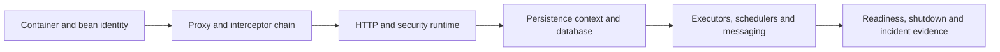

# Spring Runtime Architect Path

<DocLabels items={[
  {label: 'Lead and architect', tone: 'advanced'},
  {label: 'Runtime internals', tone: 'foundation'},
  {label: 'Production evidence', tone: 'production'},
  {label: 'Shopverse scenarios', tone: 'shopverse'},
]} />

Spring annotations are configuration, not explanations. At architect level, every design
must identify the interceptor, execution context, physical resource, failure policy,
telemetry and multi-replica consequence that make the annotation work.

<DocCallout type="production" title="The six-boundary review">

For each operation state the proxy boundary, thread/context boundary, transaction boundary,
resource bound, failure/recovery policy and observability proof. If any owner is implicit,
the design is not ready for production review.

</DocCallout>

## Learning Stages

| Stage | Entry chapter | Required outcome |
|---:|---|---|
| 0 | [Boot 4 And Framework 7](./SPRING-BOOT-4-FRAMEWORK-7.md) | freeze the compatible framework, Java, Jakarta and dependency assumptions |
| 1 | [Container And Bean Creation](./SPRING-CONTAINER-ARCHITECT.md) | trace refresh, definitions, post-processors, scopes, AOT and early references |
| 2 | [Proxies And Transactions](./SPRING-PROXY-TRANSACTION-ARCHITECT.md) | prove advisor order, propagation, rollback, pool use and async boundaries |
| 3 | [MVC And Security Runtime](./SPRING-MVC-SECURITY-RUNTIME.md) | trace request, filter-chain, dispatch, conversion and exception ownership |
| 4 | [Spring Data Architect Path](./SPRING-DATA-ARCHITECT-PATH.md) | trace repository internals and select JPA, JDBC, reactive and NoSQL stores deliberately |
| 5 | [JPA And Hibernate Runtime](./SPRING-JPA-HIBERNATE-ARCHITECT.md) | reason about persistence context, flush, fetch plans, locks, schemas and pools |
| 6 | [Spring Data Cassandra](./SPRING-DATA-CASSANDRA.md) | preserve query-first distributed database semantics through repositories, templates and reactive access |
| 7 | [Task Execution And Scheduling](./SPRING-ASYNC-PRODUCTION-ARCHITECT.md) | bound executors/schedulers and prove context, failure and multi-replica behavior |
| 8 | [Production Lifecycle](./internals-production/PRODUCTION-LIFECYCLE.md) | own startup, readiness, admission, drain, observability and rollback |
| 9 | [Architect Interview Workbook](./SPRING-ARCHITECT-INTERVIEW-WORKBOOK.md) | diagnose realistic proxy, transaction, ORM and production failures |

## Architect Evidence Pack

Do not mark a stage complete until you can produce the matching evidence:

| Concern | Minimum evidence |
|---|---|
| Bean creation | startup step, condition report, bean definition and proxy inspection |
| Transaction | interceptor trace, connection acquisition, SQL/flush order and rollback test |
| HTTP/security | filter-chain match, route mapping, error owner, trace and adversarial request |
| Persistence | SQL count, execution plan, lock wait, pool wait and concurrency test |
| Async/messaging | queue depth, rejection/redelivery behavior, context test and drain proof |
| Operations | readiness transition, graceful-shutdown timeline, SLO panel and rollback drill |

## Architect Decision Guides

<TopicCards items={[
  {
    title: 'Advanced Spring Platform Patterns',
    href: './SPRING-PLATFORM-ADVANCED',
    description: 'Choose Modulith, messaging, streaming, native and multi-tenant patterns.',
    icon: 'layers',
    tags: ['Platform', 'Trade-offs'],
  },
  {
    title: 'Spring Internals Labs',
    href: './SPRING-INTERNALS-LABS',
    description: 'Reproduce proxy, transaction, SQL and lifecycle behavior.',
    icon: 'experiment',
    tags: ['Executable', 'Evidence'],
  },
  {
    title: 'Interview Preparation',
    href: './SPRING-INTERVIEW-PREPARATION',
    description: 'Practise expandable questions and incident scenarios.',
    icon: 'brain',
    tags: ['Lead', 'Architect'],
  },
]} />

## Official References

- [Spring Framework reference](https://docs.spring.io/spring-framework/reference/)
- [Spring Boot reference](https://docs.spring.io/spring-boot/reference/)

## Recommended Next

Confirm the [Boot 4 And Framework 7 compatibility boundary](./SPRING-BOOT-4-FRAMEWORK-7.md),
then continue with [Container And Bean Creation](./SPRING-CONTAINER-ARCHITECT.md).
