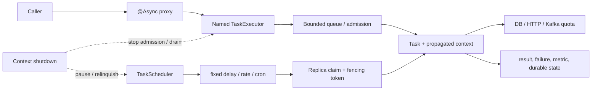

# Spring Task Execution And Scheduling For Production

<DocLabels items={[
  {label: 'Architect', tone: 'advanced'},
  {label: 'Task execution', tone: 'production'},
  {label: 'Scheduling', tone: 'intermediate'},
  {label: 'Shopverse operations', tone: 'shopverse'},
]} />

Spring task abstractions separate submission and timing from execution. Production
correctness still depends on the proxy call site, selected executor or scheduler,
queue and rejection policy, context propagation, downstream capacity, replica
ownership, durable state, and bounded shutdown.

<DocCallout type="production" title="Every task needs an owner and a terminal state">
Name who admits the task, where it queues, which resource bounds it, how success or
failure is observed, and what happens during cancellation or process termination.
Fire-and-forget is not an ownership model.
</DocCallout>

## Runtime Ownership Map



## `@Async` Is Proxy-Based Submission

`@Async` advice intercepts an eligible external call and submits an invocation to
a `TaskExecutor`. Self-invocation, manual construction, an ineligible method, or a
missing async configuration can leave execution on the caller thread.

```java
@Async("catalogExecutor")
public CompletableFuture<CatalogResult> rebuildCatalog(CatalogCommand command) {
    return CompletableFuture.completedFuture(catalogService.rebuild(command));
}
```

Prefer a returned `CompletableFuture` when a caller owns completion. A `void` async
method cannot return failure to the caller; configure an `AsyncUncaughtExceptionHandler`
and durable failure evidence. Never use `void` for a business operation whose loss
or uncertainty requires recovery.

Transactions do not move with submission. Start a deliberate transaction inside
the async task, keep it short, and do not assume the caller's transaction will
commit before the task reads its data. Use an outbox or after-commit dispatch when
ordering relative to a local commit matters.

## Explicit Executor Configuration

```java
@Bean("catalogExecutor")
ThreadPoolTaskExecutor catalogExecutor(TaskDecorator diagnosticContextDecorator) {
    ThreadPoolTaskExecutor executor = new ThreadPoolTaskExecutor();
    executor.setCorePoolSize(4);
    executor.setMaxPoolSize(8);
    executor.setQueueCapacity(100);
    executor.setThreadNamePrefix("catalog-");
    executor.setTaskDecorator(diagnosticContextDecorator);
    executor.setRejectedExecutionHandler(new ThreadPoolExecutor.AbortPolicy());
    executor.setWaitForTasksToCompleteOnShutdown(true);
    executor.setAwaitTerminationSeconds(20);
    executor.initialize();
    return executor;
}
```

Queue capacity determines when a pool can grow beyond its core size. An unbounded
queue can hide overload until memory, queue age, or business deadlines fail.
`CallerRunsPolicy` pushes work back to the submitter, but it can block an HTTP event
loop, Kafka consumer, or scheduler thread and change latency or polling semantics.
Use it only when that propagation is explicitly safe and tested.

Separate executors by failure and capacity domain, not by arbitrary package. A
catalog refresh, customer notification, and payment reconciliation should not
share one queue if starvation or rejection has different business consequences.

## `TaskDecorator` Context Capture And Cleanup

Thread-pool workers are reused. Any MDC, tenant, locale, or diagnostic state left
behind can leak into the next customer's task. Capture at submission, install for
execution, and restore the worker's previous state in `finally`.

```java
@Bean
TaskDecorator diagnosticContextDecorator() {
    return task -> {
        Map<String, String> submittedMdc = MDC.getCopyOfContextMap();
        return () -> {
            Map<String, String> workerMdc = MDC.getCopyOfContextMap();
            try {
                if (submittedMdc == null) MDC.clear();
                else MDC.setContextMap(submittedMdc);
                task.run();
            } finally {
                if (workerMdc == null) MDC.clear();
                else MDC.setContextMap(workerMdc);
            }
        };
    };
}
```

Do not hand-copy authentication tokens into MDC. Use Spring Security's delegating
executor wrappers or another supported propagation mechanism for `SecurityContext`.
Propagate only required immutable context; a captured transaction, request object,
or mutable persistence entity is unsafe.

Test cleanup by running two tasks on the same worker with different identities and
asserting the second cannot observe the first task's state.

## Scheduling Semantics And Misfires

| Trigger | Timing model | Production concern |
|---|---|---|
| fixed delay | wait after completion | cadence slows with task duration |
| fixed rate | target a start cadence | late execution can compress spacing |
| cron | wall-clock schedule and zone | daylight-saving and clock policy |
| persistent scheduler | durable trigger policy | explicit misfire and recovery semantics |

Spring's local scheduler is not a durable calendar. Runs missed while the process
is down are generally not replayed automatically. Use Quartz or a platform scheduler
when durable triggers and explicit misfire policy are requirements.

One annotated method invocation does not imply one cluster execution. Multiple
triggers, manual launches, and every application replica can all create overlapping
work. Record last start, last success, duration, outcome, and the business window
processed—not only the next scheduled time.

## Replica Ownership, Leases, And Fencing

For Shopverse reservation expiry, every replica may scan, but each row must be
claimed by at most one active owner. A lease alone is insufficient if a paused old
owner resumes after expiry. Include a monotonic fencing token in the claim and make
the final update conditional on the current token.

```text
claim row with owner + lease_until + fencing_token
  -> process bounded batch
  -> update only where fencing_token still matches
  -> commit outcome and release/advance claim
```

Make the operation idempotent and keep batches small enough to renew or finish
within the lease. Observe claim conflicts, lease expiry, stale-fence rejection,
rows processed, and oldest eligible-row age.

A distributed scheduler chooses an owner; it does not make the selected task's
database, HTTP, or messaging effects atomic.

## Virtual Threads

On supported Java and Spring Boot versions, enabling virtual threads changes the
auto-configured async executor and scheduler implementations. Virtual threads make
blocking tasks cheaper to represent, but they do not provide queueing discipline,
database connections, HTTP pool capacity, quotas, or idempotency.

Set a concurrency limit or admission gate near the scarce resource. Avoid large
inherited thread-local state and verify pinning or library behavior on the deployed
JDK. For `SimpleAsyncTaskScheduler`, scheduling uses one scheduler thread and
fixed-delay work has special single-thread timing behavior; prefer fixed-rate or
cron triggers for the virtual-thread-aligned scheduler when that matches the job.

## Shutdown Verification

Task shutdown is one phase of the canonical
[production lifecycle](./internals-production/PRODUCTION-LIFECYCLE.md):

1. stop HTTP, messaging, and scheduler admission;
2. reject or persist newly submitted work explicitly;
3. let bounded in-flight tasks complete or cancel cooperatively;
4. relinquish durable claims and preserve retry-safe state;
5. await executor termination within the platform deadline;
6. prove that forced termination leaves work recoverable.

`@PreDestroy` is not a durability boundary. The process can be killed before it
runs. A task that owns an external side effect needs an idempotency key and a
reconciliation path.

## Evidence And Failure Drills

Measure executor active count, pool size, queue size and oldest age, submission and
execution duration, rejection, cancellation, failure class, scheduled last success,
claim conflict, and downstream pool acquisition. Use bounded-cardinality task and
executor names.

Run these drills:

- call an `@Async` method through the proxy and through `this`, then compare threads;
- saturate the queue and assert the configured rejection contract;
- throw from both future-returning and `void` tasks;
- reuse a worker and prove MDC/security cleanup;
- start two replicas against one scheduled claim and pause the first past its lease;
- terminate during a DB write and during a remote side effect;
- verify executor and scheduler state after graceful and forced shutdown.

## Interview Checks

<ExpandableAnswer title="Why can an @Async method run on the caller thread?">

The call may bypass the proxy through self-invocation or a raw object, the method
may be ineligible, or async support/executor selection may be missing. Inspect the
published bean, call site, advisor, selected executor, and actual thread name.

</ExpandableAnswer>

<ExpandableAnswer title="What bug does a TaskDecorator finally block prevent?">

Pool workers are reused. Without cleanup, one task's MDC, tenant, or other thread-
local context can leak into the next task. The decorator must restore the worker's
previous state even when the task throws or is cancelled.

</ExpandableAnswer>

<ExpandableAnswer title="Why can CallerRunsPolicy be dangerous on a scheduler or event-loop thread?">

It executes rejected work on the submitting thread. That can block the scheduler,
delay unrelated triggers, stall an event loop, or change Kafka polling behavior.
Use an explicit rejection/fallback contract unless caller execution is proven safe.

</ExpandableAnswer>

<ExpandableAnswer title="Does @Scheduled run once per application cluster?">

No. Each replica owns a local scheduler. Use a durable claim, lease plus fencing,
or distributed scheduler when one active owner is required, and keep the business
operation idempotent because ownership and side-effect atomicity are separate.

</ExpandableAnswer>

<ExpandableAnswer title="Why is a lease insufficient without fencing?">

A paused owner can resume after its lease expires while a new owner is active.
A monotonic fencing token lets the database or resource reject stale-owner writes,
preventing the old process from committing after ownership moved.

</ExpandableAnswer>

<ExpandableAnswer title="Why can virtual threads increase database timeouts?">

They let more blocking tasks reach the database cheaply, but the connection pool
and database capacity remain finite. Without admission control, pending acquisition
and transaction latency rise. Bound concurrency at the database and measure wait
time rather than task count alone.

</ExpandableAnswer>

## Official References

- [Spring Framework task execution and scheduling](https://docs.spring.io/spring-framework/reference/integration/scheduling.html)
- [Spring Boot task execution and scheduling](https://docs.spring.io/spring-boot/reference/features/task-execution-and-scheduling.html)
- [Spring Framework `TaskDecorator` API](https://docs.spring.io/spring-framework/docs/current/javadoc-api/org/springframework/core/task/TaskDecorator.html)
- [Spring Framework scheduling annotations](https://docs.spring.io/spring-framework/reference/integration/scheduling.html#scheduling-annotation-support)

## Recommended Next

Continue with the [Spring Boot Production Lifecycle Runbook](./internals-production/PRODUCTION-LIFECYCLE.md).
