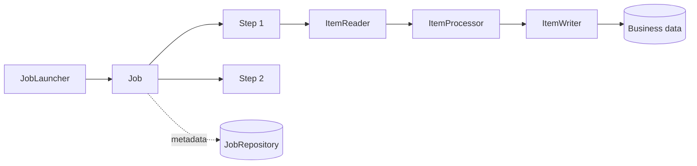

# Spring Batch

Spring Batch is a framework for finite, repeatable workloads such as imports,
exports, reconciliation, billing, report generation, and data migration. It is
not a scheduler: Kubernetes CronJobs, a platform scheduler, or Spring's
`@Scheduled` can decide **when** to launch a job; Spring Batch controls **how**
the work runs, persists progress, retries, skips, and restarts.

## Core Model



| Concept | Responsibility |
|---|---|
| `Job` | Named workflow made of one or more steps. |
| `JobInstance` | Logical run identified by the job name and identifying parameters. |
| `JobExecution` | One attempt to run a job instance. A restart creates another execution. |
| `Step` | Independently tracked unit of work. |
| `StepExecution` | One attempt to run a step, including counts and status. |
| `JobRepository` | Persists metadata needed for locking, history, and restart. |
| `JobLauncher` | Starts a job with a set of job parameters. |

Job parameters are part of identity. For example, `businessDate=2026-07-11`
can identify the daily settlement job. Do not add a random identifying value
unless every launch should be treated as a new logical instance.

## Chunk-Oriented Processing

A chunk step repeatedly reads and processes individual items, then writes a
list inside one transaction. With a chunk size of 100, a successful commit
advances the persisted checkpoint by 100 items. A failure rolls back the
current chunk, not every previously committed chunk.

```java
@Bean
Step importProductsStep(
        JobRepository jobRepository,
        PlatformTransactionManager transactionManager,
        ItemReader<ProductRow> reader,
        ItemProcessor<ProductRow, Product> processor,
        ItemWriter<Product> writer) {
    return new StepBuilder("importProducts", jobRepository)
            .<ProductRow, Product>chunk(100, transactionManager)
            .reader(reader)
            .processor(processor)
            .writer(writer)
            .faultTolerant()
            .retry(TransientDataAccessException.class)
            .retryLimit(3)
            .skip(InvalidProductException.class)
            .skipLimit(20)
            .build();
}

@Bean
Job productImportJob(JobRepository repository, Step importProductsStep) {
    return new JobBuilder("productImportJob", repository)
            .start(importProductsStep)
            .build();
}
```

Choose chunk size by measurement. Larger chunks reduce commit overhead but use
more memory, hold locks longer, and replay more work after rollback. Start with
a moderate value and load-test using realistic item and database sizes.

## Readers, Processors, And Writers

- Readers obtain data from files, JDBC cursors/paging queries, queues, or APIs.
- Processors validate, enrich, transform, or return `null` to filter an item.
- Writers persist a chunk and should use bulk operations where possible.

Prefer a paging or cursor reader over loading an entire table. When paging,
use a deterministic, unique sort key so rows are neither duplicated nor
missed. Avoid changing columns used by the reader's selection or sort while
the job is scanning them.

```java
@Bean
@StepScope
FlatFileItemReader<ProductRow> productReader(
        @Value("#{jobParameters['inputFile']}") Resource inputFile) {
    return new FlatFileItemReaderBuilder<ProductRow>()
            .name("productCsvReader")
            .resource(inputFile)
            .linesToSkip(1)
            .delimited()
            .names("sku", "name", "price")
            .targetType(ProductRow.class)
            .build();
}
```

`@StepScope` creates the component for a step execution and permits late
binding from job parameters or execution context. Do not read job parameters
in a singleton bean at application startup.

## Tasklet Steps And Job Flow

Use a tasklet for a single operation—moving a file, calling a stored procedure,
or deleting a staging partition—rather than forcing it into an item pipeline.

```java
@Bean
Step archiveFileStep(JobRepository repository,
                     PlatformTransactionManager transactionManager) {
    return new StepBuilder("archiveFile", repository)
            .tasklet((contribution, context) -> {
                archiveImportedFile();
                return RepeatStatus.FINISHED;
            }, transactionManager)
            .build();
}
```

Jobs can run steps sequentially, branch based on exit status, or split into
parallel flows. Keep flows explicit and ensure a restarted step can determine
whether its external side effects already happened.

## Restartability And Idempotency

Spring Batch stores framework progress, but application side effects still
need idempotency.

- Use a business key or import identifier with a unique database constraint.
- Prefer upsert or compare-and-set behavior where replay is possible.
- Store small restart markers in the `ExecutionContext`; store business data
  in business tables, not in batch metadata.
- Never delete batch metadata merely to make a failed job run again.
- Design API calls, file moves, notifications, and event publication so a
  crash between the side effect and checkpoint does not create duplicates.

Job and step `ExecutionContext` values must be serializable and small. Readers
provided by Spring Batch commonly persist their own checkpoint state there.

## Retry, Skip, And Failure Policy

Retry is for transient failures such as a deadlock or temporary connection
loss. Skip is for a known bad item that business rules permit the job to
quarantine. An unknown programming error should fail the job.

Record skipped input with its job identity, reason, and safe diagnostic data.
Set finite limits; an unlimited skip policy can silently turn a broken import
into a nominal success. Do not log secrets or full sensitive records.

## Scaling Options

| Option | Best fit | Main caution |
|---|---|---|
| Multi-threaded step | Independent items in one process | Reader/writer thread safety and ordering. |
| Partitioning | A data set divisible by stable ranges | Disjoint partitions and restart semantics. |
| Remote chunking | Central reading with distributed processing/writing | Broker delivery, idempotency, and operational complexity. |
| Multiple job replicas | Different job instances | Shared repository and protection from duplicate launches. |

Scale the database and downstream systems before increasing worker count.
Parallelism that only moves contention to a smaller connection pool makes the
job slower and less predictable.

## Launching And Scheduling

```java
JobParameters parameters = new JobParametersBuilder()
        .addLocalDate("businessDate", businessDate)
        .addString("inputFile", inputFile, false) // non-identifying
        .toJobParameters();

jobLauncher.run(productImportJob, parameters);
```

Prevent two schedulers from launching the same logical job unintentionally.
The shared `JobRepository` protects job-instance execution, but the launcher
must still use stable identifying parameters and handle
`JobExecutionAlreadyRunningException` as an expected concurrency outcome.

## Testing

Use `spring-batch-test` to launch a whole job or an individual step. Test at
three levels:

1. processor unit tests for validation and transformation;
2. reader/writer integration tests against realistic files and a real database;
3. job tests for parameters, status, counters, skips, rollback, and restart.

```java
@SpringBatchTest
@SpringBootTest
class ProductImportJobTest {
    @Autowired JobLauncherTestUtils jobs;

    @Test
    void importsValidProducts() throws Exception {
        JobParameters parameters = new JobParametersBuilder()
                .addString("testRun", UUID.randomUUID().toString())
                .toJobParameters();

        JobExecution execution = jobs.launchJob(parameters);

        assertThat(execution.getStatus()).isEqualTo(BatchStatus.COMPLETED);
    }
}
```

Include a restart test: fail after at least one committed chunk, relaunch the
same job instance, and prove that committed business effects are not duplicated.

## Production Checklist

- use a durable, shared database for the `JobRepository`;
- run the correct Spring Batch metadata schema migration for the deployed version;
- expose job duration, read/write/filter/skip counts, failures, and last success;
- alert on stale running executions and missed business deadlines;
- configure graceful shutdown so the current transaction can finish;
- define retention and archival for execution metadata;
- validate input location, size, encoding, schema, and checksum;
- cap retry, skip, concurrency, and memory usage;
- document restart and abandonment procedures.

## When Not To Use Spring Batch

Use a normal transactional service for a small request/response operation. Use
Kafka or another streaming platform for continuous unbounded event processing.
Use WebFlux when the central problem is high-concurrency non-blocking I/O. A
scheduled method may be enough for a tiny, stateless task that does not need
checkpointing, restart, job history, or skip/retry policy.

## Related Guides

- [Spring Transactions](./SPRING-TRANSACTIONS.md)
- [Spring Data JPA](./SPRING-DATA-JPA.md)
- [Spring Boot Testing](./SPRING-BOOT-TESTING.md)
- [Spring Reactive And WebFlux](./SPRING-REACTIVE.md)

## Official References

- [Spring Batch reference](https://docs.spring.io/spring-batch/reference/)
- [Spring Batch API](https://docs.spring.io/spring-batch/docs/current/api/)

## Recommended Next Page

Continue with [Spring Reactive And WebFlux](./SPRING-REACTIVE.md).
