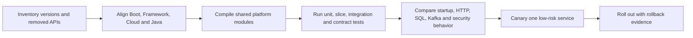

# Spring Boot 4 And Spring Framework 7 Upgrade Guide

<DocLabels items={[
  {label: 'Advanced', tone: 'advanced'},
  {label: 'Spring Boot 4.0', tone: 'foundation'},
  {label: 'Production migration', tone: 'production'},
  {label: 'Shopverse', tone: 'shopverse'},
]} />

Shopverse currently manages Spring Boot `4.0.6` and compiles services with Java 21.
This page is the compatibility boundary for that generation. Feature examples elsewhere
in the Spring track should state when they require a newer maintenance or feature line.

The shared build conventions currently align Spring Cloud `2025.1.1`, Resilience4j
`2.4.0` and Testcontainers `2.0.5`. Treat those as one tested platform set rather than
independent “latest version” choices.

<DocCallout type="production" title="Upgrade the platform, not one service at a time">

The Boot BOM, Spring Cloud release train, shared starters, Gradle convention plugins,
test infrastructure and service applications form one compatibility graph. Prove that
graph in a platform branch before independently releasing services.

</DocCallout>



## Runtime Baseline

| Boundary | Boot 4 / Framework 7 generation | Shopverse decision |
|---|---|---|
| Java | Java 17 minimum; use a supported LTS | Java 21 toolchain |
| Jakarta | Jakarta EE 11 APIs | Keep every dependency on the `jakarta.*` generation |
| Servlet | Servlet 6.1 | Embedded Tomcat; do not assume Boot 4.0 Undertow support |
| Persistence | JPA 3.2 and Hibernate ORM 7 generation | Re-run SQL, mapping, lock and repository tests |
| Validation | Bean Validation 3.1 generation | Verify custom validators and method validation |
| Testing | JUnit 6 generation in the Framework 7 baseline | Use Boot-managed test dependencies |
| JSON | Jackson 3 is the primary Boot 4 path | Treat serialization output as an API contract |
| Native image | GraalVM 25 generation | Validate reflection/resources in native CI before adoption |

Do not pin Framework, Hibernate, Jackson or test-library versions independently unless
an approved compatibility exception explains why the Boot dependency management is
insufficient.

## High-Impact Boot 4 Changes

### Focused Modules And Starters

Boot 4 decomposes support into smaller, technology-focused modules and gives many main
starters a matching test starter. The migration guide deprecates several broad or older
starter names. For example, `spring-boot-starter-webmvc` is the focused MVC starter and
`spring-boot-starter-webmvc-test` is its test companion.

Shopverse still contains some compatibility starter names such as
`spring-boot-starter-web`. They work as migration bridges in the pinned line, but the
platform should deliberately converge on focused starters instead of relying on aliases
until they disappear.

```gradle
dependencies {
    implementation 'org.springframework.boot:spring-boot-starter-webmvc'
    testImplementation 'org.springframework.boot:spring-boot-starter-webmvc-test'
    testImplementation 'org.springframework.boot:spring-boot-starter-test'
}
```

<DocCallout type="mistake" title="A successful compile is not dependency proof">

An accidentally retained classic starter can keep removed auto-configuration on the
classpath and hide missing focused dependencies. Inspect the runtime dependency graph
and start the application with the condition report during migration.

</DocCallout>

### Jackson 3 Is A Contract Migration

Boot 4 treats Jackson 3 as the primary JSON stack and offers Jackson 2 compatibility as
a temporary bridge. Package names, modules, defaults and customizer APIs can change.
Capture representative request and response fixtures before the upgrade, including:

- Java time, money and enum representations;
- unknown and absent fields;
- polymorphic payloads and security-sensitive typing;
- page envelopes and error responses;
- Kafka JSON events shared with independently deployed consumers.

Prefer golden contract tests over manually comparing one happy-path response.

### Package And Configuration Movement

The modular design moved several Boot classes and renamed configuration properties.
Use the properties migrator only as a temporary diagnostic tool, then remove it. Search
compiled code, reflection configuration, `spring.factories`, imports, configuration
metadata and operational manifests—not only Java source.

### HTTP Service Clients

Boot 4 auto-configures Spring HTTP Service Clients. Spring Cloud OpenFeign is now
feature-complete, and its own reference recommends Spring HTTP Service Clients for new
work. This is not a mandate to rewrite stable clients immediately; use a decision record.

```java
@HttpExchange("/inventory")
public interface InventoryHttpClient {

    @GetExchange("/{productId}")
    InventoryView find(@PathVariable UUID productId);
}
```

The interface is only the contract surface. The architect still owns base URL discovery,
connect and response timeouts, connection pooling, authentication, correlation, retry
safety, circuit breaking, bulkheads, error mapping and observability.

| Situation | Preferred direction |
|---|---|
| Existing stable Feign client with production telemetry | Keep it; migrate when value exceeds rollout risk |
| New synchronous interface client | Evaluate HTTP Service Clients first |
| Streaming or reactive body | Use `WebClient` with explicit backpressure and timeout policy |
| Simple imperative call without interface abstraction | Use `RestClient` |

### API Versioning

Framework 7 provides MVC and WebFlux API-version strategies. A resolver can read a
header, query parameter, media-type parameter or path segment; a parser normalizes the
version; validation rejects unsupported versions; a deprecation handler can emit
deprecation and sunset hints.

```java
@Configuration
class ApiVersionConfiguration implements WebMvcConfigurer {
    @Override
    public void configureApiVersioning(ApiVersionConfigurer versions) {
        versions.useRequestHeader("API-Version")
                .addSupportedVersions("1.0", "2.0");
    }
}
```

```java
@GetMapping(path = "/orders/{id}", version = "2.0+")
OrderV2Response getOrder(@PathVariable UUID id) {
    return queryService.getV2(id);
}
```

Framework support standardizes routing; it does not choose a compatibility policy. Define
how long versions coexist, which changes require a version, how deprecation is observed,
and how clients prove migration before a version is removed.

### Nullability And AOT

Spring's JSpecify annotations improve tool and Kotlin null-safety but may expose existing
ambiguity as new compiler warnings or errors. AOT and native images constrain reflection,
resource discovery, serialization, dynamic proxies and runtime class generation. Test
the actual native artifact; a JVM test suite cannot prove the closed-world image.

## Shopverse Migration Sequence

### 1. Freeze The Compatibility Matrix

Record the exact Boot, Spring Cloud, Resilience4j, Kafka, Hibernate, database driver,
Testcontainers, Gradle and Java versions. Reject ad-hoc dependency overrides while the
migration is in flight.

### 2. Upgrade Build Logic And Shared Starters

Compile `build-logic` and `shopverse-platform` first. Their convention plugins and
auto-configuration modules affect every service. Verify auto-configuration imports,
configuration metadata, conditional beans and test fixtures.

### 3. Prove Contracts At Boundaries

Run tests for HTTP JSON, security filters and claims, database migrations and SQL,
Kafka serialization/retry topics, cache serialization, configuration binding and
Actuator endpoint behavior.

### 4. Compare Runtime Evidence

Capture both versions under the same workload:

- startup steps and condition evaluation differences;
- heap, allocation, GC and thread behavior;
- request latency, error mapping and serialization;
- database pool wait, SQL count and transaction duration;
- Kafka lag, retries and DLT publication;
- health groups, metrics, traces and log field names.

### 5. Canary And Roll Back

Choose a low-risk service with representative platform dependencies. Run old and new
event consumers during any rolling deployment where schemas changed. Roll back the
application and its configuration independently; database and event changes must remain
backward compatible through the rollback window.

## Failure Review Matrix

| Symptom | Likely migration boundary | Evidence |
|---|---|---|
| Bean disappeared | focused module or changed condition | dependency graph and condition report |
| JSON changed | Jackson module/default/customizer | golden contract diff |
| Tests no longer discover | JUnit/test starter alignment | resolved test runtime and engine output |
| Endpoint is unsecured | filter-chain matcher/order change | security trace and adversarial HTTP test |
| SQL or locking changed | Hibernate/JPA generation | SQL logs, execution plans and concurrency test |
| Actuator probe changed | health-group configuration | management endpoint response and orchestration events |
| Native image fails | missing reachability metadata | native build diagnostics and minimal reproducer |

## Lead And Architect Interview Checks

<ExpandableAnswer title="Why should a Boot upgrade begin with shared platform modules?">

They supply dependency management, convention plugins and auto-configuration to every
service. Upgrading a leaf service first can produce a mixed and unrepeatable compatibility
graph. Proving the platform first creates one controlled baseline for service teams.

</ExpandableAnswer>

<ExpandableAnswer title="Why is Jackson 3 more than an import migration?">

Serialization is an external contract. Defaults, modules and customizers can alter HTTP,
Kafka, cache and persistence-adjacent payloads even when Java code compiles. Golden
contract tests and mixed-version consumer tests provide the evidence a compile cannot.

</ExpandableAnswer>

<ExpandableAnswer title="Should Shopverse replace every Feign client immediately?">

No. OpenFeign being feature-complete makes HTTP Service Clients the stronger default for
new synchronous interfaces, but a stable Feign client already has known failure behavior
and telemetry. Migrate it only with a concrete benefit and equivalent timeout, security,
load-balancing, resilience and observability behavior.

</ExpandableAnswer>

<ExpandableAnswer title="What makes a framework migration rollback-safe?">

Old and new binaries can read current configuration, schemas and event/API contracts;
database changes are expand-and-contract; consumers tolerate mixed versions; metrics
identify each cohort; and the deployment can revert without undoing destructive data
changes.

</ExpandableAnswer>

## Official References

- [Spring Boot 4.0 reference](https://docs.spring.io/spring-boot/4.0/reference/)
- [Spring Boot 4.0 migration guide](https://github.com/spring-projects/spring-boot/wiki/Spring-Boot-4.0-Migration-Guide)
- [Spring Boot 4.0 release notes](https://github.com/spring-projects/spring-boot/wiki/Spring-Boot-4.0-Release-Notes)
- [Spring Framework 7 reference](https://docs.spring.io/spring-framework/reference/)
- [Spring Framework 7 release notes](https://github.com/spring-projects/spring-framework/wiki/Spring-Framework-7.0-Release-Notes)
- [Spring Cloud OpenFeign reference](https://docs.spring.io/spring-cloud-openfeign/reference/)

## Recommended Next

Continue with [Spring Container, Bean Lifecycle And Auto-Configuration Internals](./SPRING-CONTAINER-ARCHITECT.md).
