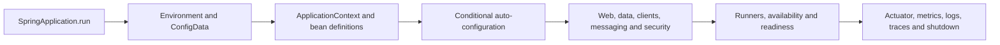

# Spring Boot Beginner-To-Architect Learning Path

Spring Boot is an opinionated application assembly and operations layer over Spring. It
selects defaults from the classpath and environment, creates infrastructure conditionally,
packages an executable application and exposes production lifecycle integration. It does
not remove the need to understand the Spring container, HTTP runtime, database or JVM.

Use [Spring Boot Production Mastery](./boot/SPRING-BOOT-PRODUCTION-MASTERY.md)
as the complete checklist for startup, configuration, beans, proxies,
transactions, web runtimes, pools, observability, AOT, containers and incidents.

## Mental Model

## Complete Route

### 0. Annotation vocabulary and runtime behavior

Use [Spring Boot Annotations Beginner-To-Architect](./SPRING-BOOT-ANNOTATIONS-PATH.md)
as a searchable annotation route. It covers container, conditional, MVC, validation,
transaction, async, cache, security, messaging and test annotations, then explains which
processor or proxy makes each annotation effective.

### 1. Foundations and external configuration

Start with [Configuration, Profiles And Environments](./boot/SPRING-BOOT-CONFIGURATION-ENVIRONMENTS.md).
Understand starters, application structure, `@SpringBootApplication`, configuration-data
precedence, profiles, typed binding, validation and secrets.

### 2. Startup and auto-configuration

Study [Auto-Configuration, Starters And Extension Design](./boot/SPRING-BOOT-AUTOCONFIGURATION-STARTERS.md),
then the existing [Spring Boot Internals Guide](../development/SPRING-BOOT-INTERNALS.md).
Trace conditions, imports, bean lifecycle, post-processors, proxies, server startup and
application availability.

### 3. Web and API runtime

Follow [Servlet And MVC Request Lifecycle](./web/SERVLET-MVC-REQUEST-LIFECYCLE.md),
[HTTP Message Conversion And Jackson](./web/HTTP-MESSAGE-CONVERSION-JACKSON.md),
[Bean Validation](./SPRING-VALIDATION.md), and the [REST API route](../development/SPRING-REST-APIS.md).

### 4. Data, transactions and integration

Use [Spring Data Architect Path](./SPRING-DATA-ARCHITECT-PATH.md),
[Transactions](./SPRING-TRANSACTIONS.md), [Task Execution](./SPRING-ASYNC-PRODUCTION-ARCHITECT.md),
[Spring Kafka](./SPRING-KAFKA.md), and [Spring Cloud](./SPRING-CLOUD-ARCHITECT-PATH.md).

### 5. Testing

Use [Spring Boot Testing](./SPRING-BOOT-TESTING.md) for unit, slice, context, container,
contract, asynchronous and CI reliability evidence.

### 6. Production runtime

Study [Actuator](../operations/SPRING-BOOT-ACTUATOR.md),
[Runtime Engineering Map](./SPRING-BOOT-INTERNALS-PRODUCTION.md), JVM/container memory,
resource-pool capacity and graceful lifecycle.
Then use [Runtime Performance And Capacity](./boot/SPRING-BOOT-RUNTIME-PERFORMANCE.md)
to trace the end-to-end queue and
[Production Incident Playbook](./boot/SPRING-BOOT-PRODUCTION-INCIDENT-PLAYBOOK.md)
to diagnose startup, proxy, transaction, HTTP, pool, JVM and shutdown failures.

### 7. Packaging and deployment

Use [Packaging, Layering, AOT And Containers](./boot/SPRING-BOOT-PACKAGING-AOT-CONTAINERS.md)
to choose executable jars, layered images, buildpacks, native images and Kubernetes
startup/readiness/shutdown contracts.

### 8. Interview and production scenarios

Finish with [Production Interview And Revision](./boot/SPRING-BOOT-PRODUCTION-INTERVIEW-REVISION.md)
and the [Spring Architect Workbook](./SPRING-ARCHITECT-INTERVIEW-WORKBOOK.md).

## Completion Standard

You should be able to answer:

- what happens from `main()` until the application accepts traffic;
- which runtime processor discovers an annotation and whether it registers metadata,
  an endpoint, a bean or an invocation interceptor;
- why an auto-configured bean appeared, backed off or failed;
- which property source supplied a value and how it was validated;
- where an HTTP request queues and which thread/transaction owns it;
- how readiness, liveness and graceful shutdown prevent traffic loss;
- how container limits relate to heap, native memory, pools and concurrency;
- when AOT/native compilation helps and which dynamic behavior it constrains;
- what evidence distinguishes Boot startup, JVM, dependency and platform failures.

## Official References

- [Spring Boot reference](https://docs.spring.io/spring-boot/reference/)
- [Spring Framework reference](https://docs.spring.io/spring-framework/reference/)
