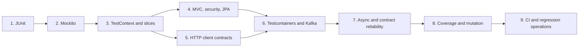

# Spring Testing Learning Guide

<DocLabels items={[
  {label: 'Dependency-ordered path', tone: 'intermediate'},
  {label: 'Spring Boot 4', tone: 'advanced'},
  {label: 'Production evidence', tone: 'production'},
]} />

JUnit and Mockito are foundations, not Spring-specific test boundaries. Learn
them first, then add Spring TestContext and slices only when configuration,
proxies, conversion, persistence, security, or infrastructure are part of the
claim.

For development workflow and collaborative behavior discovery, use the
[TDD And BDD Engineering Path](./TDD-BDD-ENGINEERING-PATH.md). It complements
this test-technology path with red-green-refactor, example mapping, domain
language, production scenarios, adoption, and revision material.

<DocCallout type="tip" title="Choose from the claim, not the annotation">
Use direct construction for pure behavior, a slice for one Spring layer, a real
dependency for a protocol or database claim, and a live server only when actual
transport behavior matters. Larger scope is not automatically stronger evidence.
</DocCallout>

## 1. Framework-Independent Foundations

<TopicCards items={[
  {title: 'TDD and BDD engineering', href: '/spring/TDD-BDD-ENGINEERING-PATH', description: 'Design feedback, behavior discovery, Spring production boundaries, labs, and interviews.', icon: 'route', tags: ['TDD', 'BDD']},
  {title: 'JUnit testing fundamentals', href: '/spring/testing/JUNIT-TESTING-FUNDAMENTALS', description: 'Lifecycle, assertions, parameterized tests, structure, tags, and deterministic execution.', icon: 'book', tags: ['Foundation', 'JUnit']},
  {title: 'Mockito and unit testing', href: '/spring/testing/MOCKITO-UNIT-TESTING', description: 'Test doubles, stubbing, verification, captors, design seams, and focused service tests.', icon: 'experiment', tags: ['Foundation', 'Mockito']},
]} />

## 2. Spring Test Boundaries

<TopicCards items={[
  {title: 'Test slices and context cache', href: '/spring/testing/SPRING-TEST-SLICES-CONTEXT-CACHE', description: 'Boot 4 focused modules, TestContext cache keys, diagnostics, failure thresholds, and context reuse.', icon: 'layers', tags: ['TestContext', 'Slices']},
  {title: 'MVC, repository, and security tests', href: '/spring/testing/SPRING-MVC-REPOSITORY-SECURITY-TESTS', description: 'MockMvc, security filters and proxies, Data JPA, transactions, locking, and production-dialect evidence.', icon: 'security', tags: ['MockMvc', 'Data JPA']},
  {title: 'HTTP client contract tests', href: '/spring/testing/HTTP-CLIENT-CONTRACT-TESTS', description: 'RestClient, WebClient, HTTP Service and Feign request mapping, transport failures, and compatibility.', icon: 'network', tags: ['Clients', 'Contracts']},
]} />

## 3. Infrastructure And Reliability

<TopicCards items={[
  {title: 'Integration tests and Testcontainers', href: '/spring/testing/INTEGRATION-TESTCONTAINERS', description: 'Real MySQL and Kafka, migrations, transactions, container lifecycle, and end-to-end boundaries.', icon: 'boxes', tags: ['Testcontainers 2.0.5', 'Kafka']},
  {title: 'Async, contract, and flaky tests', href: '/spring/testing/ASYNC-CONTRACT-FLAKY-TESTS', description: 'Bounded waiting, deterministic data, contract fixtures, isolation, and parallel execution.', icon: 'route', tags: ['Awaitility', 'Reliability']},
]} />

## 4. Quality And Delivery Operations

<TopicCards items={[
  {title: 'Coverage and test quality', href: '/spring/testing/COVERAGE-TEST-QUALITY', description: 'Risk-based coverage, JaCoCo aggregation, mutation testing, exclusions, and meaningful gates.', icon: 'gauge', tags: ['JaCoCo', 'PIT']},
  {title: 'CI test reliability operations', href: '/spring/testing/TEST-CI-RELIABILITY-OPERATIONS', description: 'Sharding, quarantine policy, retry evidence, failure triage, and incident-to-regression workflow.', icon: 'gauge', tags: ['CI', 'Quarantine']},
]} />

## Shopverse Version Anchors

<DocCallout type="shopverse" title="Current repository baseline">
Shopverse build conventions use Spring Boot `4.0.6`, Java 21, JUnit Platform,
and Testcontainers `2.0.5`. Services use `spring-boot-starter-test`; User Service
also declares the Boot 4 `spring-boot-starter-webmvc-test` focused starter.
Order, Inventory, and Payment define a separate `integrationTest` source set with
parallel execution disabled and one Gradle fork.
</DocCallout>

Spring Boot 4 separates focused test support into modules and starters such as
`spring-boot-webmvc-test` / `spring-boot-starter-webmvc-test`,
`spring-boot-data-jpa-test` / its starter, `spring-boot-restclient-test`, and
`spring-boot-webclient-test`. Use Boot dependency management rather than pinning
transitive JUnit, Mockito, Jackson, or Spring Test versions independently.

## Official References

- [Spring Boot testing](https://docs.spring.io/spring-boot/reference/testing/index.html)
- [Spring Boot test-scope dependencies](https://docs.spring.io/spring-boot/reference/testing/test-scope-dependencies.html)
- [Spring Framework testing](https://docs.spring.io/spring-framework/reference/testing.html)

## Recommended Next

Start with [JUnit Testing Fundamentals](./testing/JUNIT-TESTING-FUNDAMENTALS.md),
then continue in card order.
