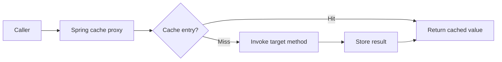
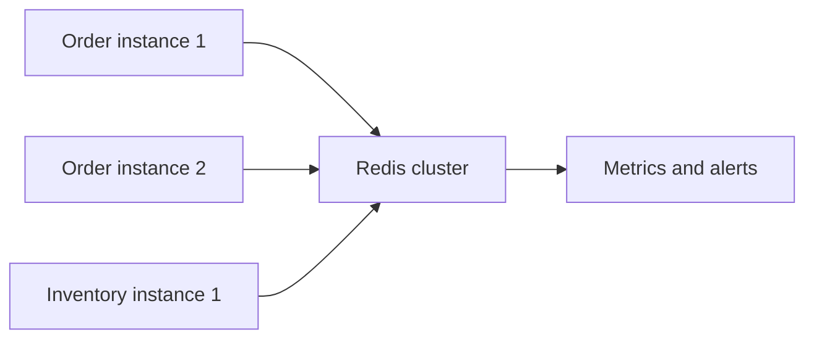

# Spring Cache

Spring Cache provides an annotation-driven abstraction over cache providers.
Application code uses Spring's cache API while configuration selects a local
provider such as Caffeine or a distributed provider such as Redis.

Start with the [Cache Umbrella](../architecture/CACHE-UMBRELLA.md) for cache
levels, storage, keys, provider selection, and hybrid caching.

## What Is The Default Cache?

| Situation | Behavior |
|---|---|
| `@EnableCaching` absent | Cache annotations are not intercepted; methods execute normally |
| Caching enabled, no provider library/bean detected | Spring Boot uses the simple in-process `ConcurrentMapCacheManager` backed by concurrent maps |
| `spring.cache.type=none` | Spring Boot configures a no-op cache manager, useful when an environment must disable storage |

The simple provider creates caches on demand and is useful for learning, but it
has no production-grade size/TTL controls and each replica has unrelated data.
Choose Caffeine for a bounded local cache or Redis for a shared cache.

## Dependencies

<DependencyTabs
  gradle={<pre><code>{`implementation 'org.springframework.boot:spring-boot-starter-cache'
implementation 'com.github.ben-manes.caffeine:caffeine'
implementation 'org.springframework.boot:spring-boot-starter-data-redis'`}</code></pre>}
  maven={<pre><code>{`<dependency>
  <groupId>org.springframework.boot</groupId>
  <artifactId>spring-boot-starter-cache</artifactId>
</dependency>
<dependency>
  <groupId>com.github.ben-manes.caffeine</groupId>
  <artifactId>caffeine</artifactId>
</dependency>
<dependency>
  <groupId>org.springframework.boot</groupId>
  <artifactId>spring-boot-starter-data-redis</artifactId>
</dependency>`}</code></pre>}
/>

Use versions managed by the Spring Boot dependency platform where possible.

## Enable Caching

```java
@Configuration(proxyBeanMethods = false)
@EnableCaching
public class CacheConfiguration {
}
```

`@EnableCaching` imports infrastructure that detects cache annotations and
wraps eligible beans with Spring AOP proxies.



As with other proxy-based features, self-invocation does not pass through the
proxy:

```java
this.getProduct(id); // @Cacheable on getProduct is normally bypassed
```

Move the cached operation to an appropriate collaborator or invoke it through
a deliberately designed proxy boundary.

## Core Annotations

### `@Cacheable`

Reads from cache before invoking the method:

```java
@Cacheable(
        cacheNames = "products",
        key = "#productId",
        unless = "#result == null"
)
public ProductResponse getProduct(Long productId) {
    return repository.findById(productId)
            .map(mapper::toResponse)
            .orElseThrow(() -> new ProductNotFoundException(productId));
}
```

On a hit, the method is skipped. On a miss, the result is stored.

### `@CachePut`

Always invokes the method and stores its result:

```java
@Transactional
@CachePut(cacheNames = "products", key = "#result.id()")
public ProductResponse update(
        Long productId,
        UpdateProductRequest request
) {
    return mapper.toResponse(updateEntity(productId, request));
}
```

Use it when the returned value is the authoritative replacement for one cache
entry.

### `@CacheEvict`

Removes stale entries:

```java
@Transactional
@CacheEvict(cacheNames = "products", key = "#productId")
public void delete(Long productId) {
    repository.deleteById(productId);
}
```

Collection caches often need broader invalidation:

```java
@CacheEvict(cacheNames = "productCatalog", allEntries = true)
public ProductResponse create(CreateProductRequest request) {
    // ...
}
```

Evicting before successful persistence can expose stale or missing values when
the transaction later rolls back. Coordinate invalidation with transaction
completion for important data.

### `@Caching`

Groups several operations:

```java
@Caching(
        put = @CachePut(cacheNames = "products", key = "#result.id()"),
        evict = @CacheEvict(
                cacheNames = "productCatalog",
                allEntries = true
        )
)
public ProductResponse update(...) {
    // ...
}
```

### `@CacheConfig`

Declares shared class-level defaults:

```java
@Service
@CacheConfig(cacheNames = "products")
class ProductQueryService {

    @Cacheable(key = "#id")
    ProductResponse get(Long id) {
        // ...
    }
}
```

## Keys, Conditions, And Results

Spring Expression Language can reference arguments and results:

```java
@Cacheable(
        cacheNames = "customerOrders",
        key = "#customerId + ':' + #pageable.pageNumber",
        condition = "#pageable.pageSize <= 100",
        unless = "#result.empty"
)
```

- `key` chooses the cache key;
- `condition` decides whether caching is attempted before invocation;
- `unless` vetoes storing the returned result;
- `sync=true` asks a supporting provider to synchronize concurrent loading for
  the same key.

Prefer a custom `KeyGenerator` when expressions become long or duplicated.
Include tenant, locale, permission context, or representation version whenever
they affect the returned value.

## Local Cache With Caffeine

```yaml
spring:
  cache:
    type: caffeine
    cache-names: products,productCatalog
    caffeine:
      spec: maximumSize=10000,expireAfterWrite=5m
```

Caffeine is fast and process-local. Each service replica has independent
entries, so invalidation and freshness can differ between instances.

Use local caching for:

- immutable or slowly changing reference data;
- very hot values where a network cache hop is undesirable;
- data whose temporary per-replica inconsistency is acceptable.

## Redis Cache With Spring

Configuration:

```yaml
spring:
  cache:
    type: redis
    redis:
      time-to-live: 5m
      cache-null-values: false
      key-prefix: "shopverse:"
      use-key-prefix: true
  data:
    redis:
      host: ${REDIS_HOST:localhost}
      port: ${REDIS_PORT:6379}
      connect-timeout: 2s
      timeout: 1s
```

Spring Boot configures a Redis connection factory and `RedisCacheManager` when
the Redis dependencies and configuration are present.

For provider-specific TTLs and JSON serialization:

```java
@Bean
RedisCacheManagerBuilderCustomizer redisCaches(ObjectMapper objectMapper) {
    var serializer = new GenericJackson2JsonRedisSerializer(objectMapper);
    var pair = RedisSerializationContext.SerializationPair
            .fromSerializer(serializer);

    return builder -> builder
            .withCacheConfiguration(
                    "products",
                    RedisCacheConfiguration.defaultCacheConfig()
                            .entryTtl(Duration.ofMinutes(10))
                            .disableCachingNullValues()
                            .serializeValuesWith(pair)
            )
            .withCacheConfiguration(
                    "customerOrders",
                    RedisCacheConfiguration.defaultCacheConfig()
                            .entryTtl(Duration.ofSeconds(30))
                            .disableCachingNullValues()
                            .serializeValuesWith(pair)
            );
}
```

Be deliberate about polymorphic JSON typing and trusted classes. Cache values
are internal data, but unsafe deserialization configuration can still create a
security risk.

## Centralized Redis For Multiple Services

Multiple replicas can use one Redis deployment:



Centralize infrastructure operations, not domain ownership. Each service
should own its namespace and serialization contract:

```text
order:v1:summary:{orderId}
inventory:v1:product:{productId}
user:v2:permissions:{userId}
```

Recommended controls:

- authentication and TLS;
- separate credentials or ACLs by service;
- memory limit and chosen eviction policy;
- high availability appropriate to cache importance;
- bounded connection pools and timeouts;
- metrics for latency, errors, memory, evictions, and hit rate;
- schema-versioned keys for safe deployment;
- no assumption that a cached value is durable.

Redis persistence can improve restart behavior, but a cache should remain
rebuildable. Do not turn Redis into an undocumented source of truth.

## Transactions And Cache Consistency

The cache and database are normally separate resources. `@Transactional` does
not make a Redis update atomic with a database commit.

Safer write flow:

```text
begin database transaction
  update source of truth
commit
  evict or replace cache
```

For cross-service invalidation, publish a durable event through an outbox after
the same database transaction and let consumers evict affected entries
idempotently.

Short-lived stale reads may still occur. Define the permitted consistency
window instead of claiming strong consistency.

## Failure Handling

Decide whether a Redis outage should:

- fall back to the source of truth;
- fail closed for security-sensitive data;
- serve a local near-cache;
- reject requests to protect the source.

Do not add long retries around cache access. A cache timeout should be much
shorter than the total request deadline.

## Metrics And Testing

Enable cache metrics through Actuator and the provider's instrumentation.
Track:

- hit and miss count;
- load duration and failures;
- eviction count;
- Redis command latency and errors;
- connection pool saturation;
- source load during cache outage.

Tests should verify hits, misses, key isolation, invalidation, TTL, serialization
compatibility, and fallback behavior. Use Testcontainers for Redis integration
tests when provider behavior matters.

## Do And Do Not

| Do | Do not |
|---|---|
| Cache stable query results | Cache every method by default |
| Define TTL per data type | Use one arbitrary global TTL |
| Include authorization context in keys | Share user-specific values accidentally |
| Evict after successful state changes | Cache failed dependency responses |
| Use bounded Redis timeouts | Retry cache access indefinitely |
| Version keys and serializers | Assume old values always deserialize |
| Measure source load and cache efficiency | Optimize only for hit percentage |
| Treat Redis as disposable cache | Store irreplaceable business state implicitly |

## Related Guides

- [Cache umbrella](../architecture/CACHE-UMBRELLA.md)
- [Caffeine, Redis and Memcached](../architecture/CACHE-PROVIDERS.md)
- [Distributed and hybrid cache](../architecture/DISTRIBUTED-HYBRID-CACHE.md)
- [Hibernate caching](../data/hibernate/HIBERNATE-CACHING.md)
- [Caching principles](../architecture/CACHING-GENERIC.md)
- [Spring AOP](SPRING-AOP.md)
- [Spring Transactions](SPRING-TRANSACTIONS.md)
- [Micrometer metrics](../observability/MICROMETER-METRICS.md)
