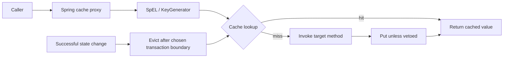
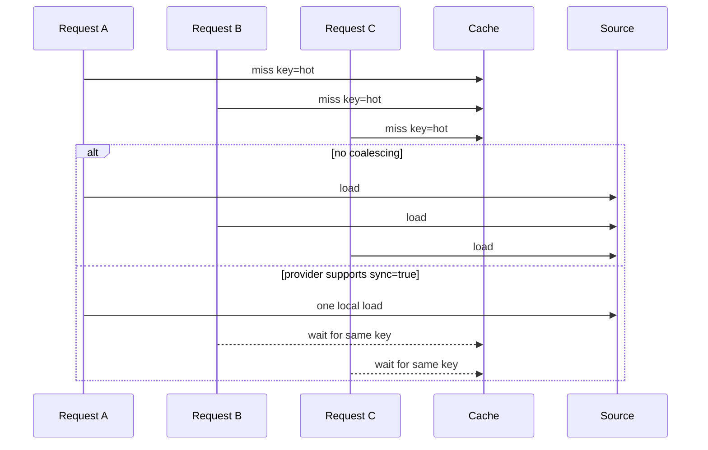

# Spring Cache Abstraction

<DocLabels items={[
  {label: 'Advanced', tone: 'advanced'},
  {label: 'Spring integration', tone: 'foundation'},
  {label: 'Production cache', tone: 'production'},
  {label: 'Shopverse evidence', tone: 'shopverse'},
]} />

Spring Cache adds method interception and a common `CacheManager`/`Cache` SPI. It
does not define provider topology, replication, eviction algorithms, or consistency.
Keep those decisions in the canonical cache architecture guides.

<TopicCards items={[
  {title: 'Cache architecture', href: '/architecture/CACHE-UMBRELLA', description: 'Choose cache level, ownership, consistency, keys, and invalidation.', icon: 'layers', tags: ['Canonical', 'Architecture']},
  {title: 'Provider selection', href: '/architecture/CACHE-PROVIDERS', description: 'Compare Caffeine, Redis, Memcached, and provider operational behavior.', icon: 'boxes', tags: ['Providers', 'Operations']},
  {title: 'Distributed and hybrid cache', href: '/architecture/DISTRIBUTED-HYBRID-CACHE', description: 'Design shared, near-cache, and multi-replica invalidation.', icon: 'network', tags: ['Distributed', 'Consistency']},
]} />

## Proxy And Provider Flow



`@EnableCaching` imports the infrastructure that detects cache annotations and
wraps eligible Spring beans. Calls through `this` bypass ordinary proxy interception.
Private methods and manually constructed instances are not cache-advised.

<DocCallout type="mistake" title="A cache annotation is inactive without a proxy call">

Move the cached operation to an appropriate collaborator. Do not hide self-proxy
lookups merely to make an annotation fire.

</DocCallout>

## Annotation And SpEL Boundary

```java
@Cacheable(
        cacheNames = "inventory",
        key = "#productId",
        condition = "#productId > 0",
        unless = "#result == null",
        sync = true
)
public InventoryResponse getByProductId(Long productId) { ... }
```

| Element | Evaluation point |
|---|---|
| `key` / `keyGenerator` | before lookup; defines identity |
| `condition` | before method invocation; decides whether caching applies |
| `unless` | after invocation; can veto storing `#result` |
| `cacheManager` / `cacheResolver` | selects provider/cache at runtime |
| `sync=true` | requests provider-supported same-key load synchronization |

Use explicit keys when tenant, locale, authorization scope, representation version,
or normalization affects the response. SpEL is code: keep expressions short and
test null, case, and parameter-name behavior. Use a `KeyGenerator` for shared rules.

## Boot 4 Provider Integration

```gradle
implementation 'org.springframework.boot:spring-boot-starter-cache'
implementation 'com.github.ben-manes.caffeine:caffeine'
```

When caching is enabled, Boot selects a provider from classpath/configuration or a
user-supplied `CacheManager`. Force the intended provider with `spring.cache.type`
rather than relying on an accidental dependency. The simple concurrent-map provider
is useful for learning/tests but has no production size or TTL policy.

```yaml
spring:
  cache:
    type: caffeine
    cache-names: catalog,orders
    caffeine:
      spec: maximumSize=500,expireAfterWrite=60s
```

TTL, maximum weight, serialization, distributed locks, and failure behavior are
provider capabilities, not portable Spring Cache semantics.

## Shopverse Current State

<DocCallout type="shopverse" title="Current implementation">

Order uses a bounded Caffeine manager for `catalog` and `orders`. `CatalogService`
caches its zero-argument catalog call under the default empty key and exposes a
programmatic clear. Inventory and Payment use `spring.cache.type=simple`, cache
individual reads, and broadly evict all entries after writes. These are current
facts, not a recommendation to use the simple provider in production.

</DocCallout>

The Catalog fallback throws an explicit unavailable response rather than caching an
empty authoritative-looking list. Inventory and Payment simple caches remain
per-replica and unbounded; replacing them with bounded Caffeine or a deliberately
designed shared provider is proposed hardening.

## Stampede, Hot Keys, And Memory



`sync=true` can coalesce same-key work only within the effective provider boundary.
A local Caffeine cache does not coordinate other replicas. For hot keys, combine
bounded coalescing with source bulkheads, jittered expiry or refresh policy, and a
truthful stale-data decision.

Measure entry count/weight, value size, hit/miss/load latency, evictions, and source
load. A high hit rate can still hide one oversized value, a hot key, or an unbounded
simple cache consuming heap.

## Transaction And Invalidation Timing

`@Transactional` does not make a database and cache one atomic resource. Cache
advice order and provider transaction awareness determine when put/evict occurs.
If correctness requires after-commit behavior, use a transaction-aware cache manager
or an explicit after-commit/domain-event invalidation and test rollback.

<DocCallout type="production" title="Current broad eviction needs evidence">

Inventory and Payment currently use `allEntries=true` on many writes. It avoids
some stale keys but creates miss bursts and does not coordinate replicas. Measure
source amplification and replace with key-specific or event-driven invalidation
only when the full affected-key set is known.

</DocCallout>

## Key And Serializer Migration

Version keys and serialized values during incompatible changes:

```text
catalog:v1:all
catalog:v2:all
payment:v2:{orderNumber}
```

Deploy readers that tolerate old/new values, dual-read or dual-write only for a
bounded window, warm the new namespace, switch traffic, then expire the old data.
Never change a Redis serializer in place while old entries remain unreadable.

Include tenant and authorization scope in the key when they change the result.
Never cache secrets, raw tokens, or mutable JPA entities.

## Outage Behavior

Define per cache whether provider failure should fall through to the source, reject
to protect the source, serve a bounded stale value, or fail closed. Keep cache
timeouts far below the request deadline and prevent retries from turning a cache
outage into a database outage.

Order's local Caffeine provider has no network outage mode, but an empty cache plus
Inventory outage returns an explicit unavailable response. A future Redis design
must define its own failure handler; it is not current Shopverse behavior.

## Test Evidence

- invoke a proxied bean twice and prove one source call;
- prove self-invocation/manual construction does not activate caching;
- assert key isolation for tenant, case, locale, and representation version;
- run concurrent same-key misses and measure source calls;
- roll back a write and prove cache state remains correct;
- test TTL/eviction/serialization with the real provider;
- inject provider failure and measure source protection;
- compare heap/source load before and after configuration changes.

Current `CatalogServiceTest` directly constructs the service and verifies manual
clear and truthful fallback. It does not prove annotation or multi-aspect ordering;
add a Spring proxy integration test for that behavior.

## Interview Questions

<ExpandableAnswer title="Why can @Cacheable appear to do nothing during a unit test?">

The test may construct the class directly or invoke a self-call, so no Spring cache
proxy intercepts the method. Test annotation behavior with a proxied Spring bean.

</ExpandableAnswer>

<ExpandableAnswer title="What does sync=true protect in a multi-replica service?">

Only the synchronization scope implemented by the selected cache provider. With a
local cache it coalesces within one process, not across replicas.

</ExpandableAnswer>

<ExpandableAnswer title="Why can allEntries eviction cause a production spike?">

Every key becomes a miss at once, so concurrent requests reload the source and can
overwhelm its database or remote dependency.

</ExpandableAnswer>

<ExpandableAnswer title="Why is cache eviction on a transactional method not automatically after commit?">

Cache and transaction advice are separate, and the provider may not be
transaction-aware. Verify advisor ordering or schedule invalidation explicitly
after successful commit.

</ExpandableAnswer>

<ExpandableAnswer title="How do you migrate a Redis cache value schema safely?">

Use a versioned namespace/serializer, deploy tolerant readers, warm or dual-read for
a bounded window, switch traffic, and expire old entries after rollback closes.

</ExpandableAnswer>

<ExpandableAnswer title="Why can an unbounded simple cache fail even with a high hit rate?">

Hit rate says nothing about entry count, value size, or retained heap. Without size
or TTL bounds, the cache can grow until memory pressure dominates.

</ExpandableAnswer>

## Official References

- [Spring Framework cache abstraction](https://docs.spring.io/spring-framework/reference/integration/cache.html)
- [Spring cache annotations](https://docs.spring.io/spring-framework/reference/integration/cache/annotations.html)
- [Spring Boot 4 caching](https://docs.spring.io/spring-boot/4.0/reference/io/caching.html)

## Recommended Next

Use [Cache Architecture](../architecture/CACHE-UMBRELLA.md) for provider/topology
decisions, then review [Spring Resilience4j](./SPRING-RESILIENCE4J.md) for source
protection during cache misses and outages.
