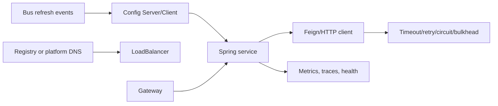

# Spring Cloud Architect Learning Path

Spring Cloud is a family of integrations for distributed-system concerns, not one runtime
and not a replacement for understanding networking, consistency, or Kubernetes.

## Component Selection

| Need | Spring Cloud option | Alternative/constraint |
|---|---|---|
| centralized versioned configuration | Config Server/Client | platform-native ConfigMaps/secrets plus rollout controller |
| JVM service registry | Netflix Eureka integration | Kubernetes DNS/service or cloud registry |
| choose instance client-side | Spring Cloud LoadBalancer | server/proxy/service-mesh load balancing |
| declarative HTTP client | OpenFeign | RestClient/WebClient with explicit adapter |
| circuit/retry abstraction | Spring Cloud CircuitBreaker | direct Resilience4j for deeper control |
| API edge routing | Spring Cloud Gateway | managed gateway/ingress/service mesh |
| broadcast refresh signal | Spring Cloud Bus | immutable restart/rollout model |
| event application abstraction | Spring Cloud Stream | canonical [event-streaming path](../integration/EVENT-STREAMING-APPLICATION-PATH.md) |

## Complete Route

1. [Config Server, Config Client, Refresh, And Secrets](./cloud/SPRING-CLOUD-CONFIG.md)
2. [Discovery, LoadBalancer, OpenFeign, And HTTP Failure Semantics](./cloud/SPRING-CLOUD-DISCOVERY-CLIENTS.md)
3. [Circuit Breaker, Gateway, Resilience Composition, And Capacity](./cloud/SPRING-CLOUD-RESILIENCE-GATEWAY.md)
4. [Config Data, LoadBalancer, And Gateway Internals](./cloud/SPRING-CLOUD-RUNTIME-INTERNALS.md)
5. [Spring Cloud Kubernetes And Contract](./cloud/SPRING-CLOUD-KUBERNETES-CONTRACT.md)
6. [Optional Ecosystem Selection And Governance](./cloud/SPRING-CLOUD-ECOSYSTEM-GOVERNANCE.md)
7. [Bus, Security, Observability, Kubernetes, Upgrades, And Operations](./cloud/SPRING-CLOUD-OPERATIONS.md)
8. [Architect Interviews, Production Scenarios, Labs, And Revision](./cloud/SPRING-CLOUD-INTERVIEW-REVISION.md)

## Existing Focused Guides

- [Spring OpenFeign](./SPRING-OPENFEIGN.md)
- [Advanced Spring Cloud Gateway](../development/SPRING-CLOUD-GATEWAY-ADVANCED.md)
- [Spring Cloud Stream And Kafka Application Path](../integration/EVENT-STREAMING-APPLICATION-PATH.md)
- [Resilience4j Engineering](../reliability/RESILIENCE4J-GENERIC.md)

## Compatibility Rule

Select a Spring Cloud release train compatible with the Spring Boot generation, import its
BOM, and validate component support before overriding transitive versions. Compatibility
is a platform decision and should be automated in build/test evidence.

## Completion Standard

You are ready when you can explain startup with unavailable config/registry, configuration
precedence and refresh safety, instance selection and retry multiplication, circuit/bulkhead
capacity, gateway trust boundaries, credential rotation, zero-downtime changes, Kubernetes
alternatives, and incident diagnosis across client, platform, and downstream service.

## Official References

- [Spring Cloud reference](https://docs.spring.io/spring-cloud/docs/current/reference/html/)
- [Spring Cloud projects](https://spring.io/projects/spring-cloud)
- [Spring Cloud supported versions](https://github.com/spring-cloud/spring-cloud-release/wiki/Supported-Versions)

## Recommended Next

Begin with [Config Server, Config Client, Refresh, And Secrets](./cloud/SPRING-CLOUD-CONFIG.md).
