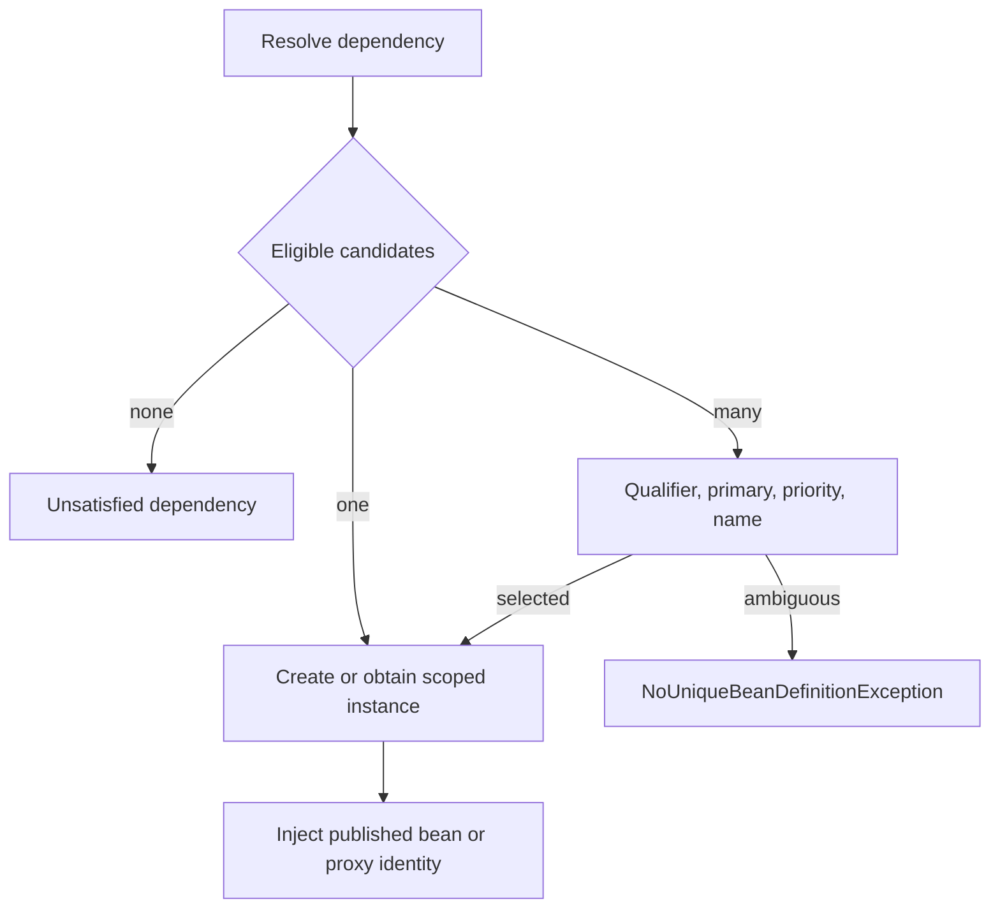

# Spring Container Runtime For Architects

<DocLabels items={[
  {label: 'Architect', tone: 'advanced'},
  {label: 'Container runtime', tone: 'advanced'},
  {label: 'Production diagnostics', tone: 'production'},
  {label: 'Executable evidence', tone: 'intermediate'},
]} />

The container is a staged object factory, not annotation magic. A useful
production explanation identifies whether a failure occurred while discovering
metadata, changing definitions, resolving dependencies, creating an instance,
running lifecycle callbacks, replacing the instance with a proxy, or starting
runtime infrastructure.

<DocCallout type="production" title="Do not force application beans into existence from infrastructure code">
Creating a normal bean while factory or post-processor infrastructure is still
being registered can make it ineligible for later processors, including proxy
creators. Treat premature creation warnings as correctness failures, not harmless
startup noise.
</DocCallout>

## Context Refresh Is An Ordered Protocol


`ApplicationContext.refresh()` coordinates phases with different extension
contracts. The exact implementation contains more steps, but this model is
precise enough for design and incident review:

| Phase | Primary work | Typical failure evidence |
|---|---|---|
| prepare | validate environment and initialize early listeners | missing property, profile, or bootstrap configuration |
| create/prepare factory | obtain the `BeanFactory`, load and merge definitions | duplicate name, invalid metadata, class-loading failure |
| invoke factory post-processors | add or mutate definitions before ordinary instances exist | ordering error, premature bean creation |
| register bean post-processors | install instance lifecycle and proxy infrastructure | bean not eligible for all processors |
| initialize infrastructure | message source, event multicaster, listeners | missing infrastructure dependency |
| create non-lazy singletons | resolve, instantiate, initialize, and possibly proxy beans | unsatisfied dependency, cycle, callback failure |
| finish refresh | start lifecycle components and publish completion events | listener/container startup or readiness failure |

Ordering follows `PriorityOrdered`, then `Ordered`, then unordered processors.
Incidental component-scan order is not a contract. A
`BeanDefinitionRegistryPostProcessor` may add definitions; a
`BeanFactoryPostProcessor` changes definitions; a `BeanPostProcessor` acts on
instances before and after initialization and may return a replacement object.

```java
@Component
final class TimingPostProcessor implements BeanPostProcessor {
    @Override
    public Object postProcessAfterInitialization(Object bean, String beanName) {
        return bean; // an auto-proxy creator may return a proxy here
    }
}
```

## Per-Bean Creation And Published Identity


The object constructed by a factory method is not necessarily the object that
callers receive. Per-bean creation normally includes:

1. resolve the merged definition and choose a constructor or factory method;
2. instantiate the raw object;
3. populate dependencies and properties;
4. invoke aware callbacks;
5. run before-initialization post-processors;
6. run `@PostConstruct`, `InitializingBean`, and configured init methods;
7. run after-initialization post-processors, which may publish a proxy;
8. cache the final singleton identity;
9. invoke owned destruction callbacks when the scope ends.

Code must depend on the published container identity, not retain a raw reference
captured during construction. `FactoryBean` adds another identity distinction:
the bean name normally resolves to its product, while `&beanName` addresses the
factory itself.

## Dependency Resolution, Scopes, And Early References

Resolution considers the required type and generic type, qualifiers, `@Primary`,
priority, name fallback, optional/provider semantics, and collection ordering.
Constructor injection makes mandatory dependencies and cycles visible. An
`ObjectProvider<T>` is appropriate when deferred or repeated resolution is part
of the ownership model, not as a general service locator.



Scopes express ownership:

| Scope | Ownership implication |
|---|---|
| singleton | one published instance per container |
| prototype | container creates and initializes; the caller owns later cleanup |
| request/session | web scope owns the instance for that boundary |
| custom | the custom scope must define lookup, destruction, and context transfer |

Injecting a shorter-lived object directly into a singleton resolves it once.
Use a provider or scoped proxy only when fresh lookup is intentional and tested.

Spring can expose an early singleton reference for some setter/field cycles.
That reference must agree with the final advised identity, which makes cycles
especially risky around proxy creation. Constructor cycles cannot be constructed
because neither required object exists first. Prefer a coordinator, event, narrower
interface, or explicit deferred boundary instead of enabling circular references.

## Lifecycle Ownership And Readiness

Initialization is not readiness. `SmartInitializingSingleton` runs after regular
singleton creation, while `SmartLifecycle` participates in ordered start and stop.
Application runners and readiness events occur later in Boot's startup protocol.
Long remote calls in constructors or `@PostConstruct` consume the startup budget,
hide retry policy, and make graceful failure difficult.

For each component, define:

- who starts it and when traffic may reach it;
- whether failure prevents readiness or degrades an optional capability;
- who stops it and in which phase;
- how in-flight work is drained or relinquished;
- which metric or event proves each transition.

Parent and child application contexts also have distinct singleton namespaces.
A bean visible through a parent is not the same ownership boundary as a bean
defined in the child, and post-processors do not automatically operate across
both factories.

## Boot Auto-Configuration And Back-Off

Boot discovers auto-configuration imports and evaluates conditions on classes,
beans, properties, resources, web application type, and environment state.
Configuration-class conditions can run during parsing or bean-registration phases;
ordering auto-configuration does not impose ordinary bean initialization order.

`@ConditionalOnMissingBean` is a back-off contract. Supplying an application bean
does not merely tweak the default—it transfers responsibility for the complete
capability and its production configuration.

Use these sources of evidence:

- the condition evaluation report or Actuator `conditions` endpoint;
- the Actuator `beans` endpoint in an appropriately secured environment;
- configuration-properties binding and validation errors;
- startup steps through `ApplicationStartup` and JFR startup recording;
- focused `ApplicationContextRunner` tests for match, back-off, and failure cases.

## AOT And Native-Image Boundary

AOT processing shifts work from runtime discovery toward generated metadata.
Reflection, resource access, dynamic proxies, and serialization may require
runtime hints. An architect should verify that custom starters and post-processors
work both in normal JVM startup and in the selected AOT/native mode rather than
assuming runtime classpath scanning will remain available.

Keep build-time and runtime claims separate: faster startup is useful only when
configuration behavior, diagnostics, and rollback remain supportable.

## Shopverse Failure Walkthrough

Assume an inventory application supplies a custom `DataSource` bean. Boot's
default backs off, but startup later fails while creating JPA infrastructure.
A strong investigation does not conclude that auto-configuration is broken:

1. confirm the custom definition and the exact missing-bean condition outcome;
2. inspect which properties the replacement consumed and validated;
3. trace the dependency failure from JPA infrastructure back to the replacement;
4. compare pool, driver, health-check, metrics, and shutdown behavior with the
   responsibilities previously supplied by auto-configuration;
5. reproduce the back-off and failure with an isolated context test.

The design decision is whether to own the entire replacement or customize the
supported default through properties or a narrower extension point.

## Diagnostic Playbook

| Symptom | First checks | Evidence that closes the diagnosis |
|---|---|---|
| advice missing | bean ownership, proxy identity, creation timing | proxy/advisor inspection and processor eligibility logs |
| ambiguous dependency | candidate types, qualifiers, generics, priorities | isolated context failure with candidate report |
| unexpected raw instance | early creation, manual `new`, retained factory reference | identity comparison and creation trace |
| startup is slow | startup steps, constructors, init callbacks, migrations | JFR/startup-step duration attributed to an owner |
| auto-config absent | imports, classpath, properties, missing-bean conditions | condition evaluation report |
| shutdown leaks work | scope ownership and lifecycle phase | bounded shutdown test plus thread/resource evidence |

## Executable Lab

Create a small test configuration with a registry post-processor, factory
post-processor, bean post-processor, proxied service, prototype dependency, and
conditional auto-configuration. Record callbacks rather than relying on log order.

```java
new ApplicationContextRunner()
        .withUserConfiguration(LabConfiguration.class)
        .withPropertyValues("lab.feature.enabled=true")
        .run(context -> {
            assertThat(context).hasSingleBean(LabService.class);
            assertThat(AopUtils.isAopProxy(context.getBean(LabService.class)))
                    .isTrue();
            assertThat(context.getStartupFailure()).isNull();
        });
```

Run variants for a missing dependency, two candidates, a user-bean back-off,
premature creation, a constructor cycle, and context close. Preserve the JDK,
Spring versions, property set, ordered callback trace, condition report, and the
rejected explanation.

## Tricky Interview Questions

<ExpandableAnswer title="Why can a Spring bean miss AOP advice?">

The object may have been created with `new`, instantiated too early before the
complete post-processor chain, or invoked without crossing an eligible proxy
method. Prove which case applies by checking container ownership, published
identity, proxy/advisor inspection, call site, and processor eligibility logs.

</ExpandableAnswer>

<ExpandableAnswer title="Does prototype scope receive automatic destruction?">

Spring creates, populates, and initializes a prototype but does not generally
track it through final destruction. The client that obtains the instance owns
resource cleanup. A prototype injected directly into a singleton is also resolved
only once unless a provider or scoped proxy performs later lookup.

</ExpandableAnswer>

<ExpandableAnswer title="Why do constructor dependency cycles fail?">

Each constructor requires the other completed dependency before either instance
exists. Early singleton exposure cannot supply an object before construction.
The preferred fix is a responsibility change—coordinator, event, narrower
interface, or explicit deferred lookup—not field injection.

</ExpandableAnswer>

<ExpandableAnswer title="Can a BeanPostProcessor return a different object?">

Yes. The after-initialization result may be a proxy or another wrapper, and that
published identity is what later callers must use. Retaining the raw instance can
bypass advice and create inconsistent identity or lifecycle behavior.

</ExpandableAnswer>

## Official References

- [Spring Framework container extension points](https://docs.spring.io/spring-framework/reference/core/beans/factory-extension.html)
- [Spring Framework bean lifecycle callbacks](https://docs.spring.io/spring-framework/reference/core/beans/factory-nature.html)
- [Spring Framework bean scopes](https://docs.spring.io/spring-framework/reference/core/beans/factory-scopes.html)
- [Spring Boot auto-configuration](https://docs.spring.io/spring-boot/reference/using/auto-configuration.html)
- [Spring Boot application startup tracking](https://docs.spring.io/spring-boot/reference/features/spring-application.html#features.spring-application.application-startup-tracking)
- [Spring Boot testing auto-configuration](https://docs.spring.io/spring-boot/reference/features/developing-auto-configuration.html#features.developing-auto-configuration.testing)

## Recommended Next

Continue with [Spring Proxy And Transaction Runtime For Architects](./SPRING-PROXY-TRANSACTION-ARCHITECT.md).
