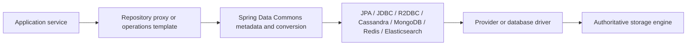

# Spring Data Architect Learning Path

Spring Data is a family of store-specific projects built on shared repository, mapping,
conversion, auditing, paging, and lifecycle infrastructure. It reduces adapter code; it
does not erase the database's consistency, query, transaction, indexing, or capacity model.

## Start With The Decision

| Requirement | Likely starting point | Critical warning |
|---|---|---|
| rich relational aggregates and change tracking | JPA/Hibernate | fetch plans and persistence-context behavior must be owned |
| explicit relational SQL and aggregate persistence | Spring Data JDBC | no lazy loading or dirty checking |
| end-to-end non-blocking relational pipeline | R2DBC | blocking work destroys the execution model |
| query-first, partitioned wide-column workloads | Cassandra | model tables from access paths, not entities |
| document aggregates and flexible shape | MongoDB | document growth, indexes and shard keys remain design decisions |
| cache, ephemeral state, counters or streams | Redis | durability and eviction may make it unsuitable as authority |
| text search and relevance | Elasticsearch | source-of-truth and index-rebuild strategy are required |

## Complete Route

1. [Spring Data Commons Internals](./data/SPRING-DATA-COMMONS-INTERNALS.md)
2. [Repositories, Queries, Paging, Auditing, And Events](./data/SPRING-DATA-REPOSITORIES-PAGING-AUDITING.md)
3. [Spring Data JPA](./SPRING-DATA-JPA.md)
4. [Spring Data JDBC](./data/SPRING-DATA-JDBC.md)
5. [Spring Data R2DBC](./data/SPRING-DATA-R2DBC.md)
6. [Spring Data Cassandra](./SPRING-DATA-CASSANDRA.md)
7. [Spring Data MongoDB](./data/SPRING-DATA-MONGODB.md)
8. [Spring Data Redis](./data/SPRING-DATA-REDIS.md)
9. [Spring Data Elasticsearch](./data/SPRING-DATA-ELASTICSEARCH.md)
10. [Multi-Store Consistency And Schema Evolution](./data/SPRING-DATA-MULTISTORE-CONSISTENCY.md)
11. [Testing, Observability, Capacity, And Incidents](./data/SPRING-DATA-TESTING-OPERATIONS.md)
12. [Optional Modules And Adjacent Tools](./data/SPRING-DATA-OPTIONAL-MODULES.md)
13. [Interview, Labs, And Revision](./data/SPRING-DATA-INTERVIEW-REVISION.md)

Run the compiled [Spring Data Repository Internals Lab](./architect-labs/SPRING-DATA-REPOSITORY-INTERNALS-LAB.md)
after the first two chapters and repeat it after JPA to compare your initial and final explanations.
Then run the real-engine [PostgreSQL JPA Performance And Concurrency Lab](./architect-labs/POSTGRES-JPA-PERFORMANCE-LAB.md)
to replace framework assumptions with query-plan, pool, lock and SQLSTATE evidence.
Complete the [Transactional Outbox, Inbox, And CDC Lab](./architect-labs/TRANSACTIONAL-OUTBOX-INBOX-CDC-LAB.md)
before claiming database-to-broker consistency or replay-safe consumer expertise.

## API Selection Rule

Repositories are useful for stable aggregate access. Use a template, criteria API, client,
or explicit adapter when the query requires store-specific control. Hiding a costly query
behind a friendly repository name does not make it safe.

Keep domain code behind a persistence port when datastore replacement, dual-running, or
contract testing is plausible. Do not create a lowest-common-denominator abstraction that
removes useful store capabilities.

## Completion Standard

You are ready when you can trace repository creation and query execution, explain mapping
and conversion, select imperative or reactive access deliberately, design transactions and
idempotency, calculate connection/concurrency limits, evolve schemas and indexes safely,
test against real engines, diagnose latency or data anomalies, and defend why a particular
store and API were selected.

## Official References

- [Spring Data Commons reference](https://docs.spring.io/spring-data/commons/reference/)
- [Spring Boot data access](https://docs.spring.io/spring-boot/reference/data/)
- [Spring Data projects](https://spring.io/projects/spring-data)

## Recommended Next

Begin with [Spring Data Commons Internals](./data/SPRING-DATA-COMMONS-INTERNALS.md).
