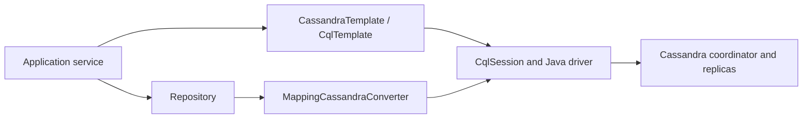

# Spring Data Cassandra Learning Path

This store-specific track is part of the
[Spring Data Architect Learning Path](./SPRING-DATA-ARCHITECT-PATH.md). Spring Data
Commons explains repository creation and mapping infrastructure shared with other modules;
the pages here preserve Cassandra-specific query, consistency, and driver behavior.

Spring Data Cassandra reduces driver and mapping boilerplate; it does not turn
Cassandra into JPA. The table model, partition key, clustering restrictions,
consistency, idempotency, paging, repair, and compaction remain Cassandra decisions.

Complete [Apache Cassandra Architect Learning Path](../data/CASSANDRA-ARCHITECT-PATH.md)
first or alongside this track.



## Route

1. [Configuration, Mapping, Repositories, And Templates](./cassandra/SPRING-CASSANDRA-MAPPING-REPOSITORIES.md)
2. [Reactive, Consistency, Testing, And Production](./cassandra/SPRING-CASSANDRA-PRODUCTION-REACTIVE-TESTING.md)
3. [Advanced Driver, LWT, Data Types, And Multi-Datacenter Behavior](./cassandra/SPRING-CASSANDRA-ADVANCED-DRIVER.md)
4. [Cassandra Interview, Labs, And Revision](../data/cassandra/CASSANDRA-INTERVIEW-LABS-REVISION.md)

## API Selection

| API | Use when |
|---|---|
| `CassandraRepository` | stable aggregate CRUD and primary-key-derived queries |
| `CassandraTemplate` | mapped queries/mutations need explicit control |
| `CqlTemplate` | direct CQL, counters, batches, or row extraction is clearer |
| async variants | driver futures fit the application contract |
| reactive variants | the entire request pipeline is reactive and backpressure-aware |
| `CqlSession` | a driver feature is not exposed suitably by higher abstractions |

Prefer the narrowest interface that expresses the access pattern without hiding
query or consistency cost. Do not force every operation through repositories.

## Dependency Management

Use the starter/dependencies managed by the Spring Boot platform selected by the
project. Do not force unrelated Spring Data or Java-driver versions.

```xml
<dependency>
  <groupId>org.springframework.boot</groupId>
  <artifactId>spring-boot-starter-data-cassandra</artifactId>
</dependency>
```

For reactive access:

```xml
<dependency>
  <groupId>org.springframework.boot</groupId>
  <artifactId>spring-boot-starter-data-cassandra-reactive</artifactId>
</dependency>
```

Choose the imperative or reactive execution model from the complete application
stack. Adding the reactive starter does not make blocking controllers or downstream
calls non-blocking.

## Architectural Rules

- Design CQL tables before Java entities.
- Keep one repository/template method per known access pattern.
- Never introduce `ALLOW FILTERING` to satisfy a derived method.
- Bound every partition, page, batch, retry, and concurrency path.
- Set consistency intentionally by workload/profile where defaults are insufficient.
- Make retries and business effects idempotent.
- Manage schema through reviewed CQL migrations, not application auto-creation in production.
- Test real Cassandra behavior; mocks cannot prove CQL, tokens, paging, or consistency.

## Completion Standard

You should be able to map composite keys, implement repositories and templates,
choose imperative/reactive APIs, configure TLS/authentication and execution
profiles, propagate paging state safely, test with containers, expose metrics,
diagnose driver/cluster failures, and explain why no Spring annotation provides a
relational transaction across Cassandra partitions.

## Official References

- [Spring Data for Apache Cassandra reference](https://docs.spring.io/spring-data/cassandra/reference/)
- [Spring Boot Cassandra support](https://docs.spring.io/spring-boot/reference/data/nosql.html#data.nosql.cassandra)
- [Apache Cassandra documentation](https://cassandra.apache.org/doc/latest/)

## Recommended Next

Begin with [Configuration, Mapping, Repositories, And Templates](./cassandra/SPRING-CASSANDRA-MAPPING-REPOSITORIES.md).
