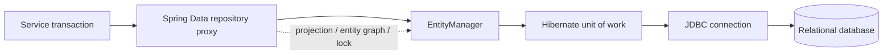

# Spring Data JPA

This store-specific track is part of the
[Spring Data Architect Learning Path](./SPRING-DATA-ARCHITECT-PATH.md). Complete the
shared Commons internals first when preparing for lead or architect interviews.

<DocLabels items={[
  {label: 'Intermediate', tone: 'intermediate'},
  {label: 'Canonical route', tone: 'foundation'},
  {label: 'Production data', tone: 'production'},
  {label: 'Shopverse evidence', tone: 'shopverse'},
]} />

Spring Data JPA supplies repository composition, query derivation, projections,
specifications, auditing integration, and transaction participation. Hibernate is
the ORM provider used by Shopverse, but its object lifecycle and mapping internals
have a separate canonical home in [Hibernate](../data/HIBERNATE.md).

<DocCallout type="production" title="The repository is not the data boundary">

A repository method can generate a query, but the service transaction owns the
business invariant. Generated SQL, indexes, locks, connection capacity, and schema
compatibility still determine whether the operation is correct in production.

</DocCallout>

## Focused Pages

- [Advanced Repositories, Routing, Multi-Tenancy, Envers, And OSIV](./jpa/JPA-ADVANCED-REPOSITORIES-ROUTING.md)

<TopicCards items={[
  {title: 'Entity integration', href: '/spring/jpa/JPA-BASICS-ENTITY-MAPPING', description: 'Connect the Spring repository model to deliberate entity and schema contracts.', icon: 'layers', tags: ['Entities', 'Schema']},
  {title: 'Associations and ownership', href: '/spring/jpa/JPA-RELATIONSHIPS-JSON', description: 'Define the owning side, aggregate mutation rules, cascades, and fetch boundaries.', icon: 'network', tags: ['Ownership', 'Cascades']},
  {title: 'Repositories and queries', href: '/spring/jpa/JPA-REPOSITORIES-QUERIES', description: 'Choose derived queries, JPQL, projections, specifications, and safe sorting.', icon: 'code', tags: ['Queries', 'Projections']},
  {title: 'Fetching and evidence', href: '/spring/jpa/JPA-FETCHING-PERFORMANCE', description: 'Control query shape and prove N+1, pagination, and batching behavior.', icon: 'gauge', tags: ['N+1', 'SQL evidence']},
  {title: 'Transactions and locking', href: '/spring/jpa/JPA-TRANSACTIONS-LOCKING', description: 'Protect invariants with transaction boundaries, versions, locks, and conditional updates.', icon: 'security', tags: ['Concurrency', 'Outbox']},
  {title: 'Auditing and deletes', href: '/spring/jpa/JPA-AUDITING-DELETING-TESTING', description: 'Populate audit metadata and choose entity, bulk, archive, or soft-delete semantics.', icon: 'book', tags: ['Auditing', 'Deletion']},
]} />

## Ownership Boundary

| Question | Canonical guide |
|---|---|
| How does Spring create and compose repository proxies? | This Spring Data JPA track |
| Which query abstraction should a repository expose? | [Repositories And Queries](./jpa/JPA-REPOSITORIES-QUERIES.md) |
| What are managed, detached, and removed states? | [Hibernate Basics And Lifecycle](../data/hibernate/HIBERNATE-BASICS-LIFECYCLE.md) |
| How does Hibernate dirty checking become SQL? | [Persistence Runtime For Architects](./SPRING-JPA-HIBERNATE-ARCHITECT.md) |
| How should HTTP JSON be isolated from entities? | [HTTP Message Conversion And Jackson](./web/HTTP-MESSAGE-CONVERSION-JACKSON.md) |

## Shopverse Current State

<DocCallout type="shopverse" title="Current implementation">

Order and User repositories declare entity graphs for known read paths. User and
Role repositories also expose `JpaSpecificationExecutor`; Inventory protects stock
with `@Version`; and domain services persist state plus outbox rows in one database
transaction. These are current repository-backed patterns, not a claim that every
query or migration is already optimal.

</DocCallout>

## Production Completion Standard

Before approving a repository change, require:

1. the business invariant and transaction owner;
2. the intended query and fetch shape;
3. indexes and expected cardinality;
4. timeout, lock, and connection-pool behavior;
5. an expand-and-contract schema rollout when compatibility spans deployments;
6. integration evidence from the production database engine;
7. a rollback that remains valid after old and new application versions overlap.

## Locking And Concurrency

The former landing-page anchor remains here for compatibility. Canonical coverage
is in [JPA Transactions Locking And Concurrency](./jpa/JPA-TRANSACTIONS-LOCKING.md).

## Interview Check

<ExpandableAnswer title="Why is a JpaRepository method not automatically a business transaction?">

Repository methods have transactional behavior for their own operation, but a
business invariant often spans several reads, writes, and an outbox insert. Put the
boundary on the service operation that owns the complete invariant.

</ExpandableAnswer>

<ExpandableAnswer title="When should a Spring Data page link to Hibernate rather than repeat it?">

Link when the subject is provider lifecycle, dirty checking, proxy behavior, or
generic mapping mechanics. Keep the Spring page focused on repository composition,
query declarations, transaction integration, and framework-specific evidence.

</ExpandableAnswer>

<ExpandableAnswer title="What evidence should accompany a new repository query?">

Capture generated SQL and bind values safely, inspect the execution plan with
representative cardinality, verify query count and result shape, and test timeouts
and concurrency against the production database engine.

</ExpandableAnswer>

## Official References

- [Spring Data JPA reference](https://docs.spring.io/spring-data/jpa/reference/)
- [Spring Framework transaction management](https://docs.spring.io/spring-framework/reference/data-access/transaction.html)
- [Hibernate ORM user guide](https://docs.hibernate.org/orm/current/userguide/html_single/)

## Recommended Next

Start with [Entity Integration](./jpa/JPA-BASICS-ENTITY-MAPPING.md), or use
[Persistence Runtime For Architects](./SPRING-JPA-HIBERNATE-ARCHITECT.md) for the
complete runtime synthesis.
