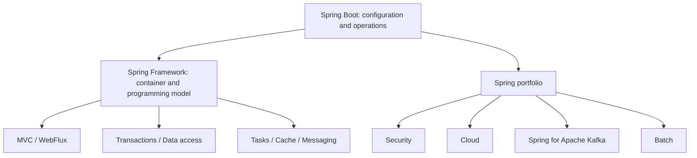

# Spring Ecosystem

<DocLabels items={[
  {label: 'Foundation', tone: 'foundation'},
  {label: 'Spring Boot 4', tone: 'intermediate'},
  {label: 'Shopverse context', tone: 'shopverse'},
]} />



<DocCallout type="production" title="Know which layer owns the behavior">

Spring Boot selects and configures infrastructure; Spring Framework executes the container,
web and transaction mechanisms; portfolio projects add their own runtime semantics. A
condition report, proxy inspection or broker/database trace is usually more useful than
describing all of this as “Boot magic”.

</DocCallout>

## Why Spring?

Spring solves common enterprise application problems so every service does not
need to rebuild the same infrastructure by hand.

It provides:

- dependency injection and inversion of control;
- declarative transactions;
- web MVC and REST support;
- validation and type conversion;
- security integration;
- data access abstractions;
- cache abstraction;
- messaging and integration support;
- testing support;
- observability hooks;
- cloud-native configuration and discovery integrations.

Without Spring, application code usually contains more manual object creation,
transaction handling, servlet plumbing, security wiring, configuration parsing,
and repeated infrastructure code.

## Spring Framework

Spring Framework provides the core programming model:

- inversion of control and dependency injection;
- bean lifecycle and scopes;
- AOP proxies;
- transaction abstraction;
- Spring MVC and WebFlux;
- validation and conversion;
- integration and testing support.

```java
@Service
@RequiredArgsConstructor
class InventoryService {
    private final InventoryRepository repository;
}
```

Spring creates the service bean, resolves the repository dependency, applies
eligible proxies, and manages its lifecycle.

## Spring Boot

Spring Boot builds on Spring Framework. It does not replace Spring; it makes
Spring applications easier to create, configure, run, package, and operate.

Spring Boot adds conventions and production-oriented auto-configuration:

- starter dependencies;
- conditional auto-configuration;
- externalized configuration;
- embedded servlet server;
- Actuator;
- structured logging and observability integration;
- executable JAR packaging.

## Why Spring Boot Over Plain Spring Framework?

| Plain Spring Framework | Spring Boot |
|---|---|
| more manual dependency selection | starter dependencies |
| more manual XML/Java configuration | auto-configuration |
| external servlet container often required | embedded Tomcat/Jetty/Undertow |
| production endpoints need custom setup | Actuator |
| config patterns are manual | externalized configuration and profiles |
| packaging varies by project | executable JAR conventions |

Spring Boot is the usual choice for microservices because it gives a consistent
application model, faster setup, easier local runs, and stronger production
defaults.

Spring also provides the
[Spring Expression Language (SpEL)](SPRING-SPEL.md) for small declarative
expressions in configuration injection, method security, caching, event
listeners, scheduling, and supported Spring Data features.

## Important Spring Boot Features

| Feature | Why it matters |
|---|---|
| `@SpringBootApplication` | entry point combining configuration, scanning, and auto-configuration |
| starters | curated dependency sets for web, JPA, security, Kafka, actuator |
| auto-configuration | creates infrastructure beans when conditions match |
| externalized config | reads properties from files, env vars, config server, command line |
| profiles | environment-specific configuration |
| embedded server | run service as a self-contained app |
| Actuator | health, metrics, info, readiness/liveness endpoints |
| Micrometer | vendor-neutral metrics/tracing facade |
| testing support | slice tests, Spring context tests, MockMvc, Testcontainers integration |
| devtools | development-time restart support |

Shopverse is pinned to Boot `4.0.6`. Use the
[Boot 4 And Framework 7 guide](./SPRING-BOOT-4-FRAMEWORK-7.md) before copying examples
from a different framework generation.

```java
@SpringBootApplication
public class OrderServiceApplication {
    public static void main(String[] args) {
        SpringApplication.run(OrderServiceApplication.class, args);
    }
}
```

`@SpringBootApplication` combines configuration, component scanning, and
auto-configuration enablement. See
[Spring Boot internals](../development/SPRING-BOOT-INTERNALS.md) for the full
startup and request lifecycle.

## Spring Web And REST

Spring MVC uses `DispatcherServlet` as the front controller:

```text
HTTP request
  -> servlet filters
  -> DispatcherServlet
  -> HandlerMapping
  -> controller
  -> service
  -> HttpMessageConverter/Jackson
  -> HTTP response
```

Controllers should translate HTTP contracts and delegate business behavior:

```java
@PostMapping("/checkout")
ResponseEntity<OrderResponse> checkout(
        @Valid @RequestBody CheckoutRequest request
) {
    return ResponseEntity.status(HttpStatus.CREATED)
            .body(orderService.checkout(request));
}
```

## Spring Data

Spring Data generates repository implementations from interfaces and method
signatures:

```java
interface OrderRepository extends JpaRepository<OrderEntity, Long> {
    Optional<OrderEntity> findWithItemsByIdempotencyKey(String key);
}
```

The abstraction does not remove the need to understand SQL, indexes, fetching,
transactions, and locking. See [Spring Data JPA](SPRING-DATA-JPA.md).

## Spring Security

Spring Security runs through filter chains before controller invocation. It
supports authentication providers, bearer JWT decoding, authorization rules,
method-security proxies, and security context propagation.

Shopverse uses:

- Basic authentication for a narrowly scoped internal credential endpoint;
- RSA-signed JWT bearer tokens for external and service API authorization;
- JWKS for public-key distribution;
- method-level roles, permissions, and ownership checks.

## Spring Cloud

| Module | Shopverse use |
|---|---|
| Config | load centralized service configuration |
| Netflix Eureka | register and discover service instances; see the dedicated [Service Discovery](../architecture/SERVICE-DISCOVERY.md) guide |
| LoadBalancer | select an instance for logical service names |
| OpenFeign | declarative synchronous service clients |
| Gateway | route and protect external requests |

Advanced production topics are documented separately:

- [Advanced Spring Cloud Gateway](../development/SPRING-CLOUD-GATEWAY-ADVANCED.md)
  covers filter factories, Redis-backed rate limiting, circuit-breaker filters,
  retries, fallbacks, and operational behavior;
- [Spring Boot production tuning](../development/spring-boot-internals/PRODUCTION-TUNING.md)
  covers startup measurement, JVM/container memory, connection pools,
  concurrency, graceful shutdown, and capacity formulas.

```text
InventoryClient logical name
  -> Eureka instance list
  -> Spring Cloud LoadBalancer
  -> selected Inventory instance
  -> Feign HTTP request
```

## Actuator And Micrometer

Actuator exposes health, information, and metrics endpoints. Micrometer records
vendor-neutral meters and tracing observations. Prometheus scrapes metrics;
Zipkin receives sampled spans.

## Configuration Precedence

Values can come from:

1. command-line arguments;
2. environment variables;
3. centralized Config Server values;
4. local application files;
5. code defaults.

Use `@ConfigurationProperties` for related, typed, validated settings rather
than scattering many `@Value` fields.

## Proxy-Based Features

Several Spring features are applied by proxies:

- `@Transactional`;
- `@Cacheable`;
- `@PreAuthorize`;
- Resilience4j annotations;
- asynchronous method execution.

Calls must pass through the proxy. Self-invocation inside the same bean can
bypass advice, so transaction and security boundaries should be placed on
public methods owned by the appropriate service.

## Related Guides

- [Spring Boot internals](../development/SPRING-BOOT-INTERNALS.md)
- [Spring REST APIs](../development/SPRING-REST-APIS.md)
- [Spring AOP](SPRING-AOP.md)
- [Spring Cache](SPRING-CACHE.md)
- [Spring Transactions](SPRING-TRANSACTIONS.md)
- [Spring Data JPA](SPRING-DATA-JPA.md)
- [Caching principles](../architecture/CACHING-GENERIC.md)

## Official References

- [Spring Framework reference](https://docs.spring.io/spring-framework/reference/)
- [Spring Boot reference](https://docs.spring.io/spring-boot/reference/)
- [Spring project portfolio](https://spring.io/projects)

## Recommended Next

Continue with [Spring Boot Internals](../development/SPRING-BOOT-INTERNALS.md), or use the
[Spring Runtime Architect Path](./SPRING-ARCHITECT-PATH.md) if the fundamentals are already
familiar.
