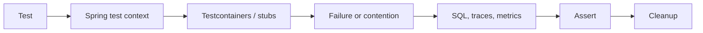

# Spring Internals Hands-On Labs

| Lab | Failure to reproduce | Required assertion |
|---|---|---|
| container phases | early bean creation misses post-processing | lifecycle log proves corrected order |
| candidates | qualifier/primary/generic ambiguity | startup fails then resolves explicitly |
| proxy | transactional self-invocation | external proxy call opens transaction; self-call does not |
| propagation | nested `REQUIRES_NEW` exhausts small pool | bounded failure then redesigned boundary |
| rollback | caught inner exception marks rollback-only | expected completion status/exception |
| MVC | connector/executor saturation | queue wait and controlled admission |
| WebFlux | blocking call on event loop | detector/latency failure then offload/fix |
| HTTP client | connection-pool exhaustion | acquisition timeout and bounded concurrency |
| Hibernate | N+1 and Cartesian join | query-count and result-cardinality assertions |
| batching | identifier/statement shape disables batch | round-trip reduction after correction |
| locking | optimistic conflict and deadlock | bounded retry classification |
| shutdown | terminate during HTTP/Kafka/scheduled claim | readiness/drain/relinquish evidence |

Use Testcontainers for databases/brokers, deterministic stubs for remote systems,
Actuator/Micrometer assertions for resource behavior and automatic cleanup.

## Safety, Security And Performance

Use synthetic identities and data; logs, traces and database snapshots must not
contain production tokens or PII. Bind containers to nonproduction ports and cap
memory, CPU, connections, retries and test duration. Failure injection must target
the disposable dependency selected by the test.

Assertions should cover business invariants and resource behavior: query count,
pool wait, active connections, queue depth, rejected work, transaction outcome,
trace context and graceful cleanup. Compare p95/p99 only with controlled workload
and warmup; functional slice tests remain deterministic.

## Official References

- [Spring TestContext Framework](https://docs.spring.io/spring-framework/reference/testing/testcontext-framework.html)
- [Spring Boot Testcontainers](https://docs.spring.io/spring-boot/reference/testing/testcontainers.html)
- [Hibernate ORM User Guide](https://docs.jboss.org/hibernate/orm/current/userguide/html_single/Hibernate_User_Guide.html)

## Recommended Next Page

Continue with [Database Engine Internals](../data/DATABASE-ENGINE-INTERNALS.md).
