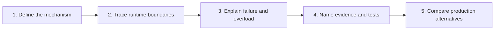

# Spring Interview Preparation

<DocLabels items={[
  {label: 'Intermediate to architect', tone: 'intermediate'},
  {label: 'Expandable answers', tone: 'foundation'},
  {label: 'Production scenarios', tone: 'production'},
]} />

Attempt each question aloud before expanding its answer. A lead-level answer should move
past the annotation name and explain the proxy, thread, transaction, resource, failure,
observability and multi-replica boundaries involved.

<TopicCards items={[
  {
    title: 'Spring And Boot Interview Questions',
    href: './SPRING-ECOSYSTEM-INTERVIEW',
    description: 'Container, auto-configuration, web, data and production mechanics.',
    icon: 'brain',
    tags: ['Core Spring', 'Boot'],
  },
  {
    title: 'REST Lead Interview Guide',
    href: '../development/spring-rest/REST-INTERVIEW-WORKBOOK',
    description: 'HTTP contracts, idempotency, pagination, failures and test strategy.',
    icon: 'route',
    tags: ['REST', 'Testing'],
  },
  {
    title: 'Architect Scenario Workbook',
    href: './SPRING-ARCHITECT-INTERVIEW-WORKBOOK',
    description: 'Diagnose proxy, transaction, ORM, async and production incidents.',
    icon: 'layers',
    tags: ['Architecture', 'Incidents'],
  },
  {
    title: 'Executable Internals Labs',
    href: './SPRING-INTERNALS-LABS',
    description: 'Replace memorized claims with trace, SQL, metrics and runtime evidence.',
    icon: 'experiment',
    tags: ['Hands-on', 'Evidence'],
  },
]} />

## Answer Rubric

| Level | Evidence in the answer |
|---:|---|
| 1 | Correct annotation, API or definition |
| 2 | Container, proxy or runtime mechanism |
| 3 | Thread, transaction and resource boundary |
| 4 | Failure, security, observability and recovery behavior |
| 5 | Multi-replica trade-off, migration plan and rollback evidence |

<DocCallout type="tip" title="Use the boundary sentence">

Start difficult answers with: “The boundary is owned by …”. It forces you to identify
whether the behavior belongs to a Spring proxy, servlet filter, transaction manager,
executor, persistence context, broker consumer, connection pool or external system.

</DocCallout>

## Recommended Sequence

1. Complete the ecosystem bank without notes.
2. Revisit weak answers in the linked canonical concept page.
3. Run the matching internals lab and record evidence.
4. Attempt the REST guide with API and compatibility trade-offs.
5. Finish with the architect workbook under a 45-minute time limit.

## Recommended Next

Start with [Spring And Spring Boot Interview Questions](./SPRING-ECOSYSTEM-INTERVIEW.md).
