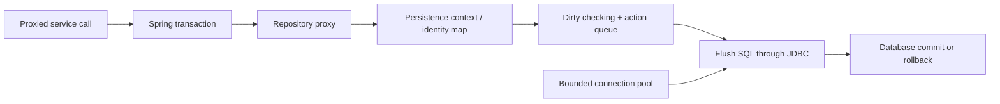

# Spring Data JPA And Hibernate Runtime For Architects

<DocLabels items={[
  {label: 'Advanced', tone: 'advanced'},
  {label: 'Canonical synthesis', tone: 'foundation'},
  {label: 'Production architecture', tone: 'production'},
  {label: 'Shopverse evidence', tone: 'shopverse'},
]} />


This is the canonical Spring persistence-runtime synthesis. The focused Spring Data
pages explain repository declarations; the [Hibernate track](../data/HIBERNATE.md)
contains provider-level lifecycle and mapping reference.

<DocCallout type="production" title="Trace six owners">

For every persistence incident, identify the service transaction, repository
method, persistence context, generated SQL, physical connection, and database lock
or plan. “JPA is slow” is not a useful diagnosis.

</DocCallout>

## Runtime Mental Model



The persistence context is an identity map and unit of work. A managed entity is
tracked; changes become insert, update, delete, and collection actions at flush.
Flush synchronizes SQL but does not commit. A query can trigger auto-flush before
the service method returns.

`merge` copies detached state into a managed instance and returns that managed
instance. It does not reattach the original object. Bulk JPQL or SQL bypasses this
tracking and can leave managed state stale.

## Transaction And Flush Boundary

The Spring transaction interceptor begins or joins a transaction before the
repository work. Hibernate obtains a connection when required, flushes according
to the effective mode and query needs, and participates in commit or rollback.

Architecture decisions must include:

- which service method owns the complete invariant;
- whether any remote I/O occurs while a connection or lock is held;
- how rollback-only state and classified retries are surfaced;
- whether `REQUIRES_NEW` creates nested connection demand;
- how domain state and outbox rows commit atomically.

<DocCallout type="mistake" title="afterCommit is not durable messaging">

An `afterCommit` callback runs after the database is durable. If publication then
fails, the callback cannot roll the transaction back. Persist an outbox record in
the original transaction.

</DocCallout>

## Query And Fetch Architecture

Mapping defaults do not define production query plans. Give each read use case a
bounded repository method using an entity graph, projection, explicit query, or
two-step pagination.

Evaluate:

| Risk | Evidence | Typical control |
|---|---|---|
| N+1 secondary selects | statement count per request | entity graph, projection, batch fetch |
| collection join explosion | database rows versus entities | two-step IDs, bounded graph |
| unstable/slow pages | plan, rows examined, duplicate/missing rows | unique order, index, keyset cursor |
| oversized persistence context | managed entity count and heap | projection or periodic flush/clear |
| serialization-time SQL | trace after service return | DTO mapping inside transaction |

The focused [Fetching Performance](./jpa/JPA-FETCHING-PERFORMANCE.md) page owns
Spring repository examples. Do not duplicate that material here.

## Batching And Bulk Work

JDBC batching depends on identifier generation, statement shape, ordering,
versioned updates, flush boundaries, and driver behavior. A repository `saveAll`
call is not evidence that statements were sent as batches.

Bulk DML is appropriate when the database can express the change directly, but it
bypasses entity callbacks and persistence-context state. Separate bulk work from
managed-entity workflows or clear deliberately. Put time, row-count, memory, and
lock limits around migration and cleanup batches.

## Concurrency And Authority

Choose the smallest primitive that covers the invariant:

- `@Version` for stale-write detection on one versioned aggregate;
- a short pessimistic row lock for explicit row ownership;
- an atomic conditional update for a one-statement invariant;
- a unique constraint for duplicate business identity;
- a work-claim, lease, or partition protocol for multi-replica ownership.

No JPA annotation creates authority across services. A version on Inventory cannot
make an Order or Payment decision atomic. Use idempotency, outbox, saga, and
compensation at distributed boundaries.

## Equality, Proxies, And Cache

Entity equality must remain stable while identifiers transition from null to
assigned and while Hibernate proxies are present. Do not generate equality from
every mutable field. Prefer an immutable natural key when one truly exists, or a
carefully documented identifier strategy with tests for sets, proxies, and detached
instances.

The first-level cache belongs to one persistence context. A second-level or query
cache adds invalidation, tenancy, serialization, and deployment compatibility.
Adopt it only for a measured read pattern with a safe stale-data policy. Spring
Cache and Hibernate L2 cache operate at different boundaries.

<DocCallout type="code" title="Proposed, not current Shopverse architecture">

This guide does not claim Shopverse currently uses Hibernate second-level cache or
read replicas. If introduced, both require explicit consistency, invalidation,
credential, topology, and rollout decisions.

</DocCallout>

## Connection Capacity

A connection pool is a concurrency bulkhead, not a performance cache to maximize.
Size it from measured query/transaction duration, database capacity, total service
replicas, workload mix, and failure headroom.

```text
total possible database sessions
  = service replicas x pool maximum
  + migrations, jobs, administration, and other services
```

Monitor active, idle, pending, acquisition time, usage duration, timeout, and
database sessions together. Virtual threads or a larger executor can deliver more
waiters to the same pool and increase tail latency without increasing database
throughput.

## Shopverse Current State And Gaps

<DocCallout type="shopverse" title="Verified current patterns">

- Order and User repository methods use entity graphs for known read paths.
- User and Role repositories support specifications.
- Inventory uses `@Version` for stock state.
- Order, Inventory, and Payment outbox repositories expose pessimistic row claims.
- integration tests prove outbox commit and rollback on the real infrastructure
  path.

</DocCallout>

Current use of unpaged entity-graph list queries for some Order histories is a
capacity risk at large cardinality. Bounded summary projections, keyset pagination,
and additional indexes are proposed improvements and require load evidence before
adoption.

## Schema Evolution And Rollback

Use expand-and-contract for changes that cross deployments:

1. add compatible schema without removing the old representation;
2. deploy readers/writers that tolerate both versions;
3. backfill with bounded batches and reconciliation metrics;
4. switch reads or behavior behind a reversible release control;
5. observe correctness, lock impact, query plans, and replica lag;
6. remove old schema only after rollback no longer depends on it.

High-risk changes include new non-null columns, enum renames, relationship moves,
version-column adoption, identifier changes, table splits, and index replacements.

<DocCallout type="production" title="An application rollback is also a schema decision">

Before release, prove the old binary can still run against the expanded schema and
newly written data. A successful forward migration alone is not a rollback plan.

</DocCallout>

## Incident Walkthrough

When p99 rises while CPU looks normal:

1. check datasource pending and acquisition time;
2. correlate traces with transaction duration and query count;
3. inspect slow SQL, plans, lock waits, deadlocks, and rows examined;
4. determine whether a fetch change, retry, or executor increased concurrency;
5. reproduce with production-like cardinality and pool size;
6. compare one controlled change against p50/p95/p99 and database saturation;
7. roll back query code or routing without dropping compatibility indexes.

## Architecture Review Questions

<ExpandableAnswer title="Why can a read query issue pending writes?">

Hibernate may auto-flush changes whose SQL could affect the query result. Flush
preserves query consistency but the surrounding transaction can still roll back.

</ExpandableAnswer>

<ExpandableAnswer title="Why can virtual threads worsen datasource acquisition latency?">

They make blocked tasks cheaper, so more requests can reach the fixed connection
pool concurrently. Database capacity is unchanged and the pending queue grows.

</ExpandableAnswer>

<ExpandableAnswer title="How do you decide between an entity graph and a projection?">

Use an entity graph when the transaction needs a bounded managed graph. Use a
projection for a stable read model that should select only required data and avoid
later entity traversal.

</ExpandableAnswer>

<ExpandableAnswer title="What does optimistic locking fail to protect?">

It detects stale writes to the versioned state. It does not prevent duplicate
requests, cross-row write skew, non-JPA writers that ignore the version, or
cross-service invariant violations.

</ExpandableAnswer>

<ExpandableAnswer title="What makes a persistence migration architect-level rather than only a DDL change?">

It defines mixed-version compatibility, bounded backfill, validation, query/lock
impact, data ownership, release sequencing, observability, and a rollback that can
read values already written by the new version.

</ExpandableAnswer>

## Focused Guides

- [Entity Integration](./jpa/JPA-BASICS-ENTITY-MAPPING.md)
- [Associations And Ownership](./jpa/JPA-RELATIONSHIPS-JSON.md)
- [Repositories Queries And Projections](./jpa/JPA-REPOSITORIES-QUERIES.md)
- [Fetching Performance](./jpa/JPA-FETCHING-PERFORMANCE.md)
- [Transactions Locking And Concurrency](./jpa/JPA-TRANSACTIONS-LOCKING.md)
- [Auditing And Delete Semantics](./jpa/JPA-AUDITING-DELETING-TESTING.md)

## Official References

- [Spring Data JPA reference](https://docs.spring.io/spring-data/jpa/reference/)
- [Spring transaction management](https://docs.spring.io/spring-framework/reference/data-access/transaction.html)
- [Hibernate ORM user guide](https://docs.hibernate.org/orm/current/userguide/html_single/)
- [HikariCP configuration](https://github.com/brettwooldridge/HikariCP#configuration-knobs-baby)

## Recommended Next

Use [Spring Internals Labs](./SPRING-INTERNALS-LABS.md) to turn the runtime model
into reproducible SQL, transaction, lock, and pool evidence.
