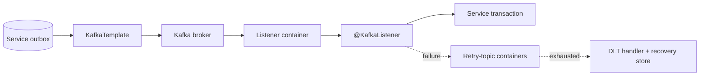

# Spring For Apache Kafka

<DocLabels items={[
  {label: 'Intermediate', tone: 'intermediate'},
  {label: 'Canonical Spring route', tone: 'foundation'},
  {label: 'Production messaging', tone: 'production'},
  {label: 'Shopverse evidence', tone: 'shopverse'},
]} />

Spring for Apache Kafka supplies `KafkaTemplate`, listener containers, message
conversion, acknowledgment/error handling, retry-topic infrastructure,
transactions, events, and observations. Broker architecture, retention,
partitions, offsets, and generic Kafka interviews remain in
[Apache Kafka](../integration/APACHE-KAFKA.md).

<DocCallout type="production" title="Spring owns the runtime, the service owns the effect">

The container can poll, invoke, seek, commit, retry, pause, and publish events. The
service must still make database effects idempotent, version event contracts, and
decide whether a failed record is safe to replay.

</DocCallout>

## Focused Pages

<TopicCards items={[
  {title: 'Publishing and event flow', href: '/spring/kafka/SPRING-KAFKA-BASICS', description: 'Configure KafkaTemplate, serializers, outbox acknowledgment, and event compatibility.', icon: 'route', tags: ['Producer', 'Schema']},
  {title: 'Consumers and delivery', href: '/spring/kafka/SPRING-KAFKA-CONSUMERS', description: 'Trace listener-container invocation, acknowledgment, transactions, and failure boundaries.', icon: 'network', tags: ['Containers', 'Offsets']},
  {title: 'Listener concurrency', href: '/spring/kafka/SPRING-KAFKA-CONCURRENCY-CAPACITY', description: 'Size child containers, partitions, poll work, retry traffic, and downstream capacity.', icon: 'gauge', tags: ['Capacity', 'Rebalance']},
  {title: 'Retry, DLT, and recovery', href: '/spring/kafka/SPRING-KAFKA-RETRY-DLT-RECOVERY', description: 'Design retry-topic infrastructure, DLT handling, security, and terminal recovery.', icon: 'layers', tags: ['Retry topics', 'DLT']},
  {title: 'Idempotency and replay', href: '/spring/kafka/SPRING-KAFKA-CONSUMER-IDEMPOTENCY-REPLAY', description: 'Protect business effects and replay failed events through a durable outbox.', icon: 'security', tags: ['Idempotency', 'Replay']},
  {title: 'Operations and incidents', href: '/spring/kafka/SPRING-KAFKA-OPERATIONS-INCIDENT-RESPONSE', description: 'Use lag, container events, observations, rollout checks, and incident evidence.', icon: 'experiment', tags: ['Operations', 'Runbook']},
]} />

## Shopverse Runtime Baseline

<DocCallout type="shopverse" title="Verified current configuration">

Shared configuration disables consumer auto-commit, uses record acknowledgment,
sets listener concurrency to one by default, limits each poll to 50 records, and
enables listener/template observations. Producers request `acks=all` and producer
idempotence. Order, Inventory, and Payment listeners use `@RetryableTopic` with
three attempts and persist terminal failures for controlled replay.

</DocCallout>

This baseline does not currently configure Kafka container transactions,
`group.protocol=consumer`, or production SASL/TLS in the shared repository file.
Those are deployment decisions described as proposed controls, not implemented
claims.

## Ownership Map

| Concern | Canonical owner |
|---|---|
| broker partitions, retention, replication, offsets | [Apache Kafka](../integration/APACHE-KAFKA.md) |
| Spring templates, containers, retry topics, events | this Spring track |
| shared JSON parsing | [Kafka Event Parsing](../platform/KAFKA-PARSING.md) |
| Shopverse failed-event persistence/replay library | [Kafka Recovery Starter](../platform/KAFKA-RECOVERY-STARTER.md) |
| database/Kafka dual-write protection | [Outbox Starter](../platform/OUTBOX-STARTER.md) |
| saga and runtime failure decisions | [Runtime Reliability Problems](../reliability/problems/RUNTIME-RELIABILITY-PROBLEMS.md) |

## Production Completion Standard

Before changing a listener or publisher, define:

1. event owner, key, schema compatibility, and sensitive-data classification;
2. listener group, concurrency, acknowledgment, and retry/DLT behavior;
3. idempotency authority and database transaction boundary;
4. maximum poll work, downstream pool limits, and recovery throughput;
5. rolling-deployment and rebalance expectations;
6. lag, failure, retry, DLT, and non-responsive-container evidence;
7. a rollback compatible with events already written by the new version.

## Interview Check

<ExpandableAnswer title="What does Spring add beyond the Kafka consumer client?">

It manages listener-container lifecycle, polling threads, method invocation,
conversion, acknowledgment/error handling, retry-topic containers, application
events, transactions, and Micrometer integration.

</ExpandableAnswer>

<ExpandableAnswer title="Why is @RetryableTopic not a business idempotency guarantee?">

It schedules additional deliveries through retry topics. The listener's database
effect can still have committed before a failure or crash, so the service needs a
stable event identity and idempotent transaction.

</ExpandableAnswer>

<ExpandableAnswer title="What must remain compatible during a rolling listener deployment?">

Old and new replicas can share the group while partitions rebalance. Both versions
must safely deserialize available events and apply compatible idempotency and
database rules throughout the overlap window.

</ExpandableAnswer>

## Official Spring Kafka 4.x References

- [Spring for Apache Kafka 4.0 reference](https://docs.spring.io/spring-kafka/reference/4.0/)
- [Using Spring for Apache Kafka](https://docs.spring.io/spring-kafka/reference/4.0/kafka.html)
- [Spring Kafka 4.0 API](https://docs.spring.io/spring-kafka/docs/4.0.x/api/)

## Recommended Next

Start with [Publishing And Event Flow](./kafka/SPRING-KAFKA-BASICS.md).
