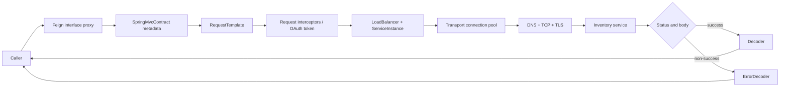

# Spring Cloud OpenFeign

<DocLabels items={[
  {label: 'Advanced', tone: 'advanced'},
  {label: 'Feature-complete', tone: 'production'},
  {label: 'Synchronous HTTP', tone: 'foundation'},
  {label: 'Shopverse inventory client', tone: 'shopverse'},
]} />

OpenFeign provides declarative synchronous HTTP clients. Spring Cloud adds Spring
MVC contracts, configuration binding, LoadBalancer, CircuitBreaker, OAuth2, and
Micrometer integration around the Feign runtime.

<DocCallout type="production" title="Evaluate HTTP Service Clients first for new synchronous interfaces">
Spring Cloud OpenFeign is officially feature-complete: it remains supported for
bug fixes and limited improvements, but new applications should evaluate Spring
Framework HTTP Service Clients first. Stable Feign integrations do not require a
rewrite when their Spring Cloud capabilities, tests, and operational behavior are
already valuable and migration has no measured benefit.
</DocCallout>

## New Client Or Existing Feign Contract?

| Situation | Default evaluation |
|---|---|
| new synchronous interface | Spring HTTP Service Client backed by `RestClient` |
| new reactive or streaming interface | HTTP Service Client backed by `WebClient` |
| established Feign interface with discovery, interceptors, decoder, and evidence | retain and upgrade Feign deliberately |
| heavy Feign-specific customization with stable operations | retain until migration removes real cost or risk |
| need for capabilities absent from the selected Feign release train | evaluate HTTP Service Clients rather than expecting major new Feign integration features |

Migration is an architecture change, not annotation replacement. Compare error
contracts, interceptors, OAuth, load balancing, observation names, transport and
pool configuration, AOT, tests, and shutdown before changing the proxy technology.

## Dependency And Enablement

```gradle
implementation 'org.springframework.cloud:spring-cloud-starter-openfeign'
implementation 'org.springframework.cloud:spring-cloud-starter-loadbalancer'
```

Use the Spring Cloud BOM compatible with the application's Spring Boot generation:

```gradle
dependencyManagement {
    imports {
        mavenBom "org.springframework.cloud:spring-cloud-dependencies:${springCloudVersion}"
    }
}
```

```java
@SpringBootApplication
@EnableFeignClients
public class OrderServiceApplication {
}
```

LoadBalancer is an optional integration. Include and test it when a logical service
name must resolve through discovery.

## Shopverse Inventory Client

```java
@FeignClient(
        name = "inventory-service",
        path = "/api/v1/inventory",
        configuration = InventoryFeignConfiguration.class
)
public interface InventoryClient {

    @GetMapping("/{productId}")
    InventoryResponse getInventory(@PathVariable long productId);

    @PostMapping("/reservations")
    ReservationResponse reserve(
            @RequestHeader("Idempotency-Key") String idempotencyKey,
            @Valid @RequestBody ReservationRequest request
    );
}
```

Keep the interface consumer-oriented. A catalog lookup and a stock reservation
have different idempotency, latency, fallback, and authorization policies even
when the same remote service owns both endpoints.

## Runtime Call Path



At startup, Spring scans interfaces, parses method metadata, assembles a client-
specific context, and publishes a proxy. At invocation time Feign expands the
template, applies interceptors, resolves a service instance when load balancing
is active, delegates to the selected transport, and decodes the response.

Do not call Feign clients from bean construction or early initialization. Their
client context and dependent infrastructure may not be ready.

## Transport And Connection Ownership

Feign defines the `feign.Client` abstraction; the classpath and configuration
select the concrete network transport. Common choices include the Feign fallback,
Apache HttpClient 5, and OkHttp. A load-balancing client wraps the selected
transport; it is not the socket implementation.

Verify the effective transport from the dependency tree and beans. Pool limits,
connection-request timeout, keep-alive, stale validation, HTTP/2 behavior, proxy,
TLS, and shutdown are transport-specific.

A custom transport client must be singleton-scoped. Creating one per Feign proxy
can create multiple pools, exhaust sockets, and leak resources. The application
context should close the shared transport after inbound admission stops and bounded
in-flight calls drain.

## Deadline And Capacity Budget

```yaml
spring:
  cloud:
    openfeign:
      client:
        config:
          inventory-service:
            connectTimeout: 1000
            readTimeout: 1500
            loggerLevel: basic
```

Feign's connect and read timeouts are only part of the call:

| Phase | Bound and evidence |
|---|---|
| pool acquisition | transport-specific lease timeout and pending count |
| service discovery/load balancing | instance availability and selection latency |
| DNS | resolver timeout/cache behavior and lookup span |
| TCP connect | Feign/transport connect timeout |
| TLS handshake | trust, hostname, certificate, and handshake timing |
| request write/response read | transport and Feign read/write policies |
| OAuth token acquisition | authorized-client manager and token endpoint deadline |
| retry/backoff | one end-to-end budget across all attempts |

The caller needs a business deadline shorter than its own upstream deadline.
Admission must be bounded by request threads/virtual threads, the transport pool,
and the remote service capacity. A large pool only moves the queue to inventory.

Record active, idle, and pending connections; acquisition time; DNS/TLS/connect
time; time to first byte; status; body limit; timeout phase; and attempt count.

## Discovery And Load Balancing

When neither annotation nor properties supply a URL, the Feign `name` can become
the service ID for Spring Cloud LoadBalancer. A fixed `url` bypasses name-based
load balancing. Test the effective configuration rather than inferring it from the
interface name.

Handle an empty instance list as a dependency-availability failure. Define whether
a retry may select another instance, how discovery caching affects recovery, and
which business deadline covers selection plus attempts. Do not layer independent
Feign, LoadBalancer, and Resilience4j retries without one combined budget.

## OAuth2, TLS, And Header Security

Spring Cloud OpenFeign can install an OAuth2 access-token interceptor through an
`OAuth2AuthorizedClientManager`. Configure a deliberate client registration ID,
especially for non-load-balanced targets. Token lookup or refresh is another
downstream operation with its own cache, expiry, deadline, and failure behavior.

Never forward an inbound `Authorization` header by default. Use service-owned
credentials or an explicit token-exchange/delegation design. Allowlist propagated
headers such as trace context and a validated correlation ID; reject hop-by-hop
headers and do not log tokens, cookies, signed URLs, or sensitive bodies.

TLS verification must check the intended trust roots and hostname. Certificate
rotation and trust-store errors should fail closed and be tested before rollout.
mTLS private keys require managed secret delivery and rotation, not interface
annotations or source-controlled configuration.

## Errors, Retries, And Idempotency

```java
@Bean
ErrorDecoder inventoryErrorDecoder() {
    return (methodKey, response) -> switch (response.status()) {
        case 400 -> new InventoryContractException(response.status());
        case 404 -> new ProductNotFoundException();
        case 409 -> new InventoryConflictException();
        case 429 -> new InventoryThrottledException();
        case 503 -> new InventoryUnavailableException();
        default -> new ErrorDecoder.Default().decode(methodKey, response);
    };
}
```

Preserve validation, authentication, authorization, missing data, conflict,
throttling, and availability as different failure classes. Limit response-body
capture and redact it before diagnostics.

Spring Cloud OpenFeign disables automatic Feign retry by default unless configured.
Keep one retry owner at the service boundary. Retry only transient failures within
the deadline and only when the operation is safe or protected by a stable
idempotency key. Never make a payment charge retryable merely because an I/O
exception hid the response.

Circuit breakers and bulkheads belong to the service operation that understands
fallback semantics. A product-description fallback may use bounded stale data;
an authentication denial or uncertain reservation should remain explicit.

## HTTP Service Client Evaluation

A new Spring synchronous interface can use `@HttpExchange`:

```java
@HttpExchange("/api/v1/inventory")
public interface InventoryHttpService {
    @GetExchange("/{productId}")
    InventoryResponse getInventory(@PathVariable long productId);
}
```

Back it with `RestClient` for synchronous execution or `WebClient` for reactive
execution. On supported Spring Boot/Cloud generations, HTTP Service groups can
also integrate configuration, OAuth, and load balancing. Verify the selected
release train rather than assuming feature parity from newer reference docs.

Keep Feign when its stable client-specific contexts, interceptors, error decoder,
LoadBalancer/CircuitBreaker integration, observation, AOT behavior, and contract
tests are already operationally proven. Migrate when consolidation on Framework
HTTP interfaces removes dependencies or closes a real capability/maintenance gap.

## AOT And Lifecycle

Current OpenFeign uses eager annotation-attribute resolution by default, which
supports AOT. Native-image use requires the version-specific documented defaults:
Spring Cloud refresh disabled, Feign client refresh disabled, and lazy client-
attribute resolution disabled. Add a native smoke test for proxy creation,
serialization, OAuth, load balancing, and one real TLS call.

During shutdown:

1. remove inbound readiness and stop new background work;
2. bound and drain in-flight service calls;
3. cancel callers whose deadlines expire;
4. close singleton transport pools and observation resources;
5. leave uncertain non-idempotent outcomes for reconciliation.

## Observability And Testing Evidence

Micrometer observation can instrument Feign when its capability, registry, and
properties are active. Use low-cardinality client name, URI template, method,
status/outcome, and attempt. Do not tag product IDs, full URLs, exception messages,
or tokens.

Test at several boundaries:

- service unit tests mock the consumer-oriented interface and business fallback;
- a stub HTTP server proves path, headers, serialization, statuses, body limits,
  delayed response, disconnect, and malformed payload behavior;
- a LoadBalancer test controls the available `ServiceInstance` list;
- OAuth tests cover cached token, expiry, token-endpoint timeout, and failure;
- transport tests cover pool exhaustion, DNS/TLS failure, and connection reuse;
- graceful-shutdown and AOT/native smoke tests use the assembled application.

## Interview Checks

<ExpandableAnswer title="What does feature-complete mean for Spring Cloud OpenFeign adoption?">

The project remains supported for bug fixes and limited improvements, but major
new integration features are not the direction. Evaluate Spring HTTP Service
Clients first for new interfaces. Retain proven Feign clients when migration adds
risk without a measured operational or maintenance benefit.

</ExpandableAnswer>

<ExpandableAnswer title="Why can a Feign call exceed connectTimeout plus readTimeout?">

The request may wait for a pooled connection, service discovery, DNS, TLS, OAuth
token acquisition, retries, and backoff outside those two settings. Trace each
phase and enforce one caller-owned deadline across all attempts.

</ExpandableAnswer>

<ExpandableAnswer title="Why can @FeignClient(name = inventory-service) fail to load balance?">

LoadBalancer may be absent, a fixed URL may bypass name resolution, or discovery
may return no instances. Inspect the effective Feign client bean, URL configuration,
LoadBalancer dependency, service-instance supplier, and selection trace.

</ExpandableAnswer>

<ExpandableAnswer title="What makes OAuth token acquisition part of client capacity planning?">

Token lookup or refresh can call an authorization server and consume its own
connections, deadline, cache, and retry budget. A token outage can therefore stall
inventory calls before they reach inventory. Observe it separately and never log
the resulting credential.

</ExpandableAnswer>

<ExpandableAnswer title="Which OpenFeign settings conflict with its documented AOT/native-image path?">

The current documented path requires Spring Cloud refresh disabled, Feign client
refresh disabled, and lazy `@FeignClient` attribute resolution disabled. Verify
these assumptions against the deployed release train and prove the assembled
native client with a smoke test.

</ExpandableAnswer>

<ExpandableAnswer title="When should a stable Feign client remain instead of migrating?">

Keep it when its interface, Cloud integrations, security, error mapping, transport,
observability, tests, and operations are mature and HTTP Service Clients offer no
clear benefit. Revisit when dependency strategy, reactive support, AOT, or missing
capability creates measurable cost.

</ExpandableAnswer>

## Production Checklist

- pin a compatible Spring Boot/Cloud release train;
- identify the concrete transport and singleton pool owner;
- bound pool acquisition, connect, TLS, read, retries, and the business deadline;
- test discovery with zero, one, and several instances;
- use service-owned OAuth and verified TLS configuration;
- retry only safe/idempotent operations under one policy owner;
- limit and redact logs and error bodies;
- monitor pool, discovery, DNS, TLS, OAuth, status, timeout phase, and attempts;
- test AOT/native behavior when deployed that way;
- drain calls and close transport resources during shutdown.

## Related Guides

- [Spring REST APIs](../development/SPRING-REST-APIS.md)
- [Load Balancing](../architecture/LOAD-BALANCING-GENERIC.md)
- [Resilience4j](../reliability/RESILIENCE4J-GENERIC.md)
- [MDC And Correlation](../observability/MDC-CORRELATION-TRACING.md)
- [Spring Reactive And WebFlux](./SPRING-REACTIVE.md)

## Official References

- [Spring Cloud OpenFeign reference](https://docs.spring.io/spring-cloud-openfeign/reference/index.html)
- [Spring Cloud OpenFeign features and configuration](https://docs.spring.io/spring-cloud-openfeign/reference/spring-cloud-openfeign.html)
- [Spring Framework REST and HTTP Service Clients](https://docs.spring.io/spring-framework/reference/integration/rest-clients.html)
- [Spring Cloud LoadBalancer](https://docs.spring.io/spring-cloud-commons/reference/spring-cloud-commons/loadbalancer.html)
- [Spring Security OAuth2 client](https://docs.spring.io/spring-security/reference/servlet/oauth2/client/index.html)

## Recommended Next Page

Continue with [Spring Resilience4j](./SPRING-RESILIENCE4J.md) to design bounded
retry, circuit-breaker, and bulkhead policy around the client operation.
