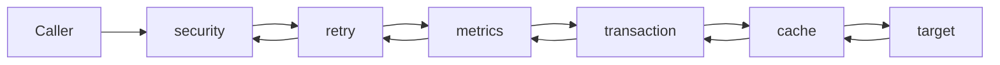
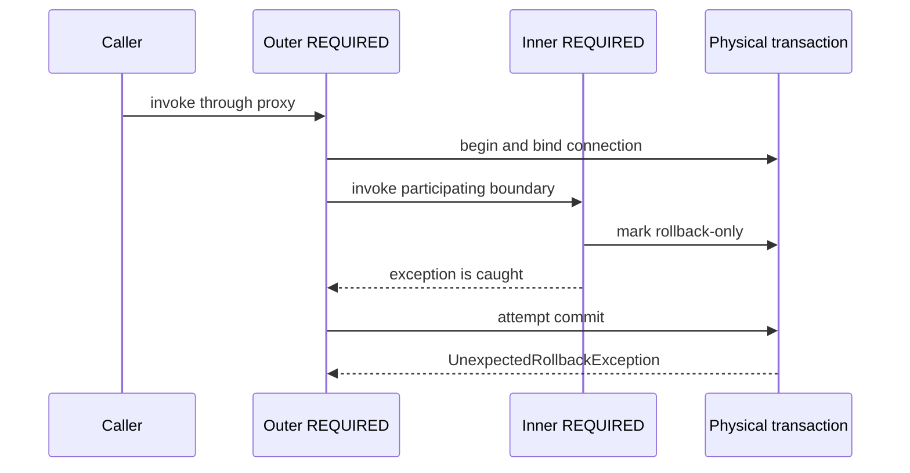

# Spring Proxy And Transaction Runtime For Architects

<DocLabels items={[
  {label: 'Architect', tone: 'advanced'},
  {label: 'Proxy internals', tone: 'advanced'},
  {label: 'Transaction runtime', tone: 'production'},
  {label: 'Failure diagnostics', tone: 'production'},
]} />

Spring proxy annotations work only when a managed call crosses an eligible proxy
and an advisor matches. Transaction correctness then depends on the transaction
manager, physical resource, database semantics, failure signal, and execution
context—not on the annotation alone.

<DocCallout type="production" title="Name the physical resource">
In every transaction review, identify the actual connection or resource, who
holds it, when it is released, and what happens under cancellation or overload.
An annotation-level explanation is incomplete without resource ownership.
</DocCallout>

## Proxy, Advisor, And Interceptor Chain


An auto-proxy creator is a `BeanPostProcessor`. It evaluates eligible beans and
returns a proxy containing advisors. Each advisor combines advice with a pointcut;
matching advisors become an interceptor chain around a method invocation.

JDK proxies expose interfaces. Class-based proxies subclass an eligible target.
Proxy choice and method visibility have version and configuration details, but
these invariants remain useful:

| Check | Failure mode |
|---|---|
| object is container-managed | manual `new` produces no infrastructure proxy |
| caller holds published proxy identity | a retained raw target bypasses advice |
| invocation crosses the proxy | `this.otherMethod()` stays on the target |
| method is eligible for the proxy mechanism | final/private or otherwise ineligible methods cannot be overridden/intercepted normally |
| advisor pointcut matches | a proxy can exist without the expected advice applying |
| interceptor order matches semantics | retry, transaction, cache, security, and async order can change the outcome |

Use `AopUtils.isAopProxy`, the `Advised` interface where appropriate, targeted
Spring context tests, and trace logging to inspect the published proxy and advisor
chain. A class-name suffix is a clue, not sufficient evidence.

## Interceptor Ordering Changes Meaning



Entry order reverses on exit. Retry outside transaction can create a fresh
transaction per attempt; retry inside transaction can repeat work in a context
already marked rollback-only. Async advice can move execution before a later
interceptor sees it. Define the intended order, test it through the real proxy,
and do not depend on incidental registration order.

## Self-Invocation And Boundary Design

```java
@Service
class OrderService {
    public void place(Order order) {
        reserve(order); // direct same-instance call
    }

    @Transactional(propagation = Propagation.REQUIRES_NEW)
    void reserve(Order order) {
    }
}
```

The direct call does not re-enter the proxy, so no distinct transaction starts.
Move the boundary to a collaborator with a real responsibility, place the
transaction on the outer public operation, or use `TransactionTemplate` when an
explicit local boundary is clearer. Self-injection and `AopContext.currentProxy()`
increase coupling and should not be routine design tools.

## Transaction Interceptor Flow


`TransactionInterceptor` resolves transaction attributes, selects a
`PlatformTransactionManager`, obtains or joins a transaction, binds resources and
synchronizations to the execution context, invokes the target, and then commits
or rolls back. With JPA, the persistence context and JDBC connection participate
in that physical boundary.

Logical method scopes can share one physical transaction. If an inner participating
scope marks it rollback-only and the outer method catches the failure, the outer
scope can return normally yet still receive `UnexpectedRollbackException` when it
tries to commit. Catching an exception does not restore a doomed transaction.



## Propagation And Capacity

| Propagation | Physical-resource consequence |
|---|---|
| `REQUIRED` | join the current transaction or create one |
| `REQUIRES_NEW` | suspend the outer transaction and acquire another physical transaction/connection |
| `NESTED` | use a savepoint when the manager and resource support it |
| `SUPPORTS` | join when present; otherwise execute without a transaction |
| `NOT_SUPPORTED` | suspend the current transaction and execute without one |
| `MANDATORY` / `NEVER` | enforce presence or absence as a contract |

`REQUIRES_NEW` can require roughly one outer connection plus one inner connection
per concurrently nested workflow. That is not a sizing formula by itself: pool
headroom must also cover other request classes, maintenance work, and bounded wait
policy. Monitor acquisition time and timeout count, not only active connections.

Isolation is applied when a new physical transaction begins and is ultimately
implemented by the database and driver. It cannot promise behavior the engine
does not support. Tie isolation, locks, and retry to a named invariant and verify
them against the production database engine.

## Flush, Synchronization, And Crash Windows

Flush sends pending SQL but is not commit. It may occur before a query, explicit
flush, or commit, and database constraints can fail at any of those points.

Transaction synchronizations participate around completion:

```text
application changes
  -> ORM flush / beforeCommit
  -> database commit
  -> afterCommit
  -> afterCompletion and resource cleanup
```

An `afterCommit` callback runs after the database decision and cannot make a
remote Kafka or HTTP operation atomic with that commit. A crash in the gap loses
in-memory follow-up work. Store an outbox record in the local transaction and
publish it through a retryable, idempotent delivery process when durability is
required.

## Async, Reactive, And Virtual-Thread Boundaries

Imperative transactions are commonly bound to the current execution context.
They do not automatically cross `@Async`, executor tasks, arbitrary futures, or
new virtual threads. Start the transaction inside the owned task, propagate only
safe request context, and bound downstream resources even when task creation is
cheap.

Reactive transactions use subscriber context rather than ordinary thread-local
association. Mixing blocking and reactive components requires an explicit model;
do not infer transaction continuity from thread names or call-stack appearance.

Security context, MDC, tracing, locale, and tenant context each have separate
propagation rules. Test them independently from transaction propagation.

## Shopverse Checkout Boundary

For an order-placement workflow:

1. authenticate and validate before opening a long database transaction;
2. create the order and outbox event in one service-owned local transaction;
3. commit before waiting for inventory or payment over the network;
4. publish through the outbox and make consumers idempotent;
5. model rejection or timeout as recoverable workflow state;
6. use compensation for completed remote effects rather than assuming
   `@Transactional` can roll them back.

A retry interceptor must not blindly repeat a non-idempotent payment. The review
must state which operation owns its idempotency key, how concurrent duplicates are
resolved, and which evidence proves no external effect occurred twice.

## Diagnostic And Evidence Playbook

| Symptom | Inspect | Required evidence |
|---|---|---|
| annotation appears ignored | published object, call site, method eligibility, advisors | proxy/advisor inspection plus focused context test |
| unexpected commit | caught exception, rollback rules, rollback-only state | transaction trace and database assertion |
| unexpected rollback | participating inner scope and rollback-only marker | full logical-scope trace ending at commit attempt |
| connection timeout | active/idle/pending connections and nested propagation | acquisition latency correlated with transaction spans |
| long transaction | remote waits, lock waits, flush time, pool occupancy | trace plus database/pool metrics |
| event lost after commit | synchronization callback and process failure window | failure-injection test demonstrating the gap |
| async work sees no transaction | execution owner and context boundary | thread/subscriber trace and transaction-state assertion |

## Executable Lab

Build two beans so cross-bean invocation and self-invocation execute the same
database operation. Add variants for checked/unchecked exceptions, caught failures,
`REQUIRED`, `REQUIRES_NEW`, a savepoint-capable `NESTED`, `afterCommit` failure,
and an async task.

Capture:

- proxy type and ordered advisors;
- transaction identifiers and rollback-only state;
- acquired connection count and wait time;
- SQL and flush timing;
- committed rows after each injected failure;
- outbox delivery state after a simulated process stop.

Use the same database engine as production for isolation, locks, savepoints, and
deadlock behavior. An in-memory substitute cannot prove those semantics.

## Tricky Interview Questions

<ExpandableAnswer title="Why does a self-invoked REQUIRES_NEW method not start a new transaction?">

The call stays on the target and does not cross the proxy that owns the transaction
advisor. Prove it by inspecting the call site and transaction/connection identity.
Move the distinct boundary to another bean or make it explicit with a transaction
template.

</ExpandableAnswer>

<ExpandableAnswer title="Can a caught runtime exception still cause rollback?">

Yes. A participating operation may already have marked the physical transaction
rollback-only. Catching the exception does not clear that state, so the outer
commit can fail with `UnexpectedRollbackException`. Conversely, if no rollback
rule or rollback-only marker applies and the interceptor sees normal return, the
transaction may commit.

</ExpandableAnswer>

<ExpandableAnswer title="Why can REQUIRES_NEW exhaust a connection pool?">

The suspended outer transaction can retain its connection while the inner
transaction requests another. Concurrent outer workflows can therefore occupy
the pool while all wait for inner connections. Bound concurrency, minimize nested
transactions, and validate with acquisition-wait and timeout evidence.

</ExpandableAnswer>

<ExpandableAnswer title="Does @Transactional(readOnly = true) universally prevent writes?">

No. It communicates intent and may change ORM or driver behavior, but enforcement
varies. Authorization, service boundaries, database permissions, and tests must
protect correctness. Be especially careful when read-only routing sends traffic
to a replica with different consistency behavior.

</ExpandableAnswer>

## Official References

- [Spring Framework AOP proxying mechanisms](https://docs.spring.io/spring-framework/reference/core/aop/proxying.html)
- [Spring Framework declarative transaction implementation](https://docs.spring.io/spring-framework/reference/data-access/transaction/declarative/tx-decl-explained.html)
- [Spring Framework transaction propagation](https://docs.spring.io/spring-framework/reference/data-access/transaction/declarative/tx-propagation.html)
- [Spring Framework transaction-bound events](https://docs.spring.io/spring-framework/reference/data-access/transaction/event.html)
- [Spring Framework programmatic transactions](https://docs.spring.io/spring-framework/reference/data-access/transaction/programmatic.html)

## Recommended Next

Continue with [Servlet And MVC Request Lifecycle](./web/SERVLET-MVC-REQUEST-LIFECYCLE.md).
