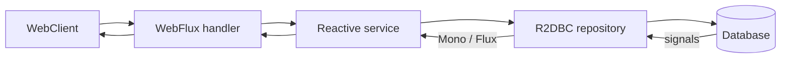

# Spring Reactive And WebFlux

Reactive programming models asynchronous work as a stream of signals. Spring
WebFlux uses Project Reactor and the Reactive Streams contract to serve many
concurrent I/O-bound requests with a small number of threads. It is most useful
when the entire request path can remain non-blocking.

Reactive is not automatically faster. It trades a familiar thread-per-request
model for higher concurrency with more demanding control flow, debugging, and
context propagation.

## The Reactive Types

| Type | Cardinality | Typical use |
|---|---:|---|
| `Mono<T>` | zero or one value | one HTTP response, lookup, save, completion |
| `Flux<T>` | zero to many values | collection, event stream, paged/streamed results |

A publisher sends `onNext` signals followed by either `onComplete` or
`onError`. Errors are terminal signals, not values. Nothing happens until a
subscriber subscribes; in a WebFlux controller, the framework subscribes for
you.



## Operator Fundamentals

```java
Mono<OrderView> findOrder(UUID id) {
    return orderRepository.findById(id)
            .switchIfEmpty(Mono.error(new OrderNotFoundException(id)))
            .flatMap(order -> inventoryClient.getProduct(order.productId())
                    .map(product -> OrderView.from(order, product)))
            .timeout(Duration.ofSeconds(2));
}
```

- `map` performs a synchronous one-to-one transformation.
- `flatMap` composes an operation that already returns `Mono` or `Flux`.
- `filter` conditionally retains values; an empty result is not an error.
- `switchIfEmpty` supplies an alternative publisher for an empty result.
- `onErrorResume` recovers only from deliberately classified failures.
- `doOnNext` and `doOnError` observe signals; they should not contain core
  business side effects.
- `then` ignores values and continues after successful completion.

Avoid calling `subscribe()` inside application services. It detaches work from
the HTTP lifecycle, error handling, tracing, and tests. Compose and return the
publisher so the framework owns the subscription.

## A WebFlux API

```java
@RestController
@RequestMapping("/api/products")
@RequiredArgsConstructor
class ProductController {
    private final ProductService service;

    @GetMapping("/{id}")
    Mono<ResponseEntity<ProductView>> get(@PathVariable UUID id) {
        return service.find(id)
                .map(ResponseEntity::ok)
                .defaultIfEmpty(ResponseEntity.notFound().build());
    }

    @GetMapping(produces = MediaType.APPLICATION_NDJSON_VALUE)
    Flux<ProductView> stream() {
        return service.findAll();
    }
}
```

Annotated controllers and functional routes use the same reactive engine.
Choose one style based on team conventions, not performance assumptions.
Returning a `Flux` does not guarantee streaming: media type, codecs, proxies,
clients, and buffering operators all influence when data is flushed.

## Backpressure

Backpressure lets a subscriber signal how many items it can currently accept.
It protects consumers from an upstream publisher that can cooperate. It cannot
make an external push source or a blocking API obey demand automatically.

Operators such as `buffer`, `window`, `limitRate`, and bounded `flatMap`
concurrency shape demand. Avoid unbounded `flatMap`, `collectList`, caches, and
queues on large or infinite streams.

```java
Flux<Result> enrich(Flux<Item> items) {
    return items.flatMap(this::callRemoteService, 16); // bounded concurrency
}
```

## Threading And Schedulers

Reactor pipelines are not inherently multi-threaded. Operators normally run on
the thread producing the signal until a scheduler boundary is introduced.

- `publishOn` changes the execution context for downstream operators.
- `subscribeOn` influences where subscription and the upstream source run.
- `Schedulers.parallel()` is for short CPU work.
- `Schedulers.boundedElastic()` is an isolation bridge for unavoidable blocking
  calls, not permission to build a mostly blocking WebFlux service.

```java
Mono<LegacyResult> callLegacyApi() {
    return Mono.fromCallable(legacyClient::fetch)
            .subscribeOn(Schedulers.boundedElastic());
}
```

Never block an event-loop thread with JDBC, JPA, `Thread.sleep`, filesystem I/O,
`Future.get`, or `.block()`. A handful of blocked event-loop threads can stall
many unrelated requests. Prefer R2DBC and non-blocking HTTP clients. If the
application is primarily JPA/JDBC, Spring MVC—optionally with virtual
threads—is usually simpler and safer.

## WebClient

```java
Mono<ProductView> getProduct(UUID id) {
    return webClient.get()
            .uri("/api/products/{id}", id)
            .retrieve()
            .onStatus(HttpStatusCode::is4xxClientError,
                    response -> response.createException())
            .bodyToMono(ProductView.class)
            .timeout(Duration.ofSeconds(2))
            .retryWhen(Retry.backoff(2, Duration.ofMillis(100))
                    .filter(this::isTransient));
}
```

Set connection, response, and read/write timeouts at the HTTP client as well as
an end-to-end policy where appropriate. Retry only idempotent operations and
transient failures. Add jitter and bound concurrency to avoid amplifying an
outage.

## Reactive Data And Transactions

R2DBC provides non-blocking relational access but is not JPA: there is no
persistence context, lazy loading, dirty checking, or identical relationship
mapping model.

```java
Mono<Order> create(Order order) {
    return transactionalOperator.transactional(
            orderRepository.save(order)
                    .flatMap(saved -> auditRepository.save(Audit.from(saved))
                            .thenReturn(saved)));
}
```

Reactive transaction state travels through the Reactor context rather than a
traditional `ThreadLocal`. The database operations must participate in the
same returned pipeline. Work launched by an internal `subscribe()` escapes the
transaction.

Do not expect one database transaction to cover an HTTP call or message broker.
Use idempotency, outbox, saga, or compensation patterns for distributed work.

## Context, Security, And Observability

Thread-local assumptions break when signals move across threads. Reactor
`Context` carries subscription-scoped metadata such as security or tracing
state. Use framework-supported context propagation rather than manually
copying MDC values in every operator.

```java
Mono<String> currentCorrelationId() {
    return Mono.deferContextual(context ->
            Mono.just(context.getOrDefault("correlationId", "unknown")));
}
```

Keep metrics low-cardinality. Measure active connections, pending acquisition,
event-loop latency, response time, error/timeout rates, cancellation, and
downstream pool saturation. Use `checkpoint("order-enrichment")` selectively
to make important pipeline failures easier to locate.

## Error Handling And Cancellation

Handle errors near the layer that understands them. Translate domain errors to
HTTP responses centrally with `@RestControllerAdvice`; do not replace every
error with an empty publisher. `onErrorContinue` has surprising upstream scope
and is rarely a safe general recovery mechanism.

Cancellation is normal: clients disconnect, timeouts expire, and operators
such as `take` cancel upstream work. Publishers and resource adapters should
release resources on cancellation. Use `usingWhen` for asynchronous resource
acquisition and cleanup.

## Testing With StepVerifier

```java
@Test
void missingOrderProducesDomainError() {
    when(repository.findById(ID)).thenReturn(Mono.empty());

    StepVerifier.create(service.findOrder(ID))
            .expectErrorSatisfies(error ->
                    assertThat(error).isInstanceOf(OrderNotFoundException.class))
            .verify();
}
```

Use `WebTestClient` for HTTP behavior and `StepVerifier` for publisher signals,
ordering, errors, completion, and cancellation. Virtual time makes delayed
retry and timeout tests fast and deterministic. Integration-test against the
actual reactive database driver; mocking cannot reveal connection-pool or
transaction behavior.

## MVC Or WebFlux?

| Choose Spring MVC when | Choose WebFlux when |
|---|---|
| the stack relies on JPA/JDBC or blocking SDKs | dependencies provide non-blocking drivers |
| request volume is moderate and code simplicity dominates | many requests wait concurrently on I/O |
| the team benefits from imperative debugging | streaming and backpressure are real requirements |
| virtual threads adequately address blocking concurrency | bounded resources require explicit demand control |

Do not mix `spring-boot-starter-web` and `spring-boot-starter-webflux` without
understanding Boot's application-type selection. `WebClient` can be used from
an MVC application; its presence does not require a reactive server.

## Production Checklist

- verify every library and driver on the hot path is non-blocking;
- set bounded connection pools, concurrency, buffers, retries, and timeouts;
- never call `block()` or manually `subscribe()` in request processing;
- protect event-loop threads from CPU-heavy and blocking work;
- test cancellation, empty publishers, timeouts, and partial downstream failure;
- preserve security, tracing, and correlation context across async boundaries;
- monitor pool pending time and event-loop health, not only HTTP averages;
- apply rate limits and response-size limits to long-lived streams;
- use BlockHound in suitable tests to detect accidental blocking calls.

## Related Guides

- [Spring Ecosystem](./SPRING-ECOSYSTEM.md)
- [Spring Transactions](./SPRING-TRANSACTIONS.md)
- [Spring Resilience4j](./SPRING-RESILIENCE4J.md)
- [Java CompletableFuture](../java/JAVA-COMPLETABLE-FUTURE.md)
- [Spring Batch](./SPRING-BATCH.md)

## Official References

- [Spring WebFlux reference](https://docs.spring.io/spring-framework/reference/web/webflux.html)
- [Project Reactor reference](https://projectreactor.io/docs/core/release/reference/)
- [Reactive Streams specification](https://www.reactive-streams.org/)

## Recommended Next Page

Continue with [Advanced Spring Platform Patterns](./SPRING-PLATFORM-ADVANCED.md).
