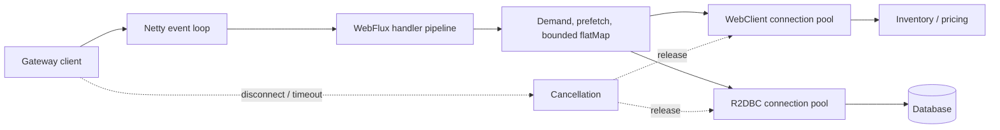

# Spring Reactive And WebFlux

<DocLabels items={[
  {label: 'Advanced', tone: 'advanced'},
  {label: 'Non-blocking runtime', tone: 'production'},
  {label: 'Shopverse gateway', tone: 'shopverse'},
  {label: 'Demand and cancellation', tone: 'intermediate'},
]} />

Reactive programming models asynchronous work as a stream of signals. Spring
WebFlux uses Project Reactor and the Reactive Streams contract to serve many
concurrent I/O-bound requests with a small number of threads. It is most useful
when the entire request path can remain non-blocking.

Reactive is not automatically faster. It trades a familiar thread-per-request
model for higher concurrency with more demanding control flow, debugging, and
context propagation.

<DocCallout type="production" title="One blocking call can consume shared event-loop capacity">
Name every driver and SDK on the request path and prove whether it blocks. Moving
a blocking call to another scheduler isolates it; it does not make the dependency
non-blocking or remove the need for a concurrency and queue bound.
</DocCallout>

## The Reactive Types

| Type | Cardinality | Typical use |
|---|---:|---|
| `Mono<T>` | zero or one value | one HTTP response, lookup, save, completion |
| `Flux<T>` | zero to many values | collection, event stream, paged/streamed results |

A publisher sends `onNext` signals followed by either `onComplete` or
`onError`. Errors are terminal signals, not values. Nothing happens until a
subscriber subscribes; in a WebFlux controller, the framework subscribes for
you.



The event loop multiplexes many connections over a small worker set. It should
schedule non-blocking I/O and short continuations, not wait on JDBC, files, locks,
remote blocking SDKs, or long CPU work. WebClient and a Reactor Netty server may
share event-loop resources by default, so client starvation can affect server work.

## Operator Fundamentals

```java
Mono<OrderView> findOrder(UUID id) {
    return orderRepository.findById(id)
            .switchIfEmpty(Mono.error(new OrderNotFoundException(id)))
            .flatMap(order -> inventoryClient.getProduct(order.productId())
                    .map(product -> OrderView.from(order, product)))
            .timeout(Duration.ofSeconds(2));
}
```

- `map` performs a synchronous one-to-one transformation.
- `flatMap` composes an operation that already returns `Mono` or `Flux`.
- `filter` conditionally retains values; an empty result is not an error.
- `switchIfEmpty` supplies an alternative publisher for an empty result.
- `onErrorResume` recovers only from deliberately classified failures.
- `doOnNext` and `doOnError` observe signals; they should not contain core
  business side effects.
- `then` ignores values and continues after successful completion.

Avoid calling `subscribe()` inside application services. It detaches work from
the HTTP lifecycle, error handling, tracing, and tests. Compose and return the
publisher so the framework owns the subscription.

## A WebFlux API

```java
@RestController
@RequestMapping("/api/products")
@RequiredArgsConstructor
class ProductController {
    private final ProductService service;

    @GetMapping("/{id}")
    Mono<ResponseEntity<ProductView>> get(@PathVariable UUID id) {
        return service.find(id)
                .map(ResponseEntity::ok)
                .defaultIfEmpty(ResponseEntity.notFound().build());
    }

    @GetMapping(produces = MediaType.APPLICATION_NDJSON_VALUE)
    Flux<ProductView> stream() {
        return service.findAll();
    }
}
```

Annotated controllers and functional routes use the same reactive engine.
Choose one style based on team conventions, not performance assumptions.
Returning a `Flux` does not guarantee streaming: media type, codecs, proxies,
clients, and buffering operators all influence when data is flushed.

## Backpressure

Backpressure lets a subscriber signal how many items it can currently accept.
It protects consumers from an upstream publisher that can cooperate. It cannot
make an external push source or a blocking API obey demand automatically.

Operators such as `buffer`, `window`, `limitRate`, and bounded `flatMap`
concurrency shape demand. Avoid unbounded `flatMap`, `collectList`, caches, and
queues on large or infinite streams.

```java
Flux<Result> enrich(Flux<Item> items) {
    return items.flatMap(this::callRemoteService, 16); // bounded concurrency
}
```

Demand is transformed by operators. Many operators request ahead for throughput,
and `flatMap` combines concurrency with an operator-specific prefetch. A downstream
request for a small number of results can therefore coexist with more work already
in flight. Inspect concurrency, prefetch, buffering, and the actual connection pool
rather than claiming that backpressure alone protects a remote service.

For a non-cooperative push source, choose an explicit overflow policy: bound and
buffer, sample, drop with evidence, or fail. An unbounded bridge converts a rate
mismatch into heap growth.

## Threading And Schedulers

Reactor pipelines are not inherently multi-threaded. Operators normally run on
the thread producing the signal until a scheduler boundary is introduced.

- `publishOn` changes the execution context for downstream operators.
- `subscribeOn` influences where subscription and the upstream source run.
- `Schedulers.parallel()` is for short CPU work.
- `Schedulers.boundedElastic()` is an isolation bridge for unavoidable blocking
  calls, not permission to build a mostly blocking WebFlux service.

```java
Mono<LegacyResult> callLegacyApi() {
    return Mono.fromCallable(legacyClient::fetch)
            .subscribeOn(Schedulers.boundedElastic());
}
```

Never block an event-loop thread with JDBC, JPA, `Thread.sleep`, filesystem I/O,
`Future.get`, or `.block()`. A handful of blocked event-loop threads can stall
many unrelated requests. Prefer R2DBC and non-blocking HTTP clients. If the
application is primarily JPA/JDBC, Spring MVC—optionally with virtual
threads—is usually simpler and safer.

Use BlockHound in suitable tests and correlate event-loop task latency with JFR,
thread dumps, and dependency spans. `boundedElastic` has a finite task/thread
policy but can still queue more work than the downstream system can accept.

Current Spring WebFlux can route controller methods classified as blocking to a
configured `AsyncTaskExecutor`, including a virtual-thread executor on supported
JDK/Spring versions. That is an explicit blocking boundary, not a conversion of
JDBC or a blocking SDK into a Reactive Streams source. If most of the path is
blocking, MVC with virtual threads is normally the clearer evaluation baseline.

## WebClient

```java
Mono<ProductView> getProduct(UUID id) {
    return webClient.get()
            .uri("/api/products/{id}", id)
            .retrieve()
            .onStatus(HttpStatusCode::is4xxClientError,
                    response -> response.createException())
            .bodyToMono(ProductView.class)
            .timeout(Duration.ofSeconds(2))
            .retryWhen(Retry.backoff(2, Duration.ofMillis(100))
                    .filter(this::isTransient));
}
```

Set connection, response, and read/write timeouts at the HTTP client as well as
an end-to-end policy where appropriate. Retry only idempotent operations and
transient failures. Add jitter and bound concurrency to avoid amplifying an
outage.

## Shopverse Gateway And Streaming Examples

A gateway aggregation should preserve one owned pipeline and one deadline:

```java
Mono<CatalogView> catalog(UUID productId) {
    Mono<ProductView> product = productClient.get(productId);
    Mono<InventoryView> inventory = inventoryClient.get(productId);

    return Mono.zip(product, inventory)
            .map(tuple -> CatalogView.of(tuple.getT1(), tuple.getT2()))
            .timeout(Duration.ofMillis(800));
}
```

`zip` cancels remaining work when completion becomes impossible. Decide whether a
missing inventory result should fail, degrade to `unknown`, or use a bounded stale
value; do not apply a generic `onErrorResume` that hides authentication or contract
failures.

For an order-status SSE or NDJSON stream, bound per-client buffering and total
connections, send heartbeats only when required by infrastructure, and stop
upstream database or broker work when the client disconnects. Test through the
actual proxy/load balancer because intermediary buffering can defeat streaming.

## Reactive Data And Transactions

R2DBC provides non-blocking relational access but is not JPA: there is no
persistence context, lazy loading, dirty checking, or identical relationship
mapping model.

```java
Mono<Order> create(Order order) {
    return transactionalOperator.transactional(
            orderRepository.save(order)
                    .flatMap(saved -> auditRepository.save(Audit.from(saved))
                            .thenReturn(saved)));
}
```

Reactive transaction state travels through the Reactor context rather than a
traditional `ThreadLocal`. The database operations must participate in the
same returned pipeline. Work launched by an internal `subscribe()` escapes the
transaction.

Do not expect one database transaction to cover an HTTP call or message broker.
Use idempotency, outbox, saga, or compensation patterns for distributed work.

## Context, Security, And Observability

Thread-local assumptions break when signals move across threads. Reactor
`Context` carries subscription-scoped metadata such as security or tracing
state. Use framework-supported context propagation rather than manually
copying MDC values in every operator.

```java
Mono<String> currentCorrelationId() {
    return Mono.deferContextual(context ->
            Mono.just(context.getOrDefault("correlationId", "unknown")));
}
```

Keep metrics low-cardinality. Measure active connections, pending acquisition,
event-loop latency, response time, error/timeout rates, cancellation, and
downstream pool saturation. Use `checkpoint("order-enrichment")` selectively
to make important pipeline failures easier to locate.

Reactor `Context` flows with the subscription, not with an arbitrary mutable
thread local. Read it with `deferContextual` at evaluation time and use supported
Spring Security/Micrometer context propagation. Test context after scheduler
boundaries and inside inner publishers; assembly-time reads often observe nothing.

## Error Handling And Cancellation

Handle errors near the layer that understands them. Translate domain errors to
HTTP responses centrally with `@RestControllerAdvice`; do not replace every
error with an empty publisher. `onErrorContinue` has surprising upstream scope
and is rarely a safe general recovery mechanism.

Cancellation is normal: clients disconnect, timeouts expire, and operators
such as `take` cancel upstream work. Publishers and resource adapters should
release resources on cancellation. Use `usingWhen` for asynchronous resource
acquisition and cleanup.

Observe cancellation with `doFinally` when diagnostics are needed, but keep cleanup
in resource-aware publishers rather than a best-effort logging callback. Cancellation
is not rollback of a remote side effect that already completed; idempotency and
reconciliation still apply.

## Testing With StepVerifier

```java
@Test
void missingOrderProducesDomainError() {
    when(repository.findById(ID)).thenReturn(Mono.empty());

    StepVerifier.create(service.findOrder(ID))
            .expectErrorSatisfies(error ->
                    assertThat(error).isInstanceOf(OrderNotFoundException.class))
            .verify();
}
```

Use `WebTestClient` for HTTP behavior and `StepVerifier` for publisher signals,
ordering, errors, completion, and cancellation. Virtual time makes delayed
retry and timeout tests fast and deterministic. Integration-test against the
actual reactive database driver; mocking cannot reveal connection-pool or
transaction behavior.

Add tests that cancel after resource acquisition, request one item at a time,
exercise an empty publisher, saturate bounded `flatMap`, and inject a blocking
call under BlockHound. A load test should record event-loop latency, connection
pending time, allocation/buffer growth, cancellation count, and downstream demand.

## MVC Or WebFlux?

| Choose Spring MVC when | Choose WebFlux when |
|---|---|
| the stack relies on JPA/JDBC or blocking SDKs | dependencies provide non-blocking drivers |
| request volume is moderate and code simplicity dominates | many requests wait concurrently on I/O |
| the team benefits from imperative debugging | streaming and backpressure are real requirements |
| virtual threads adequately address blocking concurrency | bounded resources require explicit demand control |

Do not mix `spring-boot-starter-web` and `spring-boot-starter-webflux` without
understanding Boot's application-type selection. `WebClient` can be used from
an MVC application; its presence does not require a reactive server.

## Production Checklist

- verify every library and driver on the hot path is non-blocking;
- set bounded connection pools, concurrency, buffers, retries, and timeouts;
- never call `block()` or manually `subscribe()` in request processing;
- protect event-loop threads from CPU-heavy and blocking work;
- test cancellation, empty publishers, timeouts, and partial downstream failure;
- preserve security, tracing, and correlation context across async boundaries;
- monitor pool pending time and event-loop health, not only HTTP averages;
- apply rate limits and response-size limits to long-lived streams;
- use BlockHound in suitable tests to detect accidental blocking calls.

## Interview Checks

<ExpandableAnswer title="Why can one block() call stall unrelated WebFlux requests?">

Event-loop workers are shared across many connections. Blocking one prevents it
from processing other ready I/O and continuations. Prove the diagnosis with thread
stacks, BlockHound, event-loop latency, and correlated request spans; do not merely
increase event-loop threads.

</ExpandableAnswer>

<ExpandableAnswer title="Why can bounded downstream demand still overload an inventory service behind flatMap?">

Operators reshape requests and can prefetch. `flatMap` also creates multiple inner
subscriptions, so concurrency, prefetch, buffered items, and the HTTP connection
pool determine in-flight work. Set explicit bounds and validate pending acquisition
and downstream saturation under load.

</ExpandableAnswer>

<ExpandableAnswer title="What should happen when an SSE client disconnects?">

Cancellation should propagate upstream, stop broker/database consumption owned by
that subscription, and release connections and buffers. Remote side effects already
completed are not undone. Verify cleanup with `StepVerifier`, connection metrics,
and a real disconnect through the deployed proxy path.

</ExpandableAnswer>

<ExpandableAnswer title="Why does a ThreadLocal correlation ID disappear after a reactive boundary?">

Signals can execute on different threads, while `ThreadLocal` belongs to one thread.
Use Reactor `Context` and framework-supported security/observation propagation,
read it at subscription time, and test inner publishers plus scheduler changes.

</ExpandableAnswer>

<ExpandableAnswer title="Do virtual threads make a blocking WebFlux pipeline equivalent to a non-blocking one?">

No. They can make an explicitly isolated blocking method cheaper to represent, but
the API still blocks, downstream pools remain finite, and Reactive Streams demand
does not govern it automatically. Compare with MVC plus virtual threads when the
path is mainly JDBC or blocking SDKs.

</ExpandableAnswer>

<ExpandableAnswer title="How do you prove that a reactive gateway is healthy under load?">

Show stable event-loop latency, bounded pending connection acquisition, bounded
buffers and heap, expected cancellation, preserved security/trace context, and
downstream saturation below agreed limits. Average HTTP latency alone cannot prove
the execution model is non-blocking or capacity-safe.

</ExpandableAnswer>

## Related Guides

- [Spring Ecosystem](./SPRING-ECOSYSTEM.md)
- [Spring Transactions](./SPRING-TRANSACTIONS.md)
- [Spring Resilience4j](./SPRING-RESILIENCE4J.md)
- [Java CompletableFuture](../java/JAVA-COMPLETABLE-FUTURE.md)
- [Spring Batch](./SPRING-BATCH.md)

## Official References

- [Spring WebFlux reference](https://docs.spring.io/spring-framework/reference/web/webflux.html)
- [Spring WebFlux concurrency model](https://docs.spring.io/spring-framework/reference/web/webflux/new-framework.html)
- [Spring WebFlux configuration and blocking execution](https://docs.spring.io/spring-framework/reference/web/webflux/config.html)
- [Spring WebClient reference](https://docs.spring.io/spring-framework/reference/web/webflux-webclient.html)
- [Project Reactor reference](https://projectreactor.io/docs/core/release/reference/)
- [Reactor testing](https://projectreactor.io/docs/core/release/reference/testing.html)
- [Reactive Streams specification](https://www.reactive-streams.org/)

## Recommended Next Page

Continue with [Advanced Spring Platform Patterns](./SPRING-PLATFORM-ADVANCED.md).
