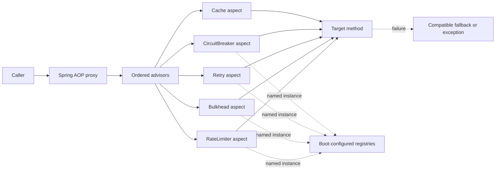

# Resilience4j With Spring Boot 4

<DocLabels items={[
  {label: 'Advanced', tone: 'advanced'},
  {label: 'Boot 4 integration', tone: 'foundation'},
  {label: 'Production resilience', tone: 'production'},
  {label: 'Shopverse evidence', tone: 'shopverse'},
]} />

This page owns Spring Boot 4 auto-configuration, annotations, AOP composition,
named instances, metrics, and integration tests. Policy selection and parameter
theory remain canonical in the generic guide.

<TopicCards items={[
  {title: 'Resilience policy design', href: '/reliability/RESILIENCE4J-GENERIC', description: 'Choose retry, breaker, limiter, bulkhead, and timeout policies independently of Spring.', icon: 'layers', tags: ['Canonical', 'Policy design']},
  {title: 'Distributed rate limiting', href: '/reliability/DISTRIBUTED-RATE-LIMITING', description: 'Protect a cluster-wide quota rather than one application process.', icon: 'network', tags: ['Distributed', 'Quota']},
  {title: 'Micrometer metrics', href: '/observability/MICROMETER-METRICS', description: 'Build bounded dashboards, SLOs, and alerts for resilience outcomes.', icon: 'gauge', tags: ['Metrics', 'Alerts']},
]} />

## Boot 4 Integration

Shopverse manages Resilience4j 2.4.0 centrally:

```gradle
implementation "io.github.resilience4j:resilience4j-spring-boot4:${resilience4jVersion}"
implementation 'org.springframework.boot:spring-boot-starter-actuator'
```

The Boot integration binds `resilience4j.*` properties, creates registries and
named instances, registers annotation aspects, health/event contributors when
configured, and exports Micrometer metrics when the required infrastructure is
present. Verify the resolved dependency graph rather than mixing Boot 3 and Boot 4
starters.

## Proxy And Policy Composition



Source-code annotation order does not define runtime nesting. Spring advisor order
and each Resilience4j aspect order do. A retry outside a breaker records several
breaker calls; the reverse composition can record one final call. A cache hit may
bypass downstream policies only if the effective advisor chain places cache lookup
outside them.

<DocCallout type="production" title="Test the effective chain">

Do not infer composition from visual annotation order. Run a proxied Spring bean,
record target invocations and registry events, and assert which policy sees each
attempt, rejection, fallback, and cache hit.

</DocCallout>

Self-invocation and direct construction bypass the aspects. Put protected remote
operations on a collaborator with a clear public boundary.

## Named Configuration

```yaml
resilience4j:
  retry:
    instances:
      inventory-client:
        max-attempts: 3
        wait-duration: 200ms
  circuitbreaker:
    instances:
      inventory-client:
        sliding-window-size: 10
        minimum-number-of-calls: 5
        failure-rate-threshold: 50
        wait-duration-in-open-state: 10s
```

Annotation `name` selects the instance:

```java
@Retry(name = "inventory-client")
@CircuitBreaker(name = "inventory-client", fallbackMethod = "fallbackCatalog")
@Cacheable(cacheNames = "catalog")
public List<CatalogItemResponse> getCatalog() { ... }
```

Use shared base configurations to remove duplication, then override only measured
differences. Keep configuration names stable across code, metrics, alerts, and
runbooks.

## Fallback Contract

A fallback must have compatible arguments and return type, with an optional final
failure parameter. It is part of the public correctness contract, not a convenient
exception swallow.

<DocCallout type="shopverse" title="Current CatalogService behavior">

The catalog method composes Retry, CircuitBreaker, and Spring Cache. Its fallback
throws `ServiceUnavailableException`; it does not return an empty catalog that
looks authoritative. Current tests prove the fallback and manual cache clear by
direct construction, but do not yet prove the proxy/aspect/cache ordering.

</DocCallout>

## Current Inventory, Payment, And Gateway Policies

- Order's Inventory client has three configured attempts and a local circuit
  breaker.
- Inventory and Payment controller classes have local semaphore bulkheads and rate
  limiters with zero permit wait.
- The API Gateway has a reactive downstream circuit breaker, a time limiter, and
  GET retry configuration.
- Payment provider operations are not blindly decorated with a generic retry; the
  domain exposes explicit retry/reconcile paths.

<DocCallout type="mistake" title="Class-level advice also reaches health methods">

Inventory and Payment put rate-limit/bulkhead annotations on controller classes
that also contain public health endpoints. Verify the effective pointcut and avoid
letting traffic policies make platform health checks fail unexpectedly.

</DocCallout>

## Local Versus Distributed Limits

Resilience4j registries and semaphore limits are process-local:

```text
cluster allowance ≈ replicas x per-instance allowance
```

A rolling scale-out changes total rate and concurrency. Use local limits to protect
each process and its pools. Use a gateway or distributed authority for a global
customer/tenant quota. Do not describe a local `@RateLimiter` as a cluster-wide
contract.

## Feedback Loops And Half-Open Stampede

Retries at gateway, service, HTTP client, and broker layers multiply. Shopverse's
Gateway can retry eligible GET requests while `CatalogService` retries Inventory;
under matching failures this composition can create up to nine downstream attempts
for one original call. Assign one retry owner and a total deadline.

Each replica also owns a circuit breaker. After the open wait elapses, several
replicas can enter half-open and probe together. Limit permitted half-open calls,
bound concurrency below downstream recovery capacity, and alert on synchronized
state transitions.

<DocCallout type="production" title="Open is not unhealthy process state">

An open breaker usually means the dependency is protected. Do not wire it directly
to liveness and create restart storms. Expose truthful readiness/degradation based
on the application's routing contract.

</DocCallout>

## Reactive Cancellation

Reactive integration needs the Reactor module or Spring Cloud CircuitBreaker
adapter. A timeout or cancellation stops demand in the decorated publisher, but the
underlying HTTP/database work stops only if that client propagates cancellation.
`cancel-running-future` is a request, not proof that remote work ended.

Test subscription, retry resubscription, cancellation, context propagation, and
fallback with virtual time. Do not use thread-pool bulkheads as a generic wrapper
around an event loop.

## Live Tuning And Rollback

Treat policy configuration as versioned production code:

1. capture baseline call, rejection, retry, fallback, and downstream metrics;
2. change one named policy in a canary;
3. log/expose the effective registry configuration safely;
4. compare p95/p99, downstream load, and business errors;
5. roll back automatically when a defined threshold is crossed.

Do not assume a Config Server refresh mutates already-created registry objects.
Prove the deployed refresh/restart mechanism and the resulting effective config.
For programmatic registry updates, audit who changed what and retain the prior
configuration.

## Metrics And Alerts

Expose Actuator/Micrometer metrics with bounded instance names. Alert on:

- sustained circuit open/half-open or repeated state transitions;
- retry amplification and exhausted retries;
- bulkhead rejections and permit wait;
- rate-limit denial by approved dimension;
- slow-call rate and timeout/cancellation;
- fallback count plus degraded-result type;
- downstream latency/error versus policy state.

Avoid enabling every event endpoint publicly or tagging metrics with user IDs,
paths containing IDs, or exception messages.

## Test Evidence

- obtain the bean from Spring and prove self-invocation/direct construction differs;
- stub the HTTP dependency and assert exact attempt count and deadline;
- force breaker open/half-open through the registry and verify fallback/rejection;
- saturate the semaphore and assert HTTP mapping plus metrics;
- prove a cache hit does or does not enter the resilience aspects as intended;
- test reactive cancellation with virtual time and client cleanup;
- verify effective configuration after refresh/restart;
- run a load test to ensure policy limits stay below datasource/HTTP capacity.

## Interview Questions

<ExpandableAnswer title="Why can annotation order in source disagree with Resilience4j execution order?">

Spring invokes ordered advisors/aspects around the proxy. Java annotation placement
does not define their nesting; inspect configuration and prove it with registry
events and target invocation counts.

</ExpandableAnswer>

<ExpandableAnswer title="Why does a local @RateLimiter not enforce a customer-wide cluster quota?">

Each application instance owns its own registry and permissions. Replica count
changes the aggregate allowance, so a distributed/gateway authority is required
for a global quota.

</ExpandableAnswer>

<ExpandableAnswer title="How can Gateway and service retries create nine Inventory calls?">

If the Gateway performs the original call plus two retries and each Order request
performs up to three Inventory attempts, the layers multiply to three times three.

</ExpandableAnswer>

<ExpandableAnswer title="Why can half-open state overload a recovering dependency?">

Every replica has an independent breaker and can permit trial calls at roughly the
same time. Aggregate probes can exceed the dependency's reduced recovery capacity.

</ExpandableAnswer>

<ExpandableAnswer title="Why is cancel-running-future not proof that remote work stopped?">

Cancellation is cooperative. The decorated future/publisher can be cancelled while
the underlying socket, query, or remote service continues unless its client honors
and propagates cancellation.

</ExpandableAnswer>

<ExpandableAnswer title="What is missing from a unit test that calls a fallback directly?">

It proves fallback code only. It does not prove Spring proxy interception, named
configuration, aspect order, attempt count, breaker events, or Micrometer output.

</ExpandableAnswer>

<ExpandableAnswer title="How should a live policy change be rolled out?">

Version it, prove how effective registry state changes, canary one instance, compare
business and downstream metrics, and retain an automatic rollback to the prior
configuration.

</ExpandableAnswer>

## Official References

- [Resilience4j project documentation](https://resilience4j.readme.io/docs/getting-started)
- [Resilience4j Spring Boot 4 API 2.4.0](https://javadoc.io/doc/io.github.resilience4j/resilience4j-spring-boot4/2.4.0/)
- [Resilience4j 2.4.0 source](https://github.com/resilience4j/resilience4j/tree/v2.4.0)
- [Spring Boot 4 Actuator metrics](https://docs.spring.io/spring-boot/4.0/reference/actuator/metrics.html)

## Recommended Next

Use [Generic Resilience4j Patterns](../reliability/RESILIENCE4J-GENERIC.md) for
policy selection, then verify Shopverse behavior through
[Micrometer Metrics](../observability/MICROMETER-METRICS.md).
