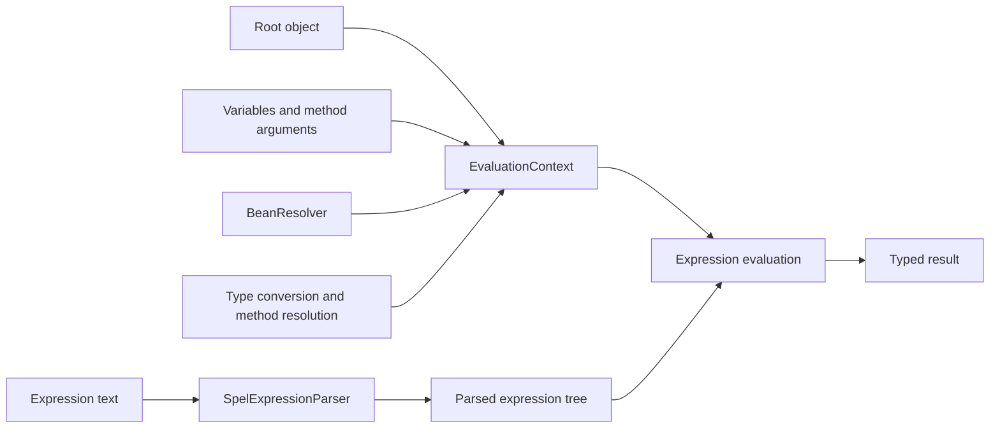

# Spring Expression Language (SpEL)

SpEL is Spring's expression language for reading object graphs, invoking
methods, performing logical operations, referring to Spring beans, and making
runtime decisions inside supported Spring annotations and configuration.

Use it for small declarative expressions. Keep substantial business rules in
named Java methods where they are easier to type-check, test, debug, and reuse.

## SpEL Versus Property Placeholders

These syntaxes solve different problems:

| Syntax | Purpose | Example |
|---|---|---|
| `${...}` | Resolve a value from Spring's `Environment` | `${server.port:8080}` |
| `#{...}` | Parse and evaluate a SpEL expression | `#{2 * 60}` |
| `#{${...}}` | Resolve configuration, then evaluate it as SpEL | `#{${app.timeout-by-service}}` |

```java
@Value("${shopverse.inventory.reservation-ttl:5m}")
private Duration reservationTtl;

@Value("#{2 * 60 * 1000}")
private long twoMinutesInMilliseconds;
```

The first example is primarily placeholder resolution plus type conversion.
The second is a genuine SpEL calculation.

## Dependency

The expression engine is provided by `spring-expression`:

```gradle
implementation 'org.springframework:spring-expression'
```

A normal Spring Boot application usually does not add it directly. Starters
that depend on Spring Context bring it transitively:

```gradle
implementation 'org.springframework.boot:spring-boot-starter'
```

Method-security expressions additionally require Spring Security:

```gradle
implementation 'org.springframework.boot:spring-boot-starter-security'
```

## Core Expression Syntax

### Literals And Operators

```java
@Value("#{42}")
int answer;

@Value("#{'shopverse'.toUpperCase()}")
String productName;

@Value("#{10 > 5 and 20 < 30}")
boolean validRange;

@Value("#{T(java.time.Duration).ofMinutes(5)}")
Duration timeout;
```

Common operators include:

```text
+ - * / %
== != < <= > >=
and or not
matches
instanceof
```

`T(...)` references a Java type. Constructor calls use `new`, although
constructing complex objects inside annotations usually reduces readability.

### Properties, Methods, And Indexing

Given an evaluation root with `customer` and `items`:

```text
customer.username
customer.getUsername()
items[0]
attributes['region']
```

Property syntax such as `authentication.name` follows JavaBean conventions
and calls `authentication.getName()`.

### Bean References

The `@` prefix resolves a Spring bean by name:

```java
@Value("#{@pricingProperties.currency}")
String currency;
```

```text
@pricingProperties
    -> BeanFactory resolves bean named pricingProperties
    -> read getCurrency() or record accessor
```

This is the same mechanism used by Shopverse method security:

```java
@PreAuthorize(
    "hasRole('ADMIN') or "
    + "@orderAuthorization.isOwner(#id, authentication.name)"
)
```

### Null-Safe Navigation And Elvis

```java
@Value("#{@tenantContext.currentTenant?.region ?: 'unknown'}")
String region;
```

| Operator | Meaning |
|---|---|
| `?.` | navigate only when the preceding value is non-null |
| `?:` | use the right side when the left side is null |

Null-safe navigation avoids one null dereference, but it should not hide a
configuration value that is required for correctness.

### Collection Selection And Projection

SpEL can filter a collection:

```text
items.?[active]
```

and project a property from each item:

```text
items.![name]
```

Useful collection operators include:

| Expression | Meaning |
|---|---|
| `.?[condition]` | select all matching elements |
| `.^[condition]` | select the first match |
| `.$[condition]` | select the last match |
| `.![expression]` | transform/project every element |

Do not move large filtering pipelines into annotation strings. Java Streams
are clearer for non-trivial application logic.

## `@Value` With Scalar Properties

`application.yml`:

```yaml
shopverse:
  payment:
    provider: stub
    approval-limit: 5000
```

Injection:

```java
@Value("${shopverse.payment.provider:stub}")
private String provider;

@Value("${shopverse.payment.approval-limit:1000}")
private BigDecimal approvalLimit;
```

The value after `:` is a placeholder default, used when the property is
missing. Spring's conversion service converts the resolved text to the target
field or constructor-parameter type.

Constructor injection is preferable to mutable field injection:

```java
@Component
public class ProviderClient {

    private final Duration timeout;

    public ProviderClient(
            @Value("${shopverse.payment.timeout:2s}") Duration timeout
    ) {
        this.timeout = timeout;
    }
}
```

## Arrays And Lists With `@Value`

### Comma-Separated Array

`application.properties`:

```properties
shopverse.gateway.allowed-origins=http://localhost:3000,https://shopverse.example
```

```java
@Value("${shopverse.gateway.allowed-origins:}")
private String[] allowedOrigins;
```

Spring converts the comma-separated text into an array. An empty default can
produce an array containing an empty value depending on conversion and input;
validate or normalize it when an empty collection has business meaning.

### List Using `split`

```java
@Value("#{'${shopverse.gateway.allowed-origins:}'.empty "
        + "? T(java.util.List).of() "
        + ": '${shopverse.gateway.allowed-origins:}'.split(',')}")
private List<String> allowedOrigins;
```

For a simple required list, the common shorter form is:

```java
@Value("#{'${shopverse.features:checkout,timeline}'.split(',')}")
private List<String> enabledFeatures;
```

Whitespace remains part of split values unless it is normalized. Prefer
configuration binding when values need validation or relaxed parsing.

### SpEL List Literal

```java
@Value("#{{'ROLE_ADMIN', 'ROLE_CUSTOMER'}}")
private List<String> builtInRoles;
```

This is a constant embedded in code, not externalized configuration.

## Maps With `@Value`

One possible `.properties` representation is a SpEL map literal:

```properties
shopverse.timeout-by-service={order:2000,inventory:1500,payment:3000}
```

Resolve the placeholder and then evaluate the resulting map:

```java
@Value("#{${shopverse.timeout-by-service}}")
private Map<String, Integer> timeoutByService;
```

Conceptual order:

```text
${shopverse.timeout-by-service}
    -> {order:2000,inventory:1500,payment:3000}

#{...}
    -> Map<String, Integer>
```

A default empty map can be expressed as:

```java
@Value("#{${shopverse.timeout-by-service:{}}}")
private Map<String, Integer> timeoutByService;
```

A map literal can also be declared directly:

```java
@Value("#{{'order': 2000, 'inventory': 1500}}")
private Map<String, Integer> defaults;
```

This syntax is compact but fragile for nested, frequently changed, or
validated configuration. Prefer:

```yaml
shopverse:
  timeout-by-service:
    order: 2s
    inventory: 1500ms
    payment: 3s
```

```java
@Validated
@ConfigurationProperties("shopverse")
public record ShopverseProperties(
        Map<String, @NotNull Duration> timeoutByService
) {
}
```

This provides type-safe binding, validation, metadata, and easier tests.

## How SpEL Works Internally

At a high level:



Programmatic example:

```java
ExpressionParser parser = new SpelExpressionParser();
Expression expression = parser.parseExpression("price * quantity");

StandardEvaluationContext context =
        new StandardEvaluationContext(new LineItem(25, 4));

Integer total = expression.getValue(context, Integer.class);
```

The parser creates a reusable expression representation. The evaluation
context supplies:

- root object;
- variables;
- property accessors;
- method resolvers;
- bean resolver;
- type locator;
- type converter.

`StandardEvaluationContext` exposes broad language capabilities. For data
binding or other restricted scenarios, `SimpleEvaluationContext` offers a
deliberately limited feature set. Never evaluate an untrusted user's text with
a powerful evaluation context.

## SpEL In Method Security

Spring Security supplies a specialized method-security expression root and
evaluation context. It exposes authentication, authorization helpers, method
arguments, and Spring beans.

```java
@PreAuthorize("hasAuthority('USER_CREATE')")
public UserResponse createUser(...) {
    // executes only when authorized
}
```

```java
@PreAuthorize(
    "hasRole('ADMIN') or "
    + "@orderAuthorization.isOwner(#id, authentication.name)"
)
public List<OrderTimelineResponse> getTimeline(Long id) {
    // ...
}
```

For `GET /orders/123/timeline` with JWT subject `john`, Spring resolves:

```text
#id                 -> 123
authentication.name -> "john"
@orderAuthorization -> Spring authorization bean
```

and effectively invokes:

```java
orderAuthorization.isOwner(123L, "john");
```

See [Resource Ownership Authorization](../reliability/problems/runtime/RESOURCE-OWNERSHIP-AUTHORIZATION.md)
for the complete JWT, security-context, repository-query, and `403` flow.

Other method-security annotations include:

```java
@PostAuthorize("returnObject.customerUsername == authentication.name")
@PreFilter("filterObject.customerUsername == authentication.name")
@PostFilter("filterObject.customerUsername == authentication.name")
```

Use `@PostAuthorize` carefully: the method and database work have already run,
even though the result is rejected afterward. A scoped query or
`@PreAuthorize` check is usually better for customer-owned reads.

## SpEL In Spring Cache

Cache annotations expose method arguments and, for `unless`, the result:

```java
@Cacheable(
    cacheNames = "payments",
    key = "#orderNumber",
    condition = "#orderNumber != null",
    unless = "#result == null"
)
public PaymentResponse getByOrderNumber(String orderNumber) {
    // ...
}
```

| Attribute | Evaluated | Purpose |
|---|---|---|
| `key` | before invocation | derive cache key |
| `condition` | before invocation | decide whether caching applies |
| `unless` | after invocation | veto caching based on result |

## SpEL In Event Listeners

Conditional listeners can inspect the event:

```java
@EventListener(condition = "#event.status == 'FAILED'")
public void onFailedPayment(PaymentStatusChanged event) {
    // ...
}
```

Use this for small routing predicates, not an entire workflow encoded in a
string.

## SpEL In Scheduled And Conditional Configuration

Some annotation string attributes are resolved through Spring's embedded
value resolver and can use placeholders or expressions:

```java
@Scheduled(fixedDelayString = "${shopverse.outbox.delay:1s}")
public void publishOutbox() {
    // ...
}
```

```java
@Scheduled(fixedDelayString = "#{@outboxProperties.delay.toMillis()}")
public void publishOutbox() {
    // ...
}
```

Spring Boot also offers:

```java
@ConditionalOnExpression("${shopverse.simulation.enabled:false}")
```

Prefer `@ConditionalOnProperty` for a straightforward configuration flag. It
is clearer and avoids unnecessary expression parsing.

## SpEL In Spring Data

Spring Data supports SpEL in selected repository features. An open projection
can compute a value:

```java
public interface OrderSummary {

    String getOrderNumber();

    @Value("#{target.orderNumber + ' - ' + target.status}")
    String getDisplayLabel();
}
```

Open projections can require more entity state than closed projections. For
large read APIs, constructor or interface projections with explicit selected
columns are usually easier to optimize.

Repository queries can also expose a restricted set of variables. Do not
accept raw query fragments or SpEL expressions from clients.

## Where SpEL Is Commonly Used

| Area | Typical annotations/features |
|---|---|
| configuration injection | `@Value` |
| method authorization | `@PreAuthorize`, `@PostAuthorize`, `@PreFilter`, `@PostFilter` |
| caching | `@Cacheable`, `@CachePut`, `@CacheEvict` |
| application events | `@EventListener(condition = "...")` |
| scheduling | string-based delay, rate, or cron attributes |
| conditional beans | `@ConditionalOnExpression` |
| Spring Data | open projections and supported query expressions |
| XML configuration | bean property and constructor expressions |
| view templates | Spring-integrated template engines may expose SpEL |

Each integration defines its own root object and variables. A name available
in method security, such as `authentication`, is not automatically available
inside `@Value` or a cache expression.

## Production Practices

- Never parse and evaluate expressions supplied by API callers.
- Keep expressions short and side-effect free.
- Put reusable or complex authorization in named Spring beans.
- Prefer `@ConfigurationProperties` for grouped lists, maps, nested values,
  validation, metadata, and immutable configuration.
- Do not use SpEL to hide required configuration behind silent defaults.
- Avoid calling remote services or expensive database operations from general
  expressions. Ownership checks are targeted authorization queries and should
  remain indexed and inexpensive.
- Remember that annotation expressions are strings: many errors are detected
  at startup or runtime rather than by the Java compiler.
- Unit-test custom expression beans and integration-test the annotation path.
- Treat changes to security expressions as security-sensitive code changes.

## Interview Questions

### What is the difference between `${...}` and `#{...}`?

`${...}` resolves external configuration from the `Environment`. `#{...}`
evaluates a SpEL expression. They can be combined when configuration contains
an expression literal, but typed binding is usually clearer.

### How does `authentication.name` work?

SpEL property access calls `Authentication.getName()`. In Shopverse JWT
resource services, the authenticated object is `JwtAuthenticationToken`, and
its name uses the JWT `sub` claim because no alternate principal claim is
configured.

### Why does `@orderAuthorization` work?

The method-security evaluation context has a Spring bean resolver. `@` means
resolve a bean by name, so it finds the component named `orderAuthorization`
and invokes its `isOwner` method.

### Why not use `@Value` for every property?

It scatters configuration, lacks a cohesive typed contract, and makes nested
maps, validation, metadata, and testing harder. Use it for genuinely isolated
values; use `@ConfigurationProperties` for a configuration domain.

## Official References

- [Spring Framework SpEL reference](https://docs.spring.io/spring-framework/reference/core/expressions.html)
- [`@Value` reference](https://docs.spring.io/spring-framework/reference/core/beans/annotation-config/value-annotations.html)
- [Spring Security method security](https://docs.spring.io/spring-security/reference/servlet/authorization/method-security.html)
- [Spring Boot externalized configuration](https://docs.spring.io/spring-boot/reference/features/external-config.html)
