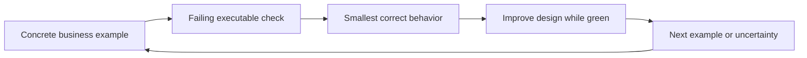

# TDD And BDD Engineering Path

TDD is a development feedback loop; BDD is a collaborative way to discover and express
observable behavior using domain language. Neither is a synonym for “write many tests.”

## Complete Route

1. [TDD Workflow, Design Feedback, And Java Examples](./testing/TDD-WORKFLOW-DESIGN.md)
2. [BDD Discovery, Specifications, And Domain Examples](./testing/BDD-DISCOVERY-SPECIFICATIONS.md)
3. [Spring Test Architecture, Boundaries, And Production Adoption](./testing/TDD-BDD-SPRING-PRODUCTION.md)
4. [Interview Questions, Failure Scenarios, Labs, And Revision](./testing/TDD-BDD-INTERVIEW-REVISION.md)

## Completion Standard

You should be able to turn an ambiguous rule into examples, select the smallest useful
test boundary, run red-green-refactor honestly, distinguish state and interaction checks,
avoid brittle mocks, test database/messaging/HTTP contracts at the correct layer, evolve
legacy code with characterization tests, and explain what production risks remain outside
automated examples.

## Official References

- [JUnit 5 User Guide](https://junit.org/junit5/docs/current/user-guide/)
- [Spring Boot testing reference](https://docs.spring.io/spring-boot/reference/testing/)
- [Mockito documentation](https://javadoc.io/doc/org.mockito/mockito-core/latest/org/mockito/Mockito.html)

## Recommended Next

Begin with [TDD Workflow, Design Feedback, And Java Examples](./testing/TDD-WORKFLOW-DESIGN.md).

