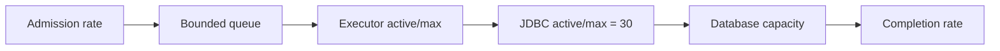

# Capacity And Thread-Pool Calculation Lab

<DocLabels items={[
  {label: 'Capacity math', tone: 'advanced'},
  {label: 'Backpressure', tone: 'production'},
  {label: 'Executable async test', tone: 'shopverse'},
]} />

## Scenario And Inputs

Order projection receives 120 events/s normally and 300 events/s during replay.
Measured service time is 80 ms p50 and 240 ms p95. The database permits 30
connections for this workload. The SLO is p95 under 800 ms, and overload must
not exhaust heap.

Use Little’s Law as a first bound:

```text
concurrency = arrival rate × time in system
normal lower bound = 120/s × 0.240s = 28.8
replay lower bound = 300/s × 0.240s = 72
```

That does not justify 72 database-active threads: the database budget is 30.
It shows replay cannot meet the same latency without lower service time,
additional database capacity, batching, or controlled backlog.



## Calculation Worksheet

| Control | Starting value | Evidence to change it |
|---|---:|---|
| worker core/max | 16 / 24 | runnable time versus downstream wait |
| queue capacity | 240 | one second of normal demand, bounded by memory/SLO |
| JDBC max | 30 | database concurrency budget and acquire latency |
| replay admission | 100/s | completion rate without SLO breach |
| task timeout | 600 ms | remaining end-to-end deadline |

## Experiment

1. Run a steady normal workload; record arrivals, completions and latency.
2. Replay at 300/s without changing capacity. Observe queue growth rate:
   `arrival rate - completion rate`.
3. Stop before the queue violates the latency budget.
4. Add admission control at the replay source, not an unbounded executor queue.
5. Test rejection behavior and confirm failed work remains recoverable.

The compiled example uses a named, bounded `ThreadPoolTaskExecutor`:
`documentation/labs/spring-architect/src/main/java/io/shopverse/labs/async/AsyncConfiguration.java`.

<!-- snippet-source: labs/spring-architect/src/main/java/io/shopverse/labs/async/AsyncConfiguration.java -->
<!-- snippet-test: labs/spring-architect/src/test/java/io/shopverse/labs/AsyncExecutionTest.java -->

<DocCallout type="mistake" title="A large queue converts overload into old work">

If work waits 30 seconds before execution, a 500 ms task timeout cannot protect
the caller. Bound queue residence, propagate deadlines, and make rejection a
designed recovery path.

</DocCallout>

## Interview Drill

**Should executor threads equal database connections?**

<ExpandableAnswer title="Expand architect answer">

Not mechanically. Some tasks compute or call other dependencies, while a task
may hold a connection for only part of its lifetime. Measure the fraction of
time at each boundary. The executor must still be bounded so it cannot create
more concurrent database demand than the pool and database can safely absorb.

</ExpandableAnswer>

## Official References

- [Spring task execution and scheduling](https://docs.spring.io/spring-framework/reference/integration/scheduling.html)
- [Spring Boot task execution](https://docs.spring.io/spring-boot/reference/features/task-execution-and-scheduling.html)

## Recommended Next

Use [Resource Pools And Capacity](../production/RESOURCE-POOL-CONCURRENCY-CAPACITY.md)
for production metrics and alert design.
