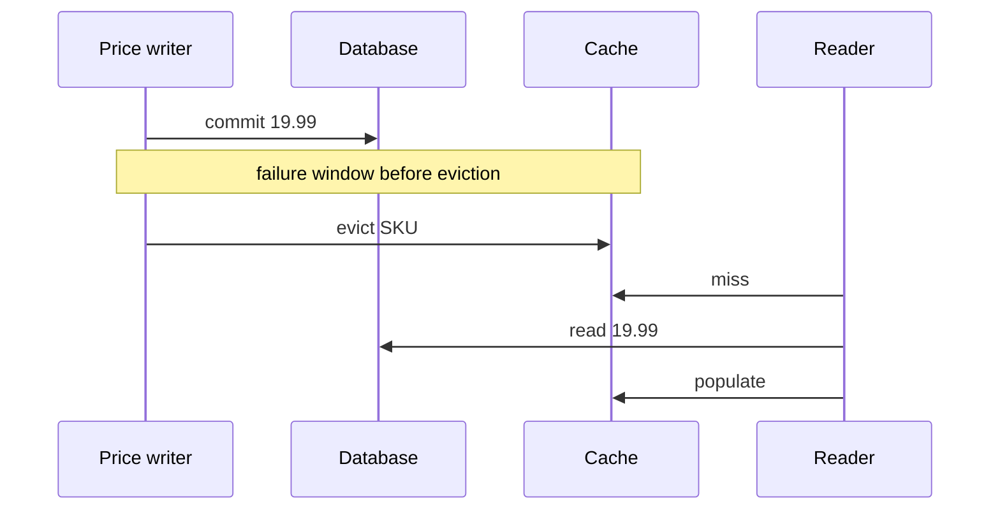

# Database And Cache Consistency Lab

<DocLabels items={[
  {label: 'Consistency', tone: 'advanced'},
  {label: 'Cache operations', tone: 'production'},
  {label: 'Executable cache-aside', tone: 'shopverse'},
]} />

## Scenario

A product price changes from 24.99 to 19.99. Checkout must never charge an old
price after the order has been accepted, while catalog browsing can tolerate up
to 30 seconds of staleness. One cache policy cannot satisfy both contracts.



## Consistency Worksheet

| Read path | Source of truth | Staleness budget | Control |
|---|---|---:|---|
| catalog card | cached product view | 30 s | TTL plus event invalidation |
| checkout pricing | price snapshot validated by server | 0 after acceptance | transactional DB read/version check |
| inventory hint | cached availability | seconds | never promise allocation from hint |
| order receipt | order aggregate snapshot | immutable | store accepted price in order line |

## Run The Cache Proof

```powershell
.\shopverse-platform\gradlew.bat -p .\documentation\labs\spring-architect test --tests *CacheBehaviorTest
```

<!-- snippet-source: labs/spring-architect/src/main/java/io/shopverse/labs/cache/ProductPriceService.java -->
<!-- snippet-test: labs/spring-architect/src/test/java/io/shopverse/labs/CacheBehaviorTest.java -->

The test proves two reads hit the source once, then eviction makes the next read
reload. Extend it by failing eviction after commit and documenting the maximum
stale window under TTL-only recovery.

## Failure Analysis

| Ordering | Failure | Mitigation |
|---|---|---|
| evict then DB commit | another reader can repopulate old data | evict after successful commit |
| DB commit then evict | crash can leave stale cache | TTL, outbox invalidation, reconciliation |
| write DB and cache | partial success can diverge | versioned events and source-of-truth rules |
| concurrent misses | stampede | per-key synchronization, request coalescing, jittered TTL |

<DocCallout type="production" title="State the business invariant before choosing a pattern">

“Cache must be consistent” is not testable. Specify which reader, which value,
the allowed stale duration, and what happens when cache or invalidation is down.

</DocCallout>

## Interview Drill

**Can `@CacheEvict` guarantee cache and database atomicity?**

<ExpandableAnswer title="Expand architect answer">

No. It can order eviction around a method or transaction-aware cache integration,
but a remote cache and database do not share one atomic commit by default. Design
for the crash window with TTLs, durable invalidation events, version checks and
reconciliation. Critical writes should validate against the source of truth.

</ExpandableAnswer>

## Official References

- [Spring cache abstraction](https://docs.spring.io/spring-framework/reference/integration/cache.html)
- [Spring transaction-bound events](https://docs.spring.io/spring-framework/reference/data-access/transaction/event.html)

## Recommended Next

Compare policies in [Cache-Aside Versus Write-Through](../decisions/CACHE-ASIDE-VS-WRITE-THROUGH.md).
