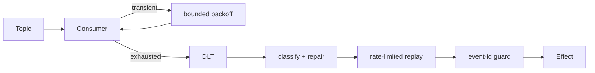

# Kafka Replay And Idempotency Lab

<DocLabels items={[
  {label: 'Kafka recovery', tone: 'production'},
  {label: 'Idempotency', tone: 'advanced'},
  {label: 'Executable replay', tone: 'shopverse'},
]} />

## Scenario

Thirty `orders.created` records reached `orders.created.DLT` during a schema
deployment. Twenty are valid after the fix; ten are permanently malformed. A
blind replay could repeat email, inventory, or projection side effects.



## Recovery Policy

| Failure | Retry? | Recovery |
|---|---|---|
| timeout or broker-side transient | yes, bounded and jittered | retry then DLT |
| malformed payload or invariant violation | no | DLT immediately |
| database unavailable | yes, admission-aware | pause/slow consumption if systemic |
| unknown code defect | limited | DLT with trace and deployment version |

## Run The Deterministic Proof

```powershell
.\shopverse-platform\gradlew.bat -p .\documentation\labs\spring-architect test --tests *KafkaReplayIdempotencyTest
```

<!-- snippet-source: labs/spring-architect/src/main/java/io/shopverse/labs/kafka/KafkaRecoveryConfiguration.java -->
<!-- snippet-source: labs/spring-architect/src/main/java/io/shopverse/labs/kafka/OrderEventConsumer.java -->
<!-- snippet-test: labs/spring-architect/src/test/java/io/shopverse/labs/KafkaReplayIdempotencyTest.java -->
<!-- snippet-test: labs/spring-architect/src/test/java/io/shopverse/labs/kafka/KafkaRecoveryConfigurationTest.java -->

The compiled configuration maps exhausted records to `<original>.DLT`, uses
bounded exponential backoff, and classifies `IllegalArgumentException` as
non-retryable. The test sends the same event twice and proves only one effect.

## Replay Runbook

1. Freeze automatic replay and preserve original topic, partition, offset and headers.
2. Group failures by exception, schema version and deployment.
3. Fix the cause and test one representative record in isolation.
4. Confirm the idempotency key is stored atomically with the business effect.
5. Replay at an explicit rate below downstream spare capacity.
6. Monitor duplicates, consumer lag, error rate, database saturation and DLT growth.
7. Stop on a predefined threshold; reconcile counts after completion.

<DocCallout type="mistake" title="An in-memory set is a teaching probe, not a production ledger">

The lab makes duplicate suppression visible with an in-memory set. Production
consumers need a durable unique key or naturally idempotent state transition,
committed in the same database transaction as the side effect.

</DocCallout>

## Interview Drill

**Does Kafka exactly-once remove the need for an idempotent database consumer?**

<ExpandableAnswer title="Expand architect answer">

No. Kafka transactions can provide exactly-once semantics for coordinated Kafka
read-process-write flows. A separate database, email provider, or HTTP service
is outside that transaction unless an additional protocol coordinates it.
Consumers must make external effects idempotent and reconcile ambiguous outcomes.

</ExpandableAnswer>

## Official References

- [Spring Kafka handling exceptions](https://docs.spring.io/spring-kafka/reference/kafka/annotation-error-handling.html)
- [Spring Kafka exactly-once semantics](https://docs.spring.io/spring-kafka/reference/kafka/exactly-once.html)

## Recommended Next

Read [Kafka Retry, DLT And Recovery](../kafka/SPRING-KAFKA-RETRY-DLT-RECOVERY.md).
