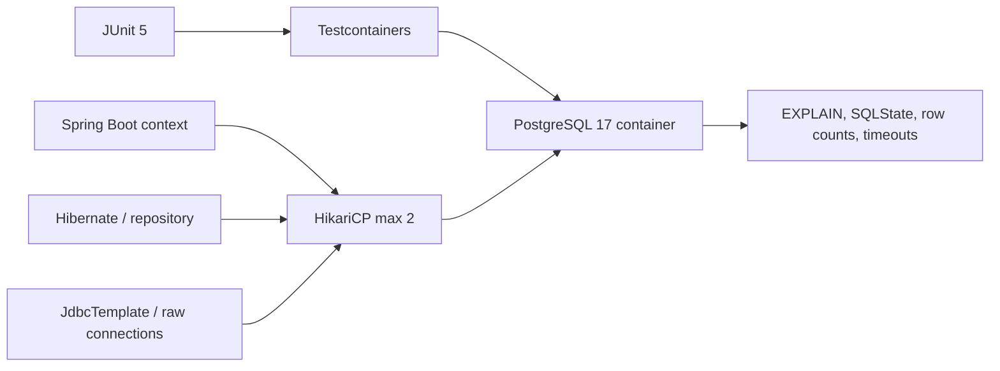

# PostgreSQL JPA Performance And Concurrency Lab

<DocLabels items={[
  {label: 'Real PostgreSQL', tone: 'production'},
  {label: 'Compiled Testcontainers lab', tone: 'shopverse'},
  {label: 'Performance and concurrency', tone: 'advanced'},
]} />

## Outcome

This lab replaces database simulation with a disposable PostgreSQL instance. Six executable tests
produce evidence for indexes, keyset pagination, pool exhaustion, atomic inventory updates, deadlocks,
and persistence-context staleness after bulk JPQL.



## Prerequisites

Start Docker Desktop or another Testcontainers-compatible runtime and verify:

```powershell
docker info
```

The lab uses `@Testcontainers(disabledWithoutDocker = true)`. If no runtime is available, Gradle
succeeds but all six PostgreSQL cases are reported as **skipped**. A green Gradle task with skipped
tests is not PostgreSQL evidence.

## Run The Lab

```powershell
.\shopverse-platform\gradlew.bat `
  -p .\documentation\labs\spring-architect `
  clean test --tests "io.shopverse.labs.PostgresJpaProductionTest"
```

<!-- snippet-source: labs/spring-architect/src/test/resources/db/postgres/V001__order_performance_indexes.sql -->
<!-- snippet-test: labs/spring-architect/src/test/java/io/shopverse/labs/PostgresJpaProductionTest.java -->

Open the report:

```text
documentation/labs/spring-architect/build/reports/tests/test/index.html
```

Confirm `tests=6`, `skipped=0`, `failures=0`. Preserve the report with the evidence pack.

## Governed Dependencies

The standalone lab imports the Testcontainers BOM and uses the renamed Testcontainers 2 modules:

```groovy
testImplementation platform("org.testcontainers:testcontainers-bom:2.0.5")
testImplementation "org.testcontainers:testcontainers-junit-jupiter"
testImplementation "org.testcontainers:testcontainers-postgresql"
```

The PostgreSQL test is isolated from the normal H2 examples. `@DynamicPropertySource` connects the
Spring datasource to the disposable container, and Hibernate creates the entity tables. The versioned
lab SQL file creates reviewed performance indexes and concurrency fixtures.

## Experiment 1: Composite Index And Plan

The lab inserts 5,000 orders with mixed status and total values, analyzes the table, then executes:

```sql
explain (analyze, buffers, format text)
select id, total
from shop_orders
where status = 'PENDING'
order by total desc, id desc
limit 50;
```

The index is ordered as `(status, total desc, id desc)` because status is the equality predicate and the
remaining columns provide stable ordered traversal. The assertion captures the selected index,
actual execution timing, and buffer evidence.

Do not use `enable_seqscan=off` as a production setting. The lab uses it only to prove the candidate
index can serve the query on a deliberately small table. Repeat with realistic cardinality and allow
the optimizer to choose naturally before making a production decision.

## Experiment 2: Keyset Pagination

The first page orders by `(total desc, id desc)`. The last tuple becomes the cursor:

```sql
where status = 'PENDING'
  and (total, id) < (:lastTotal, :lastId)
order by total desc, id desc
limit :size;
```

The unique `id` tie-breaker prevents equal totals from producing ambiguous positions. Extend the test
with concurrent inserts and deletes. Document whether the API promises a snapshot, monotonic traversal,
or merely no duplicate entries under its stated mutation model.

Compare against deep offset pages using:

```sql
explain (analyze, buffers)
select id, total from shop_orders
where status = 'PENDING'
order by total desc, id desc
offset 100000 limit 50;
```

Capture rows scanned, buffers and latency rather than claiming keysets are faster without evidence.

## Experiment 3: Hikari Pool Exhaustion

The test datasource has a maximum of two connections and a 300 ms acquisition timeout. Two connections
are held deliberately; the third request must fail with `SQLTransientConnectionException`.

Production interpretation:

```text
total possible connections = application replicas x pool maximum
                           + jobs, migration tools and administrative clients
```

Repeat with a remote call inside a transaction and graph acquisition wait. Increasing the pool can move
the queue into PostgreSQL and worsen throughput; diagnose transaction duration and database capacity first.

## Experiment 4: Atomic Conditional Inventory Update

The lab reserves inventory in one statement:

```sql
update lab_inventory
set available = available - :quantity,
    version = version + 1
where sku = :sku
  and available >= :quantity;
```

The first reservation affects one row; the second affects zero. This avoids a read-modify-write race.
The affected-row count is part of the business contract and must be translated into a clear conflict.

## Experiment 5: PostgreSQL Deadlock

Two connections update accounts in opposite order:

```text
T1 locks account 1 -> waits for account 2
T2 locks account 2 -> waits for account 1
PostgreSQL detects cycle -> one transaction receives SQLSTATE 40P01
```

The expected evidence is one committed transaction and one `40P01` victim. The permanent fix is consistent
lock ordering and smaller transaction scope. A bounded whole-transaction retry may handle residual deadlocks
only when the business command remains idempotent and is reconstructed in a fresh transaction.

## Experiment 6: Bulk JPQL Stale State

The test loads a managed entity, runs a bulk transition, and proves the Java object still contains its old
status. Bulk JPQL runs directly against rows and bypasses dirty checking, entity callbacks and ordinary
managed-state synchronization. After `EntityManager.clear()`, reloading reveals the database value.

For production bulk work:

- flush intentionally before the operation;
- use a dedicated small transaction;
- verify affected rows;
- clear or refresh managed state;
- document auditing and version behavior;
- batch/backfill with rate and lock controls.

## Schema Evolution Exercise

Treat `V001__order_performance_indexes.sql` as an illustrative migration input. For a production migration:

1. verify duplicate/null preconditions;
2. estimate build time, I/O and lock behavior;
3. use online/concurrent index creation where supported and operationally safe;
4. deploy query-compatible code through expand-and-contract;
5. validate plan adoption and latency;
6. retain a rollback or roll-forward procedure;
7. record migration identity and outcome through Liquibase/Flyway or the approved platform tool.

## Failure Exercises

1. Remove `id` from the index and compare sort/buffer behavior.
2. Increase application replicas in the capacity worksheet without changing PostgreSQL limits.
3. Reverse lock order in only one code path and capture the deadlock graph.
4. Replace the atomic inventory update with read-modify-write and reproduce overselling.
5. Remove `entityManager.clear()` after bulk JPQL and show a stale response.
6. Add a large offset and graph latency as table cardinality increases.
7. Stop the PostgreSQL container mid-query and classify unknown versus known outcomes.

## Evidence Pack

Submit:

- six non-skipped passing test results;
- `EXPLAIN (ANALYZE, BUFFERS)` before and after the index;
- offset/keyset comparison with dataset size;
- Hikari active, idle, pending and timeout metrics;
- deadlock timeline and SQLSTATE;
- atomic-update affected-row evidence;
- bulk-JPQL persistence-context timeline;
- schema migration plan and rollback/roll-forward decision;
- an ADR explaining the selected pagination and concurrency controls.

## Interview Drill

**A query is slow and the connection pool is exhausted. What do you do first?**

<ExpandableAnswer title="Expand architect answer">

I separate connection acquisition wait from database execution and application processing. I inspect active
transactions, slow-query plans and binds, rows examined versus returned, lock waits, remote calls inside
transactions, pool size across every replica, and the database's global connection/resource budget. I contain
load with a reversible control, fix the query/index or transaction boundary, and increase the pool only if
measured database capacity supports the additional concurrency. I verify p95/p99, acquisition wait, throughput,
database CPU/I/O and correctness under failure.

</ExpandableAnswer>

## Official References

- [Spring Boot Testcontainers support](https://docs.spring.io/spring-boot/reference/testing/testcontainers.html)
- [Testcontainers PostgreSQL module](https://java.testcontainers.org/modules/databases/postgres/)
- [PostgreSQL EXPLAIN](https://www.postgresql.org/docs/current/using-explain.html)
- [PostgreSQL explicit locking and deadlocks](https://www.postgresql.org/docs/current/explicit-locking.html)
- [HikariCP configuration](https://github.com/brettwooldridge/HikariCP#configuration-knobs-baby)

## Recommended Next

Continue with [Transaction Boundary Failures](./TRANSACTION-BOUNDARY-FAILURES.md), then implement the
transactional-outbox lab from [Multi-Store Consistency](../data/SPRING-DATA-MULTISTORE-CONSISTENCY.md).
