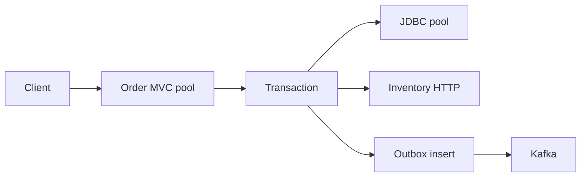

# Production Incident Diagnosis Lab

<DocLabels items={[
  {label: 'Incident command', tone: 'production'},
  {label: 'Evidence first', tone: 'advanced'},
  {label: '60–90 minutes', tone: 'shopverse'},
]} />

## Scenario

At 12:05, Shopverse checkout p95 rises from 280 ms to 4.8 s. Error rate is only
2%, CPU is 42%, and database CPU is 35%. The temptation is to add pods. Your job
is to determine whether the bottleneck is request threads, a connection pool,
inventory latency, retry amplification, Kafka publishing, or lock contention.

## Investigation Board

| Question | Evidence | Discriminator |
|---|---|---|
| Is work waiting before application code? | server active/max threads, queue, trace start gap | high queue with moderate CPU means saturation |
| Is JDBC constrained? | Hikari pending, active/max, acquire p95 | pending borrowers identify pool wait |
| Is a dependency slow? | client spans by route and outcome | long child span without local queue |
| Are retries amplifying load? | attempts per logical request | request rate grows downstream only |
| Is the database blocked? | lock waits, slow query plan, transaction age | long transaction plus blocker PID |
| Is GC responsible? | pause duration and allocation rate | pause overlaps latency window |

## Lab Steps

1. Define customer impact and freeze unrelated deployments.
2. Build a five-minute timeline around the first SLO breach.
3. Compare arrival rate, completions, active work and queue depth.
4. Select one trace containing the slowest stage; do not infer from totals.
5. Inspect the constrained pool and its downstream dependency together.
6. Apply one reversible containment: shed optional work, cap retries, or reduce
   admission. Increasing every pool is not a containment plan.
7. Prove recovery with p95/p99, queue drain time, rejection rate and correctness.

## Injected Clue

Inventory p99 is 1.2 s and the order client performs three immediate retries.
The order executor has 200 threads, while its HTTP connection pool has 40
connections. Most threads are parked waiting to lease a connection.

<DocCallout type="production" title="Expected diagnosis">

Retry amplification and connection-pool wait are the primary mechanism. More
request threads increase queued work and memory without increasing the 40-call
downstream concurrency ceiling. Bound retries, add jitter where retry is safe,
align admission with downstream capacity, and define a degraded checkout policy.

</DocCallout>

## Deliverables

- impact statement and timeline;
- causal graph distinguishing trigger, mechanism and contributing controls;
- containment with rollback conditions;
- missing telemetry list;
- regression load test and alert based on saturation, not only CPU.

## Interview Drill

**Why can latency explode while CPU stays moderate?**

<ExpandableAnswer title="Expand architect answer">

The service can be waiting rather than computing: queued for a servlet thread,
connection, database lock, broker acknowledgement, or remote response. Waiting
consumes concurrency and increases queue time while using little CPU. Correlate
active/max, pending borrowers, queue depth and span duration before scaling.

</ExpandableAnswer>

## Official References

- [Spring Boot observability](https://docs.spring.io/spring-boot/reference/actuator/observability.html)
- [Spring Boot metrics](https://docs.spring.io/spring-boot/reference/actuator/metrics.html)

## Recommended Next

Quantify the control in [Capacity And Thread-Pool Lab](./CAPACITY-THREAD-POOL-LAB.md).
