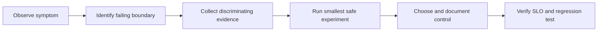

# Spring Architect Hands-On Labs

<DocLabels items={[
  {label: 'Architect labs', tone: 'advanced'},
  {label: 'Executable evidence', tone: 'production'},
  {label: 'Shopverse', tone: 'shopverse'},
]} />

These are investigation exercises, not recipes. Each lab starts with symptoms,
requires a hypothesis, asks for evidence, and ends with a decision record. The
supporting code lives in `documentation/labs/spring-architect` and is compiled as
Java 21 against Spring Boot 4.0.6.



<TopicCards items={[
  {title: 'Production Incident Diagnosis', href: './PRODUCTION-INCIDENT-DIAGNOSIS', description: 'Triage latency, saturation, errors and dependency failure without guessing.', icon: 'gauge', tags: ['Observability', 'Runbook']},
  {title: 'Capacity And Thread Pools', href: './CAPACITY-THREAD-POOL-LAB', description: 'Calculate concurrency, queue risk and rejection behavior from an SLO.', icon: 'experiment', tags: ['Little’s Law', 'Backpressure']},
  {title: 'Transaction Boundary Failures', href: './TRANSACTION-BOUNDARY-FAILURES', description: 'Reproduce rollback, proxy, propagation and remote-call failure modes.', icon: 'layers', tags: ['AOP', 'Consistency']},
  {title: 'Kafka Replay And Idempotency', href: './KAFKA-REPLAY-IDEMPOTENCY', description: 'Recover poison records and replay safely without duplicating effects.', icon: 'network', tags: ['DLT', 'Recovery']},
  {title: 'Database And Cache Consistency', href: './DATABASE-CACHE-CONSISTENCY', description: 'Choose staleness bounds and repair paths for price and inventory reads.', icon: 'boxes', tags: ['Cache', 'Data']},
  {title: 'Spring Data Repository Internals', href: './SPRING-DATA-REPOSITORY-INTERNALS-LAB', description: 'Trace repository proxies, queries, paging, auditing and optimistic conflicts with compiled tests.', icon: 'experiment', tags: ['Spring Data', 'JPA']},
  {title: 'PostgreSQL JPA Performance', href: './POSTGRES-JPA-PERFORMANCE-LAB', description: 'Measure real plans, keysets, pools, atomic updates, deadlocks and bulk-state hazards.', icon: 'gauge', tags: ['PostgreSQL', 'Testcontainers']},
  {title: 'Transactional Outbox, Inbox And CDC', href: './TRANSACTIONAL-OUTBOX-INBOX-CDC-LAB', description: 'Prove atomic publication intent, relay recovery, duplicates, ordering and reconciliation.', icon: 'network', tags: ['Outbox', 'Kafka']},
]} />

## Evidence Contract

Every completed lab should produce:

1. a timeline with the first bad signal and customer impact;
2. one falsifiable hypothesis at a time;
3. traces, metrics, logs, SQL, thread dumps, or broker evidence;
4. the immediate containment and its risk;
5. a permanent control plus a regression test;
6. an ADR when ownership, topology, or consistency changes.

<DocCallout type="production" title="Do not optimize the graph you imagined">

Capture evidence at the queue, pool, proxy, transaction, database, broker, and
remote-call boundaries. Average latency alone hides saturation and coordinated
omission.

</DocCallout>

## Run The Supporting Suite

```powershell
.\shopverse-platform\gradlew.bat -p .\documentation\labs\spring-architect clean test
```

## Official References

- [Spring Boot production-ready features](https://docs.spring.io/spring-boot/reference/actuator/index.html)
- [Spring Framework integration testing](https://docs.spring.io/spring-framework/reference/testing/integration.html)

## Recommended Next

Begin with [Production Incident Diagnosis](./PRODUCTION-INCIDENT-DIAGNOSIS.md),
then use the lab matching the first constrained boundary.
