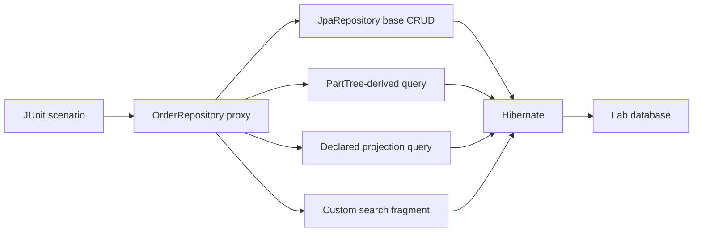

# Spring Data Repository Internals Lab

<DocLabels items={[
  {label: 'Compiled lab', tone: 'shopverse'},
  {label: 'Repository internals', tone: 'advanced'},
  {label: 'SQL evidence', tone: 'production'},
]} />

## Outcome

This lab turns the repository abstraction into observable runtime evidence. You will prove that
Spring creates an AOP proxy, observe four invocation paths, compare count-query cost, verify audit
callbacks, and force two writers to conflict through an optimistic version.



## Run The Proof

```powershell
.\shopverse-platform\gradlew.bat `
  -p .\documentation\labs\spring-architect `
  test --tests "io.shopverse.labs.SpringDataRepositoryInternalsTest"
```

<!-- snippet-source: labs/spring-architect/src/main/java/io/shopverse/labs/order/OrderRepository.java -->
<!-- snippet-test: labs/spring-architect/src/test/java/io/shopverse/labs/SpringDataRepositoryInternalsTest.java -->

Supporting fragment code:

- `OrderSearchOperations` defines the application-facing extension.
- `OrderSearchOperationsImpl` owns bounded custom JPQL.
- `OrderEntity` demonstrates `@Version`, `@CreatedDate`, and `@CreatedBy`.
- `ShopverseLabApplication` supplies the lab `AuditorAware`.

## Experiment 1: Inspect The Proxy

Set a breakpoint at the first repository call and inspect the runtime class. Confirm that it is not
the interface and not the custom fragment class. The repository proxy combines base CRUD, query-method
interception, transaction/exception advice and fragment dispatch.

Record:

1. proxy class and interfaces;
2. advisors/interceptors visible in the debugger;
3. target/base implementation;
4. which method reaches the fragment;
5. exception type before and after translation.

The invalid fragment limit deliberately throws `IllegalArgumentException`. Repository advice exposes
it as `InvalidDataAccessApiUsageException`, demonstrating that advice also applies to fragments.

## Experiment 2: Compare Query Paths

| Method | Mechanism | Evidence to capture |
|---|---|---|
| `findAll` | base repository implementation | generated select and entity materialization |
| `findByCustomerIdAndStatusOrderByTotalDesc` | derived `PartTree` query | property parsing, predicates, ordering and index need |
| `findSummariesByStatus` | declared JPQL projection | selected columns and proxy projection shape |
| `findOrdersAtOrAbove` | custom fragment | explicit bound, JPQL and tie-breaker ordering |

Enable SQL/bind diagnostics temporarily, run the focused test, and save the emitted statements. Explain
why successful query derivation proves Java property validity but not database efficiency.

## Experiment 3: Slice Versus Page

The test seeds three matching rows and requests two.

```text
Slice: fetch page size + 1 to determine hasNext -> one statement
Page: fetch page plus exact total count          -> two statements
```

Hibernate statistics are cleared immediately before each query. The setup is flushed first so seed
inserts do not contaminate the measurement. Change the requested size to ten and explain why Spring
Data may infer the total from the short result instead of issuing a count.

Production extension:

- create one million rows;
- compare `Page`, `Slice`, offset and keyset/scrolling;
- capture p95, rows examined, index plan and pool occupancy;
- decide whether the product really needs an exact total.

## Experiment 4: Auditing Boundary

`@CreatedDate` and `@CreatedBy` are populated by `AuditingEntityListener` when the entity is persisted.
Replace the constant lab auditor with request/security context, scheduler identity and message metadata.
Prove every execution path clears context and supplies an intentional system identity.

Auditing columns answer who/when for the current row. They do not provide before/after business history,
authorization evidence, an event stream or an outbox.

## Experiment 5: Optimistic Conflict

The test opens two independent entity managers and loads the same version. The first commits
`CONFIRMED`; the stale writer attempts `CANCELLED`. Hibernate includes the old version in its update,
observes zero affected rows and fails the stale transaction.

Extend the test with a fresh-transaction retry. Before retrying, decide whether the command remains valid
against the new state. Never retry the same stale entity instance.

## Failure Exercises

1. Misspell `customerId` in the derived method and capture the startup failure.
2. Remove the unique tie-breaker from the fragment ordering and demonstrate unstable pagination.
3. Remove `@Version` and show both commits succeeding with last-write-wins behavior.
4. Return entities from a JSON controller and observe lazy-loading/query coupling.
5. Add a bulk update, keep a managed entity loaded, and reproduce stale persistence-context state.
6. Put a slow HTTP call inside the transaction and graph connection-pool occupancy.

## Evidence Pack

Submit:

- test output and Hibernate statement counts;
- one repository proxy/advisor inspection screenshot;
- derived, declared and fragment SQL with bind values redacted;
- the database plan and proposed index for the derived query;
- optimistic-conflict timeline;
- decision record for `Page`, `Slice` or keyset pagination;
- one failure introduced deliberately and its root-cause explanation.

## Interview Drill

**How does Spring execute a repository method without an implementation class?**

<ExpandableAnswer title="Expand architect answer">

Repository scanning registers a store-specific factory bean. The factory reads repository and domain
metadata, composes the base repository implementation with query-method interceptors and custom fragments,
and creates a proxy. A call is routed to base CRUD, a derived query, a declared query or a fragment. Other
advice can add transactions and exception translation. I verify the actual generated query and database
plan because proxy/query creation does not prove performance.

</ExpandableAnswer>

## Official References

- [Spring Data repository reference](https://docs.spring.io/spring-data/commons/reference/repositories.html)
- [Spring Data JPA query methods](https://docs.spring.io/spring-data/jpa/reference/repositories/query-methods-details.html)
- [Spring Data auditing](https://docs.spring.io/spring-data/commons/reference/auditing.html)

## Recommended Next

Continue with [Transaction Boundary Failures](./TRANSACTION-BOUNDARY-FAILURES.md), then complete the
[Spring Data Interview And Revision](../data/SPRING-DATA-INTERVIEW-REVISION.md) scenarios.
