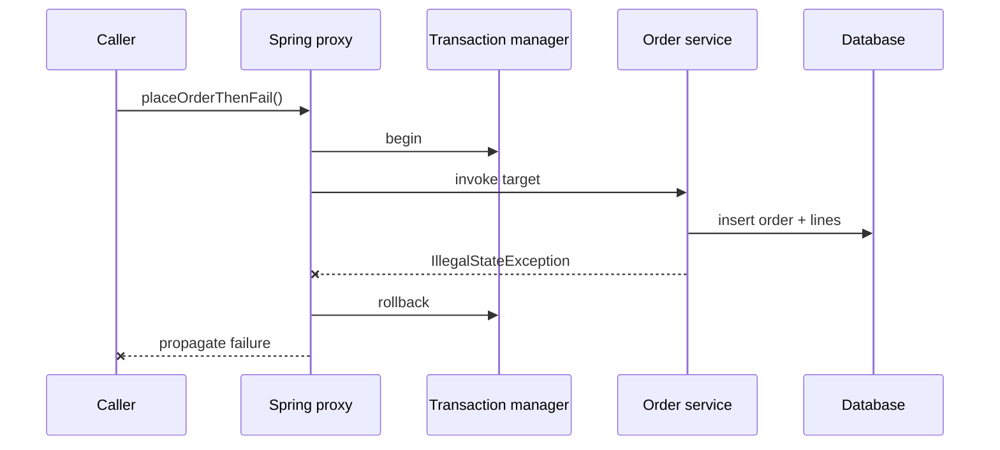

# Transaction-Boundary Failure Lab

<DocLabels items={[
  {label: 'Transactions', tone: 'advanced'},
  {label: 'Proxy mechanics', tone: 'production'},
  {label: 'Executable rollback', tone: 'shopverse'},
]} />

## Failure Matrix

| Variation | Expected result | Reason |
|---|---|---|
| public proxied method throws unchecked exception | rollback | interceptor marks transaction rollback-only |
| checked exception without `rollbackFor` | commit by default | default rollback rules differ |
| same-class call to another annotated method | annotation may be bypassed | call does not cross proxy |
| inner `REQUIRES_NEW` succeeds, outer fails | inner commit survives | separate physical transaction |
| remote payment succeeds, database rolls back | inconsistent systems | database transaction cannot undo HTTP |



## Run The Proof

```powershell
.\shopverse-platform\gradlew.bat -p .\documentation\labs\spring-architect test --tests *TransactionBoundaryTest
```

<!-- snippet-source: labs/spring-architect/src/main/java/io/shopverse/labs/order/OrderApplicationService.java -->
<!-- snippet-test: labs/spring-architect/src/test/java/io/shopverse/labs/TransactionBoundaryTest.java -->

The test verifies persisted order count is zero after an unchecked failure.
Next, create deliberate variants for checked exceptions and self-invocation;
write the predicted result before running them.

## Architect Exercise

The original design calls inventory reservation and payment authorization
inside the order database transaction. Replace it with:

1. a short local transaction that creates the order and outbox record;
2. asynchronous publication after commit;
3. idempotent reservation/payment commands;
4. explicit compensations and terminal failure states;
5. reconciliation for lost acknowledgements.

<DocCallout type="production" title="Atomicity ends at the resource manager">

`@Transactional` coordinates configured transactional resources. It does not
make arbitrary HTTP calls atomic. Holding a database connection while waiting
for a remote service also couples pool capacity to network tail latency.

</DocCallout>

## Interview Drill

**Why did an inner `@Transactional` method not start a new transaction?**

<ExpandableAnswer title="Expand architect answer">

In proxy mode, advice runs only when invocation crosses the proxy. A call through
`this` reaches the target directly, so the inner annotation is not intercepted.
Move the boundary to another bean, call through a deliberately injected proxy
only when justified, or use `TransactionTemplate` for an explicit local boundary.

</ExpandableAnswer>

## Official References

- [Spring declarative transactions](https://docs.spring.io/spring-framework/reference/data-access/transaction/declarative.html)
- [Spring transaction propagation](https://docs.spring.io/spring-framework/reference/data-access/transaction/declarative/tx-propagation.html)

## Recommended Next

Continue with [Proxy And Transaction Architecture](../SPRING-PROXY-TRANSACTION-ARCHITECT.md).
