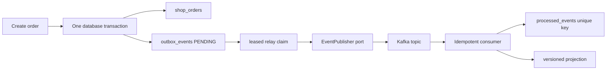

# Transactional Outbox Inbox And CDC Lab

<DocLabels items={[
  {label: 'Compiled crash-window lab', tone: 'shopverse'},
  {label: 'Distributed consistency', tone: 'advanced'},
  {label: 'Recovery evidence', tone: 'production'},
]} />

## Outcome

This lab proves reliable publication intent without pretending a database and Kafka share one
ordinary Spring transaction. It also proves why at-least-once publication requires idempotent consumers.



The publisher port separates transaction/recovery behavior from a specific Kafka API. A production
adapter sends with aggregate ID as key, waits for the required broker acknowledgement, and never marks
the row published when the outcome is unknown.

## Run The Proof

```powershell
.\shopverse-platform\gradlew.bat `
  -p .\documentation\labs\spring-architect `
  clean test --tests "io.shopverse.labs.TransactionalOutboxTest"
```

<!-- snippet-source: labs/spring-architect/src/main/java/io/shopverse/labs/outbox/OutboxRelay.java -->
<!-- snippet-test: labs/spring-architect/src/test/java/io/shopverse/labs/TransactionalOutboxTest.java -->

The expected result is seven passing tests with no skips.

## Runtime Ownership

| Component | Responsibility | Must not own |
|---|---|---|
| application service | commit order and outbox intent together | Kafka network call |
| claim service | atomically lease bounded pending work | broker wait inside transaction |
| relay | publish outside claim transaction | unconditional completion |
| completion service | complete matching event and token | stale worker completion |
| inbox transaction | insert identity and update projection atomically | duplicate catch inside failed transaction |
| consumer adapter | classify unique violation after rollback | swallowing unrelated failures |
| reconciliation | report backlog count and age | pretending metrics repair state |

## Atomic Publication Intent

The business transaction inserts the order and outbox event in the same database. The rollback test
throws after both saves and proves neither row commits. The success case proves both rows become visible.

```text
unsafe: database commit -> process crash -> Kafka send never occurs
outbox: business state and publication intent commit together
```

The guarantee is eventual at-least-once publication, not exactly-once behavior across every system.

## Leased Multi-Relay Claims

Two relays may read the same candidates. Each candidate is claimed with a conditional update that wins
only while status is `PENDING`. The winner records a unique token and lease timestamp. Completion requires
event ID, `IN_FLIGHT` status and the same token, preventing an expired worker from completing a newer lease.

For PostgreSQL, compare this portable lab implementation with a bounded `FOR UPDATE SKIP LOCKED` claim.
Index status and creation time, cap rows and bytes, and make lease duration longer than measured p99 publish
time plus headroom.

## Acknowledgment-Loss Duplicate

The fake broker appends the message and then throws:

```text
broker stores record -> acknowledgement is lost -> row remains IN_FLIGHT
lease expires -> another relay republishes the same event ID
```

The test proves two broker entries with one event ID and an attempt count of two. Republish is the safe
response to an unknown outcome; marking success on timeout risks permanent loss.

## Inbox And Idempotent Effect

The inbox primary key is `(consumer_name, event_id)`. The transactional processor inserts and flushes that
identity, then updates the projection in the same transaction. Duplicate classification happens outside
the rolled-back method and recognizes unique-violation SQLSTATE `23505`. Other failures are rethrown.

The concurrent test delivers one event from two threads and proves exactly one winner. An `existsById()`
check cannot provide this guarantee because another transaction can insert after the check.

## Aggregate Ordering

Each message carries event ID, aggregate ID, aggregate version, type, occurrence time and payload. The
projection applies only a newer aggregate version. Version 2 arriving before version 1 therefore cannot
be overwritten by the delayed event, although both event IDs can be recorded as consumed.

Define a gap policy for sequences such as `1, 3, 2`: wait, retrieve current state, rebuild, accept a
self-contained latest state, or quarantine and alert. Key Kafka records by aggregate ID when per-aggregate
partition order matters; retries and cross-region replication still require version protection.

## Reconciliation And Metrics

Alert on backlog age as well as count. Minimum signals are:

```text
pending count and oldest age
in-flight count and oldest lease age
publish attempts, failures and latency
consumer lag and inbox duplicate rate
aggregate-version gaps
DLT count and oldest age
reconciliation mismatch count
```

Reconciliation compares authoritative aggregates, outbox intent, projection checkpoints and consumer
state without replaying irreversible effects.

## Polling Or CDC

| Choice | Strength | Operational cost |
|---|---|---|
| polling relay | application owns explicit claims and retry | polling load, leases and cleanup |
| Debezium CDC | publishes committed log changes | connector, offsets, log retention and platform operation |

Debezium Outbox Event Router removes application polling, not duplicates, schema evolution, connector lag,
consumer idempotency or replay. Operate connector task status, offsets, snapshot mode, routing/key mapping,
DLQ and database-log retention during outages.

## Kafka Adapter Checklist

- Key by aggregate ID and carry event/correlation/version metadata.
- Configure durable acknowledgements and producer idempotence appropriately.
- Complete the outbox only after the send future confirms acknowledgement.
- Treat timeout as unknown outcome and reuse the same event ID.
- Bound in-flight sends and protect memory when Kafka is unavailable.
- Never hold a database connection while waiting on Kafka.

## Failure Matrix

| Failure point | Recovery |
|---|---|
| before business commit | no order/outbox; retry command idempotently |
| after commit before claim | pending row is claimed later |
| relay crashes after claim | lease expires and row is reclaimed |
| broker stores but ack is lost | republish same event ID |
| completion fails | republish; consumer inbox deduplicates |
| consumer fails before inbox commit | broker redelivers |
| effect commits but offset fails | redelivery becomes duplicate |
| old version arrives late | version rule prevents stale overwrite |

## Failure Exercises

1. Remove the outbox insert from the business transaction and reproduce loss.
2. Mark published before broker acknowledgement and crash between operations.
3. Remove claim-token matching and let a stale worker complete a new lease.
4. Replace the inbox constraint with `existsById()` and race two threads.
5. Move inbox insertion outside the projection transaction and create partial state.
6. Keep Kafka unavailable for 30 minutes and calculate database growth and recovery rate.
7. Replay a DLT event and prove no duplicate effect.

## Evidence Pack

Submit seven passing tests, commit/rollback timeline, lease state diagram, acknowledgment-loss trace,
concurrent relay/consumer results, out-of-order version proof, backlog dashboard, reconciliation runbook,
polling-versus-CDC ADR, and capacity calculation for a 30-minute broker outage.

## Interview Drill

**The database committed but Kafka publication failed. How do you prevent loss and duplicates?**

<ExpandableAnswer title="Expand architect answer">

I commit the business state and outbox intent in one database transaction. A bounded relay or CDC connector
publishes committed rows. Unknown acknowledgement or completion outcomes cause republishing with the same
event ID. Consumers insert an inbox identity and apply their local effect atomically, relying on a unique
constraint rather than a racy read. I key by aggregate ID, carry aggregate versions, monitor oldest outbox
age, lag, duplicates and reconciliation mismatches, and never claim a global exactly-once transaction.

</ExpandableAnswer>

## Official References

- [Spring transaction management](https://docs.spring.io/spring-framework/reference/data-access/transaction.html)
- [Debezium Outbox Event Router](https://debezium.io/documentation/reference/transformations/outbox-event-router.html)
- [Spring Kafka transactions](https://docs.spring.io/spring-kafka/reference/kafka/transactions.html)
- [Apache Kafka producer configuration](https://kafka.apache.org/documentation/#producerconfigs)

## Recommended Next

Continue with [Kafka Replay And Idempotency](./KAFKA-REPLAY-IDEMPOTENCY.md), then run a broker-backed
acknowledgment-loss and DLT replay experiment.

