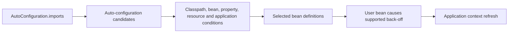

# Spring Boot Auto-Configuration Starters And Extension Design

A starter supplies a curated dependency experience. Auto-configuration supplies conditional
Spring configuration. Combining both in one vague jar makes compatibility and testing harder;
a platform starter commonly separates API, auto-configuration and starter dependency modules.

## Selection Flow



Boot discovers external auto-configurations through
`META-INF/spring/org.springframework.boot.autoconfigure.AutoConfiguration.imports`.
`@AutoConfiguration` classes normally use conditions such as `@ConditionalOnClass`,
`@ConditionalOnMissingBean` and `@ConditionalOnProperty`.

## Back-Off Is Part Of The Contract

```java
@AutoConfiguration
@ConditionalOnClass(PaymentClient.class)
@EnableConfigurationProperties(PaymentProperties.class)
public class PaymentAutoConfiguration {

    @Bean
    @ConditionalOnMissingBean
    PaymentClient paymentClient(PaymentProperties properties) {
        return new HttpPaymentClient(properties);
    }
}
```

Document which user-defined bean disables the default. Conditions should be evaluated on
stable public types/properties, not accidental internal classes.

## Ordering

Auto-configuration ordering affects definition availability, not arbitrary bean startup
sequencing. Use `before`, `after`, `@AutoConfigureBefore` or `@AutoConfigureAfter` only when
configuration selection genuinely depends on another configuration. Use normal dependency
injection and lifecycle contracts for runtime order.

## Testing With `ApplicationContextRunner`

Test a matrix, not only the happy path:

```java
private final ApplicationContextRunner contextRunner =
        new ApplicationContextRunner()
            .withConfiguration(AutoConfigurations.of(PaymentAutoConfiguration.class));

@Test
void backsOffWhenUserProvidesClient() {
    contextRunner.withBean(PaymentClient.class, StubPaymentClient::new)
        .run(context -> assertThat(context).hasSingleBean(PaymentClient.class));
}
```

Test missing class, default properties, disabled property, invalid configuration, user
override, multiple candidates and resource absence. Verify condition outcomes and public
behavior without coupling tests to every internal bean.

## Failure Diagnosis

When a bean is missing or duplicated:

1. inspect the resolved dependency graph and runtime classpath;
2. enable/read the condition evaluation report;
3. identify the candidate auto-configuration and failed/matched condition;
4. inspect component-scan and auto-configuration package boundaries;
5. check whether a user/test bean caused back-off;
6. verify Boot/Framework/library compatibility before adding exclusions.

An exclusion can make startup green while silently removing required infrastructure.

## Starter Governance

- publish a supported Java/Boot/library compatibility matrix;
- use dependency management rather than force arbitrary transitive versions;
- generate configuration metadata and document defaults;
- avoid component scanning from a shared library;
- expose minimal public customization points;
- secure defaults and fail closed for ambiguous security configuration;
- instrument created clients/pools without high-cardinality labels;
- test application-context and native/AOT compatibility where supported;
- publish deprecation and migration policy.

## Interview Questions

**How does auto-configuration avoid replacing user configuration?** Supported defaults are
usually guarded by missing-bean/property/class conditions so explicit application beans can
cause back-off.

**Does `@ConditionalOnMissingBean` eliminate all ambiguity?** No. Search strategy, type,
generic metadata, bean timing and multiple application contexts affect the condition.

**What is the first artifact when an auto-configured bean is absent?** The condition
evaluation report plus the resolved dependency graph.

## Official References

- [Spring Boot auto-configuration](https://docs.spring.io/spring-boot/reference/using/auto-configuration.html)
- [Creating custom auto-configuration](https://docs.spring.io/spring-boot/reference/features/developing-auto-configuration.html)

