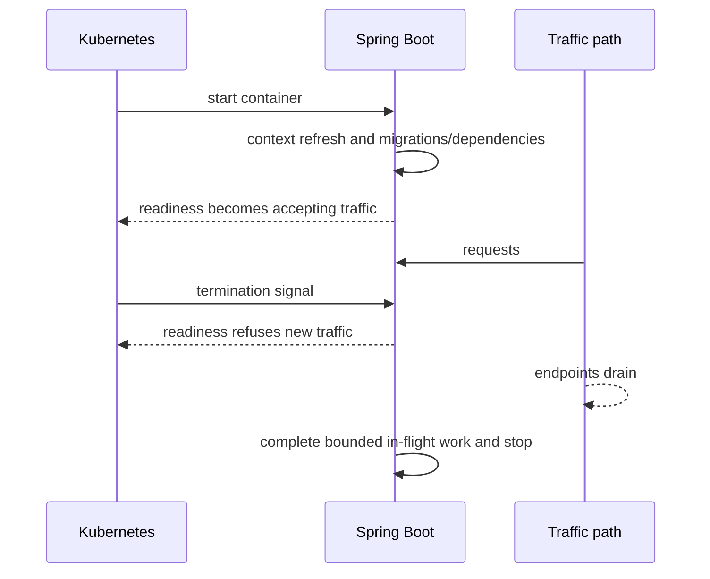

# Spring Boot Packaging Layering AOT Native And Containers

Packaging determines startup, patching, supply-chain, debugging and runtime behavior. The
same application can ship as an executable jar, layered OCI image, JVM AOT-processed app
or native executable; each optimizes a different constraint.

## Packaging Choices

| Form | Strength | Trade-off |
|---|---|---|
| executable jar | familiar JVM behavior and diagnostics | runtime/JDK must be supplied |
| layered container image | repeatable deployment and layer reuse | image/runtime lifecycle must be governed |
| buildpack image | curated builder/run images and metadata | builder lifecycle and customization constraints |
| JVM with AOT processing | earlier analysis and startup optimizations | dynamic features require hints/compatibility |
| native image | low startup/idle footprint for suitable workloads | longer build, closed-world constraints and different diagnostics |

Spring Boot supports Dockerfiles and Cloud Native Buildpacks for OCI-compatible images.

## Layering

Separate frequently changing application classes from relatively stable dependencies so
builds and registries reuse layers. Reproducibility also requires pinned base/builder
references, deterministic dependency resolution and recorded build provenance.

Do not put secrets in `ARG`, `ENV`, copied configuration or image history. Inject them at
runtime through an approved mechanism.

## Container Memory

The process limit includes more than Java heap:

```text
container memory = heap + metaspace + code cache + thread stacks
                 + direct/native buffers + agents/libraries + safety headroom
```

Setting `-Xmx` equal to the container limit invites OOM termination from native memory.
Measure native memory, thread count, direct buffers and peak behavior. CPU limits can
introduce throttling that appears as application latency or missed readiness deadlines.

## AOT And Native Constraints

AOT analyzes application structure before runtime. Native image assumes a more closed
world, so reflection, resource lookup, serialization, proxies and dynamic class generation
may require metadata/hints. Prefer framework-supported integrations and test the native
artifact itself—not only JVM tests.

Choose native for measured startup, density or scale-to-zero requirements. A long-running
high-throughput service may benefit more from mature JVM JIT optimization and diagnostics.

## Kubernetes Lifecycle



Startup, liveness and readiness answer different questions. A liveness probe should not
restart an instance merely because a remote dependency is briefly unavailable. Readiness
should protect traffic when the instance cannot serve safely. Graceful shutdown needs a
termination budget larger than endpoint propagation plus bounded in-flight completion.

## Supply-Chain Controls

- generate an SBOM and record provenance;
- scan application and base layers, but prioritize exploitable reachability and patch policy;
- sign/verify images under organizational policy;
- run as non-root with minimal filesystem/capabilities;
- use read-only filesystem and explicit writable mounts where practical;
- patch rebuilds from trusted pinned inputs;
- avoid a full JDK in runtime images unless diagnostics require it and risk is accepted.

## Deployment Evidence

Prove:

- image digest and configuration match the approved release;
- startup/readiness time stays within rollout budgets;
- rolling replacement produces no unacceptable errors;
- SIGTERM drains HTTP, messaging and scheduled work within bounds;
- heap/native memory and CPU throttling remain safe at peak;
- logs, metrics, traces and diagnostics work in the chosen artifact;
- rollback uses an immutable previous digest and compatible data/schema state.

## Interview Questions

**Why not set heap equal to the container memory limit?** Heap is only one memory owner;
metaspace, code cache, stacks, direct buffers and native libraries also consume the limit.

**When should native image be rejected?** When measured startup/density gains do not repay
build complexity, dynamic-feature constraints, diagnostic differences and compatibility risk.

**Why can a healthy liveness probe still lose traffic during deployment?** Liveness does
not guarantee readiness or endpoint-drain timing; termination and load-balancer propagation
must be coordinated.

## Official References

- [Spring Boot container images](https://docs.spring.io/spring-boot/reference/packaging/container-images/index.html)
- [Spring Boot GraalVM native images](https://docs.spring.io/spring-boot/reference/packaging/native-image/index.html)

