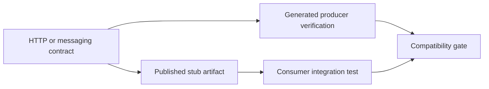

# Spring Cloud Kubernetes And Contract In Depth

## Kubernetes Integration Decision

Kubernetes already supplies Service DNS, ConfigMaps, Secrets, probes and rollout controllers.
Use Spring Cloud Kubernetes when its application-level discovery/configuration features add
clear value. Do not deploy Eureka or live reload automatically merely because they are familiar.

| Need | Platform-native option | Spring Cloud Kubernetes option |
|---|---|---|
| service location | Service DNS | DiscoveryClient metadata and instance selection |
| configuration | mounted/env ConfigMap | property-source integration |
| secrets | mounted secret/CSI/external operator | property-source integration |
| configuration change | rollout/restart | reload/watch strategies |
| leader ownership | Lease API/controller | leader-election integration |

## Discovery

Discovery may watch Services and Endpoints/EndpointSlices and expose service instances to
Spring Cloud LoadBalancer. Scope namespaces deliberately; broad discovery requires broad RBAC
and can leak topology/metadata. Prefer DNS when client-side metadata selection is unnecessary.

Readiness determines whether an endpoint should receive traffic, but propagation is not instant.
Clients need timeouts and must tolerate stale instances during rollout.

## ConfigMaps, Secrets, And Reload

Define property-source precedence and naming. Mounted files, environment variables and API
watches have different update semantics. Environment variables do not mutate in a running pod.

Live reload can refresh selected beans or restart the context, both carrying risk. Immutable
configuration plus a controlled rolling deployment is easier to audit and roll back. Never log
secret values during binding or refresh.

Use a least-privilege ServiceAccount and namespaced Role. Prefer an external secret manager and
CSI/operator integration for rotation; Kubernetes Secrets are encoding, not automatic encryption.

## Leader Election

Leader election coordinates singleton work using a Kubernetes Lease. The work must remain
idempotent because lease expiry, network delay or long pauses can create handover ambiguity.
Use fencing or datastore claims where two concurrent owners would cause damage.

## Contract Testing Model

Spring Cloud Contract turns producer-owned contracts into executable producer tests and
consumer stubs.

A contract describes observable behavior, not internal implementation. Include request shape,
headers, authentication assumptions, response/error schema and messaging metadata that consumers
actually depend on.

## HTTP Contracts

Provider tests run against a controlled controller/application boundary. Consumers use Stub
Runner/WireMock artifacts to test adapters without calling a shared unstable environment.
Contracts complement, rather than replace, OpenAPI governance and end-to-end tests.

## Messaging Contracts

Define trigger/input, destination, headers and payload. Verify producer serialization and consumer
expectations. Contract success does not prove broker delivery, ordering, retries or exactly-once
effects; those require integration/failure tests.

## Evolution And CI

- Add optional fields before requiring them.
- Do not rename/remove/type-change fields without a versioned migration.
- Publish stubs with producer versions and retain supported lines.
- Run producer verification on every change.
- Run affected consumers or compatibility analysis before release.
- Expire unused contracts through ownership evidence, not assumption.

## Production Scenarios

1. Discovery RBAC is revoked: DNS may work while DiscoveryClient fails; alert the correct path.
2. ConfigMap changes but pods retain old values: identify mount, env, API-watch and rollout semantics.
3. Two scheduler pods execute: verify lease renewal, clock/pause behavior and business fencing.
4. Producer makes an optional field mandatory: compatibility gate should fail before deployment.
5. Stub passes but production returns 503: contract tests do not prove capacity or dependency health.

## Interview Questions

1. Why might Kubernetes DNS be preferable to Eureka?
2. What security permission does discovery/config watching require?
3. Why can configuration reload be riskier than rolling restart?
4. What does Spring Cloud Contract generate?
5. Why do contracts not replace integration and load tests?

## Official References

- [Spring Cloud Kubernetes reference](https://docs.spring.io/spring-cloud-kubernetes/reference/)
- [Spring Cloud Contract reference](https://docs.spring.io/spring-cloud-contract/reference/)
- [Kubernetes API access control](https://kubernetes.io/docs/reference/access-authn-authz/authorization/)

## Recommended Next

Continue with [Spring Cloud Ecosystem And Governance](./SPRING-CLOUD-ECOSYSTEM-GOVERNANCE.md).

