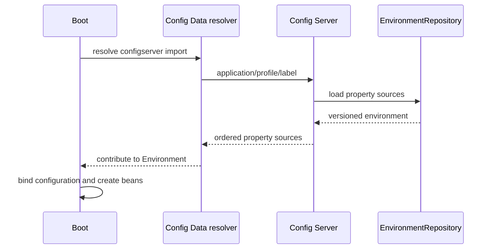
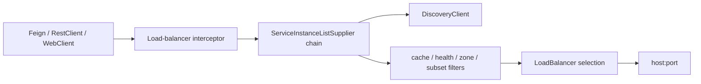

# Spring Cloud Config LoadBalancer And Gateway Internals

## Config Data Startup

With the Config Data model, `spring.config.import` participates while the `Environment` is
prepared, before ordinary application beans are created. The client resolves remote property
sources and inserts them according to precedence; fail-fast, optional import, retry and local
fallback determine whether startup proceeds.



Config Server delegates to an `EnvironmentRepository` such as Git, native filesystem, Vault,
or a composite. Define repository availability, clone/cache behavior, label rules, credentials,
encryption, audit, and rollback. A server being reachable does not prove the requested revision
is valid.

`@RefreshScope` creates scoped proxies whose targets can be replaced after an environment
change. Existing objects, static state, connection pools, and libraries may not be refreshable.
For security or structural settings, immutable rollout is safer than live refresh.

## Spring Cloud LoadBalancer



`ServiceInstanceListSupplier` is the extension point for instance lists. Supplier decorators
may add caching, health checks, zone preference, hints or subsets. Understand ordering: caching
an already filtered list differs from filtering a cached discovery list.

Round-robin does not account for heterogeneous latency. Random selection avoids synchronized
cycles but still ignores load. Weighted or least-request behavior needs trustworthy signals
and stability controls. Platform-side balancing may be preferable.

Retries can select the same or a different instance and multiply load. Use one end-to-end
deadline, retry only safe operations, bound attempts, add jitter and include connection-acquisition
time. Stale discovery must be observable separately from downstream failure.

## Gateway Filter Chain

Route predicates select a route. Route-specific `GatewayFilter` instances combine with
`GlobalFilter` instances and are ordered into one chain. Pre-logic runs in ascending order;
post-logic unwinds in reverse.

```java
@Component
final class CorrelationGlobalFilter implements GlobalFilter, Ordered {
    public Mono<Void> filter(ServerWebExchange exchange, GatewayFilterChain chain) {
        String correlation = validatedOrGenerated(exchange.getRequest());
        return chain.filter(withCorrelation(exchange, correlation));
    }
    public int getOrder() { return -100; }
}
```

Filters must remain non-blocking on the reactive gateway. Request/response body modification
buffers data and therefore needs strict size limits. Retrying a request body requires caching
and is unsafe for large or non-idempotent operations.

## Gateway Security

Authenticate at the edge when appropriate, but every service still enforces authorization for
its resources. Strip untrusted identity headers, establish a trusted internal identity format,
validate issuer/audience/signature/expiry, and control forwarded headers.

`TokenRelay` forwards an authorized OAuth2 access token to a downstream service. It does not
turn a user token into a safe service credential automatically. Review audience, scopes,
token exchange, logging, propagation and confused-deputy risks.

## Gateway MVC Or Reactive Gateway

Select based on execution model and required filters. Reactive Gateway fits high-concurrency
non-blocking routing and its established filter ecosystem. Gateway MVC fits servlet stacks but
has a different filter/runtime model. Do not copy reactive configuration or capacity assumptions
blindly between them.

## Capacity And Failure Diagnosis

Track gateway event-loop utilization, pending connections, connection-pool wait, active requests,
route latency, response status, retries, circuit state, rate-limit decisions, body size and memory.
Use route IDs as bounded dimensions.

Failure isolation sequence:

1. Did routing/predicate selection choose the expected route?
2. Did authentication, rate limit, filter or circuit reject locally?
3. Did discovery return healthy instances?
4. Was connection acquisition, DNS, TCP or TLS slow?
5. Did the downstream accept and complete the request?
6. Did a retry obscure the original failure and consume the deadline?

## Interview Questions

1. At what point does Config Data load remote properties?
2. Why can live refresh leave a process internally inconsistent?
3. What does `ServiceInstanceListSupplier` customize?
4. How are global and route filters ordered?
5. Why is `TokenRelay` not a complete authorization design?

## Official References

- [Spring Cloud Config reference](https://docs.spring.io/spring-cloud-config/reference/)
- [Spring Cloud LoadBalancer reference](https://docs.spring.io/spring-cloud-commons/reference/spring-cloud-commons/loadbalancer.html)
- [Spring Cloud Gateway reference](https://docs.spring.io/spring-cloud-gateway/reference/)

## Recommended Next

Continue with [Spring Cloud Kubernetes And Contract](./SPRING-CLOUD-KUBERNETES-CONTRACT.md).

