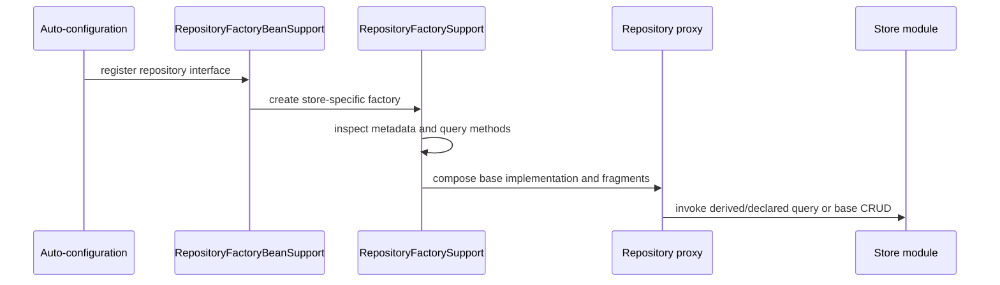

# Spring Data Commons Internals

## What Commons Owns

Spring Data Commons supplies repository contracts, metadata, query-method parsing, paging,
auditing abstractions, conversion, and shared infrastructure. Store modules add the query
creator, mapping rules, operations object, transaction integration, and driver adapter.



## Repository Startup

1. Module scanning finds candidate repository interfaces.
2. Strict multi-store rules decide which module owns each candidate.
3. `RepositoryFactoryBeanSupport` participates in bean creation.
4. A store-specific `RepositoryFactorySupport` builds metadata and the target.
5. Query methods are resolved at startup or first use, depending on the module.
6. Custom fragments and interceptors are composed into a proxy.
7. Calls dispatch to base CRUD, a declared query, derived query, or fragment.

A repository is therefore a proxy with several possible invocation paths—not a generated
class containing handwritten SQL.

## Query Lookup Strategy

| Strategy | Meaning | Failure mode |
|---|---|---|
| `CREATE` | derive a query from the method name | unsupported property/operator fails resolution |
| `USE_DECLARED_QUERY` | require an annotated or named query | startup fails when none exists |
| `CREATE_IF_NOT_FOUND` | prefer declared query, otherwise derive | convenient but may hide unintended derivation |

`PartTree` parses names such as `findTop20ByStatusAndCreatedAtBeforeOrderByCreatedAtDesc`.
Parsing validates Java property paths, not database cost. The resulting query still needs
an index, bounded cardinality, stable ordering, and explain-plan evidence.

## Mapping Metadata

`MappingContext` holds store-specific `PersistentEntity` and property metadata. A mapping
converter uses this model to translate between domain objects and store values. Converters
should be deterministic, version-aware, null-safe, and tested with historic values.

Use explicit converters for identifiers, money, encrypted values, legacy codes, or time
types whose storage representation is not safely inferred. Never change a converter in a
way that makes already persisted data unreadable without a migration plan.

## Repository Composition

```java
interface OrderSearchOperations {
    List<OrderSummary> findForOperations(OrderSearch search);
}

interface OrderRepository extends
        Repository<Order, UUID>, OrderSearchOperations {
    Optional<Order> findById(UUID id);
    Order save(Order order);
}

final class OrderSearchOperationsImpl implements OrderSearchOperations {
    // Delegate to the store-specific template or query API.
}
```

Custom fragments are preferable to enormous derived names or leaking a store template
through every service. Keep the fragment's contract business-oriented and its implementation
explicitly store-aware.

## Exception Translation

Spring translates supported driver/provider exceptions into the `DataAccessException`
hierarchy. Translation provides stable categories such as integrity violation or transient
resource failure, but retry decisions still require operation semantics and idempotency.
Never retry every `DataAccessException` indiscriminately.

## Multi-Store Registration

When multiple Spring Data modules are present, make ownership unambiguous with module-specific
repository superinterfaces, mapping annotations, and separated base packages. A domain type
annotated for multiple stores creates coupling and ambiguous discovery.

```java
@EnableJpaRepositories(basePackages = "com.shopverse.order.jpa")
@EnableMongoRepositories(basePackages = "com.shopverse.catalog.mongo")
class PersistenceConfiguration {}
```

## Diagnostics

- No repository bean: inspect package boundaries, conditional reports, and module enablement.
- Wrong module claims an interface: inspect superinterface, annotations, and scan packages.
- Property-reference failure: compare method tokens with mapped property paths.
- Converter failure: capture source type, target type, historic representation, and module.
- Query succeeds but is slow: inspect generated query, bind values, plan, result size, and pool wait.

## Interview Questions

1. How is a repository implementation created when no class was written?
2. What does `PartTree` validate, and what does it not validate?
3. Why can adding two Spring Data modules change repository discovery?
4. When should a custom fragment replace a derived query?
5. Does exception translation make an operation safe to retry?

## Official References

- [Spring Data Commons repositories](https://docs.spring.io/spring-data/commons/reference/repositories.html)
- [Spring Data Commons API](https://docs.spring.io/spring-data/commons/docs/current/api/)

## Recommended Next

Continue with [Repositories, Queries, Paging, Auditing, And Events](./SPRING-DATA-REPOSITORIES-PAGING-AUDITING.md).

