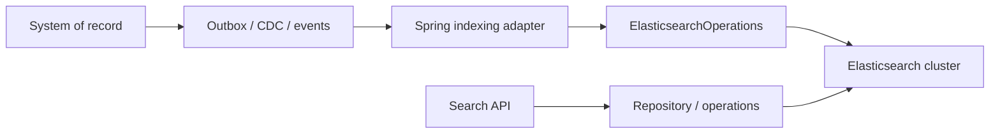

# Spring Data Elasticsearch In Depth

Elasticsearch is normally a search projection, not the transactional authority. The system
must tolerate indexing delay, duplicate delivery, mapping evolution, and complete rebuilds.

## Runtime Boundary



## Mapping

```java
@Document(indexName = "products-read")
class ProductDocument {
    @Id String id;
    @Field(type = FieldType.Keyword) String sku;
    @Field(type = FieldType.Text, analyzer = "standard") String name;
    @Field(type = FieldType.Scaled_Float, scalingFactor = 100) BigDecimal price;
    @Version Long version;
}
```

Define keyword/text, analyzers, normalizers, dates, nested objects, numeric scale, and dynamic
mapping policy explicitly. Changing many field types requires a new index and reindex, not
an in-place annotation edit.

## Repositories And Operations

Repositories fit bounded lookup and simple search. Use `ElasticsearchOperations` or the
native client for compound queries, aggregations, highlighting, collapse, point-in-time,
`search_after`, bulk operations, routing, and index lifecycle control.

Do not encode a complex relevance contract in a long derived repository name. Keep query
construction in an adapter with relevance tests and representative datasets.

## Pagination

Deep `from/size` pagination consumes coordinating-node resources and has a configured result
window. Use `search_after` with a stable unique sort for user navigation, and point-in-time
when a consistent multi-page view matters. Scroll is primarily for bounded bulk traversal,
not interactive pagination.

## Bulk Indexing

Batch by measured document bytes and operation count, not an arbitrary huge number. Bound
concurrent bulk requests and handle partial item failures individually. A successful HTTP
bulk response can still contain failed items.

Idempotent projection rule:

```text
apply event only when incoming aggregate version >= indexed aggregate version
```

Use external versioning or an equivalent application rule when ordering can vary.

## Zero-Downtime Mapping Evolution

1. Create a versioned index with reviewed settings/mappings.
2. Backfill from the authority or durable event history.
3. Continue applying live changes idempotently.
4. Compare counts, samples, freshness, and business queries.
5. Atomically switch read/write aliases as designed.
6. Retain the previous index for a bounded rollback window.
7. Delete only after evidence and approval.

## Consistency And Refresh

Refresh controls search visibility, not durability. Avoid forcing refresh per request; it
damages throughput. For read-your-write UX, return the authoritative write response, poll
with a bound, or use a specific product flow rather than globally weakening performance.

## Production Signals

Monitor indexing/search latency, rejection counts, thread pools, heap, GC, shard sizes,
segment count, merges, disk watermarks, refresh cost, query cache, fielddata, cluster state,
replica health, projection lag, and failed bulk items.

## Incident Scenarios

- Search is stale: compare source version, event lag, consumer errors, bulk failures and refresh.
- Cluster is red: identify unassigned primary shards and allocation constraints before rerouting.
- Heap pressure: inspect aggregations, fielddata, shard count, mappings and query concurrency.
- Reindex falls behind: throttle/batch, isolate workload, resume from durable checkpoints.
- Relevance regressed: replay a golden query set and compare ranking metrics before rollout.

## Testing

Use Testcontainers for mapping, analyzer, query, aggregation, pagination, and version tests.
Maintain golden relevance cases and rebuild tests. Mocks cannot prove analysis or distributed
search behavior.

## Interview Questions

1. Why should Elasticsearch usually not be the order authority?
2. How do `search_after` and point-in-time work together?
3. Why can a bulk request be partly unsuccessful?
4. How do aliases enable mapping migration?
5. How would you prove a projection is fully rebuilt?

## Official References

- [Spring Data Elasticsearch reference](https://docs.spring.io/spring-data/elasticsearch/reference/)
- [Elasticsearch documentation](https://www.elastic.co/guide/en/elasticsearch/reference/current/index.html)

## Recommended Next

Complete the [Elasticsearch Architect Path](../../data/ELASTICSEARCH-ARCHITECT-PATH.md) and then [Multi-Store Consistency](./SPRING-DATA-MULTISTORE-CONSISTENCY.md).

