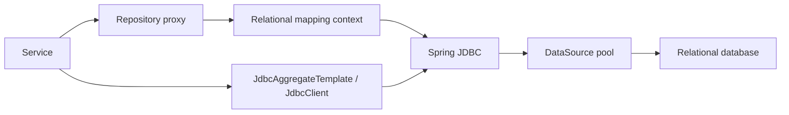

# Spring Data JDBC In Depth

Spring Data JDBC maps relational aggregates without a persistence context, lazy-loading
proxies, dirty checking, or JPQL. Its smaller runtime model is an advantage when aggregate
boundaries and SQL behavior should remain explicit.

## Runtime Model



A loaded object is not managed after the call returns. Updating it requires an explicit
save. Associated entities inside an aggregate are persisted according to aggregate rules;
cross-aggregate references should normally be identifiers, not navigable object graphs.

## Aggregate Mapping

```java
@Table("orders")
public class Order {
    @Id private UUID id;
    @Version private long version;
    private OrderStatus status;
    @MappedCollection(idColumn = "order_id")
    private Set<OrderLine> lines;
}
```

Model an aggregate small enough to load and replace safely. Saving an existing aggregate
can delete and recreate child rows depending on mapping and version; inspect emitted SQL
before using large child collections.

## Repositories And Explicit SQL

Use repositories for aggregate CRUD and bounded derived queries. Use `JdbcClient`,
`NamedParameterJdbcTemplate`, or a custom fragment for reporting, joins across aggregates,
database-specific SQL, streaming, or carefully tuned batches.

```java
List<OrderSummary> findReady(int limit) {
    return jdbcClient.sql("""
        select id, status, total
        from orders
        where status = :status
        order by created_at, id
        fetch first :limit rows only
        """)
        .param("status", "READY")
        .param("limit", limit)
        .query(OrderSummary.class)
        .list();
}
```

Bind values; never concatenate untrusted input. Whitelist dynamic sort columns rather than
attempting to bind SQL identifiers.

## Transactions And Concurrency

`DataSourceTransactionManager` binds one connection to the current transaction. Keep remote
calls outside database transactions unless a reviewed consistency design requires otherwise.
Use `@Version`, conditional updates, database constraints, or explicit locks based on the
invariant and contention profile.

```sql
update inventory
set available = available - :quantity,
    version = version + 1
where sku = :sku and available >= :quantity;
```

An affected-row count of zero represents a business conflict or missing row and must not be
silently treated as success.

## Batch And Streaming Work

- Batch only when the driver and database reduce round trips.
- Bound batch size by parameter, packet, lock, undo, and memory limits.
- Keep streaming result sets inside the connection/transaction lifetime.
- Configure fetch size and timeouts explicitly for large reads.
- Avoid holding a connection while waiting on a slow consumer.

## JDBC Versus JPA

Choose JDBC when explicit aggregate persistence and SQL are valuable and rich change tracking
is unnecessary. Choose JPA when its unit of work, mappings, fetch plans, and provider features
create more value than complexity. For query-heavy SQL-first services, also evaluate jOOQ or
plain Spring JDBC rather than forcing all queries through repositories.

## Production Diagnosis

| Symptom | Evidence | Likely direction |
|---|---|---|
| pool timeout | active/pending/max connections and transaction duration | leaked or slow connections, pool too small/large |
| slow query | SQL, binds, plan, waits, rows examined/returned | index/query/cardinality issue |
| deadlock | database deadlock graph and lock order | inconsistent mutation order |
| duplicate key | constraint and business identifier | concurrency/idempotency failure |
| excessive child SQL | statement trace during aggregate save | aggregate too large or wrong API |

## Testing

Use repository tests against the production database engine with Testcontainers. Prove
constraints, generated keys, mapping, isolation, time zones, locks, batching, migrations,
and failure behavior. An in-memory database is not equivalent evidence.

## Interview Questions

1. How does Spring Data JDBC differ from JPA at runtime?
2. Why can saving a child collection be unexpectedly expensive?
3. When would you use `JdbcClient` instead of a repository?
4. How do connection-pool size and request concurrency interact?
5. How would you implement a safe inventory decrement?

## Official References

- [Spring Data JDBC reference](https://docs.spring.io/spring-data/relational/reference/jdbc.html)
- [Spring Framework JDBC](https://docs.spring.io/spring-framework/reference/data-access/jdbc.html)

## Recommended Next

Compare with [Spring Data JPA](../SPRING-DATA-JPA.md) and [Spring Data R2DBC](./SPRING-DATA-R2DBC.md).

