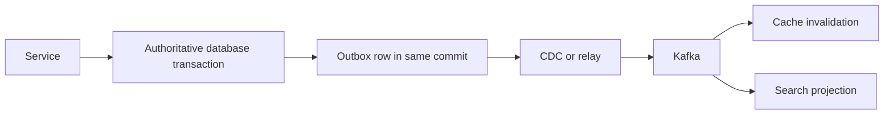

# Spring Data Multi Store Consistency And Schema Evolution

Use the compiled [Transactional Outbox, Inbox, And CDC Lab](../architect-labs/TRANSACTIONAL-OUTBOX-INBOX-CDC-LAB.md)
to reproduce acknowledgment loss, relay reclaim, concurrent duplicates and versioned projection recovery.

## One Transaction Manager Is Not Global Atomicity

`@Transactional` applies through a selected transaction manager. A method touching a SQL
database, Kafka, Redis, and Elasticsearch does not become atomically committed because the
annotation appears once.

## Consistency Patterns

| Problem | Typical design |
|---|---|
| database plus event publication | transactional outbox and idempotent relay |
| duplicate consumer delivery | inbox/unique event ID and idempotent transition |
| cache after database write | post-commit invalidation, bounded TTL and repair |
| search projection | versioned idempotent event application and rebuild |
| long business workflow | saga with explicit states, compensation and reconciliation |
| unknown remote outcome | business idempotency key and status reconciliation |

Avoid chained transaction managers as a claim of atomicity. They still have partial-commit
windows. XA may be justified in constrained environments, but requires explicit participant,
recovery, throughput, and operational analysis.

## Schema Evolution

Use expand-and-contract:

1. Add backward-compatible schema/index/field.
2. Deploy code able to read old and new forms.
3. Start dual-write/backfill only when necessary and observable.
4. Validate completeness and semantic equivalence.
5. Switch readers.
6. Stop old writes.
7. Remove old representation in a later, reversible change.

Database migrations belong in version control with ownership, review, preconditions,
timeouts, rollback/roll-forward, backup requirements, and production evidence. Application
ORM auto-DDL is not a production migration strategy.

## Datastore Replacement

Define source of truth, compatibility window, shadow-read sampling, dual-write failure policy,
backfill checkpoint, reconciliation query, cutover metric, rollback deadline, and deletion
approval. Dual writing in application code creates a consistency problem that must be measured,
not hidden behind a common repository interface.

## Read Replicas And Routing

Routing reads to replicas introduces lag and read-after-write anomalies. Mark operations
read-only only when product semantics tolerate staleness. Transactions, authentication state,
inventory confirmation, and idempotency checks often require the writer.

## Privacy And Retention

Maintain a data inventory across primary rows, documents, caches, indexes, CDC logs, events,
backups, replicas, and DLTs. Encryption, tenant isolation, deletion, retention, legal hold,
and restore workflows must cover every copy. Deleting the SQL row alone is insufficient.

## Backup And Restore

A backup is evidence only after a restore drill. Define RPO/RTO, consistency across stores,
encryption keys, catalog retention, point-in-time recovery, replay starting point, projection
rebuild order, and reconciliation. Caches may be discarded; authoritative stores may not.

## Architecture Review Questions

- Which store is authoritative for each field?
- What happens after each possible partial commit?
- Is every retry idempotent?
- Can every projection be rebuilt without user-facing side effects?
- What staleness does the product permit?
- How are schema versions rolled across old and new instances?
- What proves the migration or restore is complete?

## Interview Scenarios

1. Database commit succeeds and Kafka publication fails.
2. Cache invalidation is lost during Redis failover.
3. Search receives version 12 before version 11.
4. A new field must deploy while three application versions coexist.
5. A customer deletion must propagate into backups and event-derived stores.

## Official References

- [Spring transaction management](https://docs.spring.io/spring-framework/reference/data-access/transaction.html)
- [Liquibase documentation](https://docs.liquibase.com/)
- [Debezium outbox pattern](https://debezium.io/documentation/reference/transformations/outbox-event-router.html)

## Recommended Next

Continue with [Testing, Observability, Capacity, And Incidents](./SPRING-DATA-TESTING-OPERATIONS.md).
