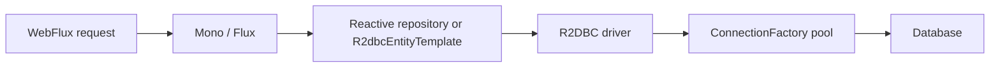

# Spring Data R2DBC In Depth

R2DBC provides non-blocking relational database access. It is useful only when the complete
hot path is reactive and the selected driver/database behavior is understood. It is not
"faster JDBC" and does not provide JPA's persistence context.

## Execution Path



Nothing executes until subscription. Cancellation, demand, timeout, and context therefore
matter to connection acquisition and cleanup.

## Repository And Template

```java
interface OrderRepository extends ReactiveCrudRepository<OrderRow, UUID> {
    Flux<OrderRow> findByStatusOrderByCreatedAt(OrderStatus status);
}

Mono<Integer> reserve(String sku, int quantity) {
    return template.getDatabaseClient().sql("""
        update inventory set available = available - :q
        where sku = :sku and available >= :q
        """)
        .bind("q", quantity)
        .bind("sku", sku)
        .fetch().rowsUpdated();
}
```

Use `R2dbcEntityTemplate` or `DatabaseClient` for explicit SQL, projections, conditional
updates, and operations the repository abstraction cannot express safely.

## Reactive Transactions

Reactive transactions bind resources through Reactor context, not a thread-local. The
transactional chain must be assembled and subscribed as one publisher.

```java
return transactionalOperator.transactional(
    repository.save(order)
        .then(outboxRepository.save(event))
);
```

Calling `subscribe()` inside application code breaks composition, error propagation, context,
and transaction ownership. Returning a publisher after accessing a resource outside its
lifetime causes late failures.

## Backpressure And Pool Capacity

Backpressure controls demand between publishers; it does not make the database infinitely
parallel. Bound `flatMap` concurrency and relate it to pool size, database capacity, and
transaction duration.

```text
safe in-flight database work <= min(pool capacity, database workload capacity)
```

An oversized pool moves contention into the database. An unbounded `flatMap` creates a large
pending-acquisition queue and increases timeout latency.

## Blocking Hazards

JDBC, filesystem calls, blocking SDKs, and `.block()` must not run on event-loop threads.
Isolate unavoidable blocking work on a bounded scheduler and measure the queue. A reactive
controller calling a blocking repository is not a reactive system.

## Error And Retry Rules

Classify constraint, serialization, transient connection, timeout, and cancellation errors.
Retry only idempotent operations with a bounded budget. A timeout may leave the database
outcome unknown, so use business idempotency keys and reconciliation.

## Testing And Evidence

- `StepVerifier` proves signal sequence, errors, cancellation, and timeouts.
- Testcontainers proves driver types, transactions, constraints, and SQL dialect.
- Load tests expose event-loop blocking and acquisition wait.
- Metrics separate query latency from pool wait and subscriber processing.
- BlockHound or equivalent test instrumentation can detect accidental blocking.

## Interview Questions

1. Why does thread-local transaction reasoning fail with R2DBC?
2. Does backpressure protect the database automatically?
3. When should an application remain on JDBC?
4. What is wrong with calling `subscribe()` in a service?
5. How would you diagnose increasing R2DBC connection-acquisition time?

## Official References

- [Spring Data R2DBC reference](https://docs.spring.io/spring-data/relational/reference/r2dbc.html)
- [Spring reactive transactions](https://docs.spring.io/spring-framework/reference/data-access/transaction/programmatic.html)

## Recommended Next

Review [Spring Reactive And WebFlux](../SPRING-REACTIVE.md) and [Testing And Operations](./SPRING-DATA-TESTING-OPERATIONS.md).

