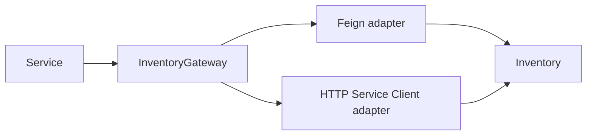

# OpenFeign Versus Spring HTTP Service Clients

<DocLabels items={[
  {label: 'Decision guide', tone: 'advanced'},
  {label: 'Spring Framework 7', tone: 'intermediate'},
  {label: 'Incremental migration', tone: 'shopverse'},
]} />

Spring Cloud OpenFeign is feature-complete, while Spring Framework HTTP Service
Clients are the strategic framework-native declarative option for new synchronous
interfaces. Existing stable Feign clients do not require a rewrite solely for
fashion.

| Retain Feign when | Prefer HTTP Service Clients when |
|---|---|
| current clients are stable and operationally understood | creating a new Spring-native client |
| Cloud integrations/interceptors are already standardized | reducing dependency on a feature-complete project |
| migration has no measured benefit | using `RestClient`/`WebClient` configuration consistently |

## Avoid

- Do not leak either client’s annotations into application/domain ports.
- Do not migrate without parity for timeouts, auth, load balancing, observation,
  error decoding and resilience.
- Do not stack retries in client, load balancer and Resilience4j.
- Do not treat declarative syntax as a substitute for a deadline and failure contract.

## Strangler Migration

1. Define an annotation-free `InventoryGateway` application port.
2. Characterize existing Feign behavior with contract tests.
3. Implement an HTTP Service Client adapter beside the Feign adapter.
4. Match URI encoding, serialization, auth propagation, errors and telemetry.
5. Route a small traffic slice or one consumer to the new adapter.
6. Compare latency and failure outcomes; switch configuration, then remove Feign.

<ExpandableAnswer title="Interview: Why not replace every Feign client immediately?">

Migration creates contract and operational risk. A stable client may already
have tested interceptors, service discovery and error mapping. Put both behind a
port, migrate where lifecycle or capability benefit exists, prove parity, and
remove the old adapter incrementally.

</ExpandableAnswer>

## Official References

- [Spring Framework HTTP Service Clients](https://docs.spring.io/spring-framework/reference/integration/rest-clients.html#rest-http-interface)
- [Spring Cloud OpenFeign](https://docs.spring.io/spring-cloud-openfeign/reference/)

## Recommended Next

Read [Spring Cloud OpenFeign](../SPRING-OPENFEIGN.md) for runtime controls.
