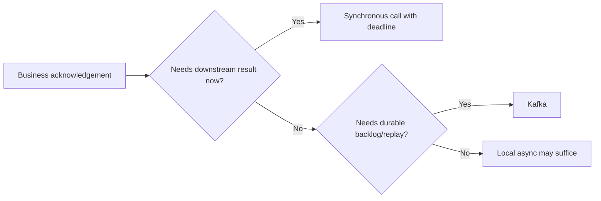

# Kafka Versus Synchronous Communication

<DocLabels items={[
  {label: 'Decision guide', tone: 'advanced'},
  {label: 'Temporal coupling', tone: 'production'},
  {label: 'Recovery semantics', tone: 'shopverse'},
]} />

| Synchronous HTTP is stronger when | Kafka is stronger when |
|---|---|
| caller requires an immediate answer | producer can acknowledge durable acceptance |
| operation is a query | event represents a durable fact or command backlog |
| failure must be returned to the caller now | consumers need independent pace and replay |
| fan-out is small and explicit | multiple owners consume without producer coordination |

## Decide From The Acknowledgement

“Order accepted” can mean payment completed, inventory reserved, or only that an
order command was durably stored. Write the meaning before choosing transport.
Kafka does not make a process asynchronous if the HTTP caller waits for the
consumer result.

## Avoid

- Do not use Kafka as a hidden RPC bus with per-request reply topics.
- Do not chain synchronous calls without end-to-end deadlines and load shedding.
- Do not publish after a database commit without an outbox or equivalent recovery.
- Do not assume eventual consistency is acceptable without a user-visible state model.

## Migration Path

To replace a synchronous side effect, first persist a command/outbox record in
the local transaction. Publish asynchronously, make the consumer idempotent,
expose `PENDING/COMPLETED/FAILED`, add reconciliation, then remove the old call.
For Kafka-to-HTTP migration, introduce a stable application port and prove the
new latency and availability coupling before retiring replay infrastructure.

<ExpandableAnswer title="Interview: When is synchronous communication the safer choice?">

When the caller cannot proceed without a current authoritative response and the
dependency can meet the shared deadline and availability target. A synchronous
query is often simpler and more honest than a replicated cache maintained by
events. Bound the call and define failure behavior.

</ExpandableAnswer>

## Official References

- [Spring Kafka reference](https://docs.spring.io/spring-kafka/reference/)
- [Spring Framework REST clients](https://docs.spring.io/spring-framework/reference/integration/rest-clients.html)

## Recommended Next

Use [Kafka Replay And Idempotency Lab](../architect-labs/KAFKA-REPLAY-IDEMPOTENCY.md).
