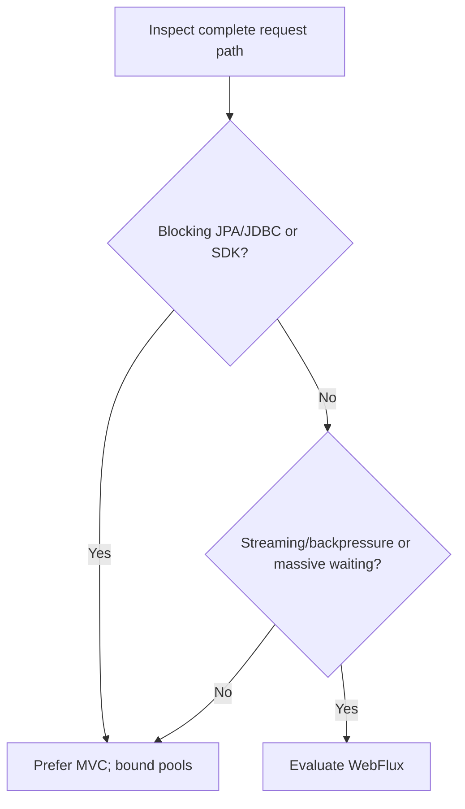

# Spring MVC Versus WebFlux

<DocLabels items={[
  {label: 'Decision guide', tone: 'advanced'},
  {label: 'Execution model', tone: 'production'},
  {label: 'Shopverse boundary', tone: 'shopverse'},
]} />

## Decision Summary

| Choose MVC when | Choose WebFlux when |
|---|---|
| dependencies are primarily blocking JPA/JDBC | the full hot path has non-blocking drivers |
| request concurrency is bounded and understood | very high concurrent waiting dominates |
| imperative debugging and ecosystem fit matter | streaming and backpressure are contract requirements |
| Java 21 virtual threads may simplify blocking concurrency | Reactor composition is already an owned skill |

## Avoid

- Avoid WebFlux merely to appear modern; blocking calls on event loops destroy
  its concurrency model.
- Avoid MVC with unbounded threads or queues; blocking still needs admission and
  downstream pool alignment.
- Avoid wrapping every blocking call in `boundedElastic` as a permanent design;
  it relocates rather than removes the capacity boundary.

## Shopverse Decision

Servlet services using JPA fit MVC. The API Gateway is reactive because its work
is primarily routing and non-blocking network composition. Keep shared security
configuration separated: servlet and reactive filter chains are different APIs.

## Migration Path

1. Measure blocking time, concurrency and tail latency by dependency.
2. Isolate one endpoint whose full dependency chain has reactive drivers.
3. Add BlockHound-style development detection or equivalent event-loop probes.
4. Compare load, memory, cancellation, trace readability and operator skill.
5. Migrate only if the measured constraint improves; retain contract-level tests.

<ExpandableAnswer title="Interview: Can WebFlux make a JPA service non-blocking?">

No. JPA and conventional JDBC block the executing thread. WebFlux can offload
that call to another bounded scheduler, but the database connection and worker
remain scarce resources. Use MVC/virtual threads for an imperative blocking path,
or adopt an end-to-end reactive persistence stack when its trade-offs are justified.

</ExpandableAnswer>

## Official References

- [Spring MVC](https://docs.spring.io/spring-framework/reference/web/webmvc.html)
- [Spring WebFlux](https://docs.spring.io/spring-framework/reference/web/webflux.html)

## Recommended Next

Read [Web Execution Models And Capacity](../web/WEB-EXECUTION-MODELS-CAPACITY.md).
