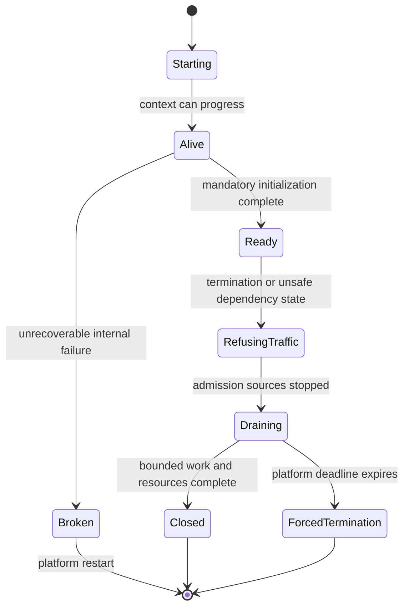

# Spring Boot Production Lifecycle And Incident Runbook

<DocLabels items={[
  {label: 'Canonical runbook', tone: 'production'},
  {label: 'Advanced', tone: 'advanced'},
  {label: 'Availability and drain', tone: 'intermediate'},
  {label: 'Incident evidence', tone: 'production'},
]} />

Availability is a protocol between the application and its platform. Spring Boot
publishes lifecycle state, but the service must still define when it can accept
work, how each admission source stops, which in-flight work drains, what becomes
retryable, and which evidence proves recovery.

<DocCallout type="production" title="Graceful shutdown is verified behavior, not a YAML property">
Enabling graceful HTTP shutdown covers only part of the process. Test HTTP, Kafka,
schedulers, executors, durable claims, telemetry, and forced termination together
inside the platform's real termination deadline.
</DocCallout>

## Availability State Machine



Liveness asks whether restarting this process is likely to help. Readiness asks
whether this instance should receive new work. A startup probe protects a process
that legitimately needs longer to initialize. None of these states proves every
business operation will succeed.

## Startup And Readiness Contract

Separate these milestones:

| Milestone | Evidence | Failure policy |
|---|---|---|
| process started | JVM and bootstrap logs | restart only for unrecoverable process failure |
| context refreshed | application-started event and startup steps | fail startup for mandatory configuration |
| infrastructure initialized | migrations, listeners, caches, credentials | mandatory versus degraded capability decision |
| traffic ready | `ReadinessState.ACCEPTING_TRAFFIC` and main-path probe | admit only supported operations |

Do not put shared database or internet health into liveness; restarting every replica
cannot repair a shared dependency and can create a restart storm. Include an external
dependency in readiness only when this instance cannot honor its contract without it
and taking all replicas unready has an understood platform outcome.

If Actuator uses a separate management port, a successful probe can miss failure in
the main web connector. Expose additional liveness/readiness paths on the main server
when the deployed topology requires end-to-end connector evidence.

Startup work needs an owner and deadline. Configuration binding, Liquibase, cache
warmup, JWKS, discovery, and broker initialization should either block readiness,
degrade an optional feature, or fail startup explicitly. Endless retries create a
process that is alive but never useful.

## Admission Inventory

List every way work enters the process:

- HTTP and streaming connections;
- Kafka or other listener containers;
- `@Scheduled` and distributed scheduler triggers;
- `@Async` and application executors;
- batch job launchers and remote chunk workers;
- durable work claims, polling loops, and callbacks.

Readiness normally controls HTTP routing only. Shutdown must also pause listener
containers, schedulers, launchers, and claim acquisition. Define the order so one
source does not keep feeding another queue after downstream admission stopped.

Task-specific behavior belongs in
[Spring Task Execution And Scheduling](../SPRING-ASYNC-PRODUCTION-ARCHITECT.md),
while pool sizing belongs in the
[resource capacity guide](../production/RESOURCE-POOL-CONCURRENCY-CAPACITY.md).

## Graceful Drain Sequence

Use a bounded sequence:

1. publish `REFUSING_TRAFFIC` and allow routing state to propagate;
2. stop new listener polls, schedules, job launches, and durable claims;
3. let already admitted HTTP and streaming work finish within its deadline;
4. acknowledge, checkpoint, or relinquish messaging and claimed work safely;
5. await bounded executors and transactions;
6. flush telemetry without making correctness depend on export success;
7. close HTTP, database, broker, and file resources;
8. exit before the platform sends a forced kill.

The platform termination grace period must cover any pre-stop propagation delay,
Spring's shutdown phases, dependency timeouts, and a safety margin. Long individual
timeouts can consume the entire budget and prevent later phases from running.

```yaml
server:
  shutdown: graceful

spring:
  lifecycle:
    timeout-per-shutdown-phase: 30s
```

This is configuration, not proof. Record the actual timestamp of readiness removal,
last admission, phase completion, forced cancellation, and process exit.

## Forced Termination And Durable Recovery

The platform can kill the process before callbacks or `@PreDestroy` run. Correctness
must survive termination between any two durable steps:

- HTTP commands use idempotency keys for retry after an uncertain response;
- database-plus-message workflows use an outbox;
- Kafka processing commits offsets only after the owned effect is durable;
- scheduled work uses idempotent claims and fencing where ownership can move;
- batch jobs restart from durable metadata and reconcile external effects;
- file output uses a manifest or atomic promotion rather than cleanup alone.

For each operation, document how an operator distinguishes completed, not started,
and ambiguous outcomes. "Retry it" is unsafe without that classification.

## Actuator And Probe Security

Expose only required endpoints. Health, metrics, conditions, environment,
configuration properties, heap dumps, thread dumps, scheduled tasks, and loggers
can reveal architecture, secrets, or personal data and require authentication,
network policy, sanitization, audit, and retention.

Health contributors need timeouts and aggregation rules. A slow health check can
exhaust the same pool it is attempting to diagnose. Avoid high-cardinality detail
in health output and avoid calling every business dependency on every probe.

## Observation And Evidence Model

Micrometer Observation coordinates metrics and tracing handlers. Low-cardinality
dimensions such as operation, outcome, dependency, and bounded error category fit
metrics. Product IDs, users, raw URLs, exception messages, and job parameters belong
nowhere in metric labels; sensitive values should also be excluded from baggage.

Minimum lifecycle evidence:

| Area | Evidence |
|---|---|
| startup | startup-step duration, condition report, migration/warmup outcome |
| admission | readiness state, last accepted work, listener/scheduler state |
| saturation | executor queue age, DB/HTTP pending acquisition, Kafka lag |
| drain | in-flight count, oldest work, phase duration, forced cancellation |
| correctness | idempotency/outbox/offset/claim/batch recovery state |
| telemetry | export backlog/failure and final flush duration |

Secure incident artifacts. Heap dumps, JFR, thread dumps, SQL, traces, and environment
snapshots may contain credentials or customer data; define capture authority,
encrypted storage, access logs, retention, and deletion.

## Incident Workflow

1. Protect users: stop or reduce admission at the narrowest safe boundary.
2. Establish a timeline from deployment, availability events, saturation, and errors.
3. Identify the first constrained owner, not the loudest downstream symptom.
4. Capture bounded evidence before restarting destroys it.
5. Recover through a reversible action and verify backlog plus correctness.
6. Reconcile ambiguous durable work.
7. Record the failed assumption, detection gap, and an executable prevention test.

Do not change several pools, JVM flags, retry counts, and timeouts during one incident.
That destroys causal evidence and can move the bottleneck into a less observable
resource.

## Shopverse Shutdown Drill

Run order placement while inventory calls are slow and Kafka has a controlled lag.
Terminate one Order-service replica and verify:

- readiness changes before the last admitted HTTP request;
- no new scheduled or async work enters after its admission phase closes;
- completed orders contain their outbox record;
- unfinished requests can retry with the same idempotency key;
- Kafka offsets reflect only durable processing;
- database and HTTP pools close after in-flight work;
- telemetry reports the drain without exposing customer data;
- a forced kill at each phase still leaves a documented recovery path.

Repeat with all replicas becoming unready to observe the ingress/load-balancer
behavior rather than assuming an HTTP `503` will always be returned.

## Interview Checks

<ExpandableAnswer title="What is the difference between liveness and readiness?">

Liveness indicates an internal condition where restarting this process can help.
Readiness controls whether this instance receives new work. A shared database outage
normally should not fail liveness because restarting every replica amplifies it.

</ExpandableAnswer>

<ExpandableAnswer title="Why can a readiness probe on a separate management port be misleading?">

The management connector and its pools can be healthy while the main application
connector cannot accept traffic. Use additional probe paths on the main server when
the platform needs evidence through the same web infrastructure.

</ExpandableAnswer>

<ExpandableAnswer title="What happens if every replica becomes unready?">

The platform stops routing to the service, but the client-visible result depends on
the service, ingress, and load-balancer implementation; it is not guaranteed to be
an application-generated `503`. Test the deployed topology and choose dependency
checks with that consequence in mind.

</ExpandableAnswer>

<ExpandableAnswer title="What proves graceful shutdown worked?">

Evidence must show readiness removal, admission closure for every source, bounded
in-flight completion or relinquishment, safe durable state, resource closure, and
exit before the platform deadline. A successful context-close log is insufficient.

</ExpandableAnswer>

<ExpandableAnswer title="Should telemetry export failure block process shutdown?">

Telemetry should receive a bounded flush opportunity, but correctness and platform
termination cannot depend on an unavailable collector. Record export loss and close
within the budget rather than hanging indefinitely.

</ExpandableAnswer>

<ExpandableAnswer title="Why is @PreDestroy insufficient for durable correctness?">

Forced termination can skip it, and a crash can occur between an external effect
and cleanup. Idempotency, outbox, offset, claim, and checkpoint protocols must make
recovery safe without relying on a final callback.

</ExpandableAnswer>

## Official References

- [Spring Boot Actuator endpoints and Kubernetes probes](https://docs.spring.io/spring-boot/reference/actuator/endpoints.html)
- [Spring Boot graceful shutdown](https://docs.spring.io/spring-boot/reference/web/graceful-shutdown.html)
- [Spring Boot application availability](https://docs.spring.io/spring-boot/reference/features/spring-application.html#features.spring-application.application-availability)
- [Spring Boot observability](https://docs.spring.io/spring-boot/reference/actuator/observability.html)
- [Micrometer Observation](https://docs.micrometer.io/micrometer/reference/observation.html)

## Recommended Next

Use [Spring Boot Production Tuning](../../development/spring-boot-internals/PRODUCTION-TUNING.md)
to choose the startup/memory or capacity guide for the limiting resource.
