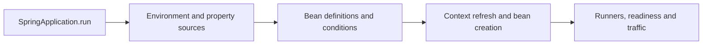

# Spring Boot And Container Interview Questions

<DocLabels items={[
  {label: 'Intermediate', tone: 'intermediate'},
  {label: 'Spring Boot 4', tone: 'foundation'},
  {label: '12 expandable answers', tone: 'production'},
]} />

<DocCallout type="tip" title="Answer before expanding">

State the container phase or extension point, the object identity being published, one
failure symptom and the diagnostic evidence you would inspect before opening the answer.

</DocCallout>

## Spring Boot

<ExpandableAnswer title="What are the main features of Spring Boot?">

Boot supplies opinionated auto-configuration, focused starter dependencies and dependency
management, embedded servers, externalized/type-safe configuration, executable packaging,
Actuator, observability integration, graceful shutdown and test support. It builds on
Spring Framework; it does not replace the container, MVC, transaction or data mechanisms.

</ExpandableAnswer>

<ExpandableAnswer title="How does a Spring Boot application start?">

`SpringApplication.run` determines the application type, prepares the environment,
creates an `ApplicationContext`, applies initializers and listeners, loads bean definitions,
refreshes the context, creates non-lazy singletons, starts the embedded server, invokes
runners and publishes availability events. A production diagnosis uses startup steps and
the condition report instead of assuming this is one opaque operation.

</ExpandableAnswer>

<ExpandableAnswer title="What does `@SpringBootApplication` contain?">

It combines `@SpringBootConfiguration`, `@EnableAutoConfiguration` and `@ComponentScan`.
The primary class should normally sit in a root application package so scanning is narrow
and predictable. Auto-configuration imports conditional infrastructure; component scanning
discovers application definitions. They are different registration mechanisms.

</ExpandableAnswer>

<ExpandableAnswer title="What is a Spring Boot starter?">

A starter is a curated dependency descriptor for one capability. Boot 4 introduced more
focused main and test starters, so choose the starter that owns the technology and allow
the Boot BOM to select compatible transitive versions. A starter adds classpath candidates;
conditions still decide which auto-configuration becomes active.

</ExpandableAnswer>

<ExpandableAnswer title="How do you disable an auto-configuration?">

Exclude the class through `@SpringBootApplication(exclude = ...)` or the
`spring.autoconfigure.exclude` property. First inspect why it matched using the condition
report. Exclusion is appropriate when the capability is intentionally absent, but it can
hide a missing property or accidental dependency.

</ExpandableAnswer>

<ExpandableAnswer title="How does auto-configuration back off?">

Auto-configuration uses conditions such as `@ConditionalOnClass`,
`@ConditionalOnMissingBean`, `@ConditionalOnProperty` and web-application conditions.
A default guarded by `@ConditionalOnMissingBean` is created only when the application has
not supplied a compatible bean. Back-off is a contract that custom starters should verify
with isolated application-context tests.

</ExpandableAnswer>

## Dependency Injection And Bean Selection

<ExpandableAnswer title="Constructor injection or setter injection?">

Use constructor injection for required dependencies: it makes invalid construction
impossible, supports final fields and makes plain-Java testing direct. Setter injection is
reasonable for truly optional reconfiguration. A long constructor is design feedback,
not a reason to hide dependencies with field injection.

</ExpandableAnswer>

<ExpandableAnswer title="What is the difference between `@Bean` and `@Component`?">

`@Component` makes an application-owned class discoverable by scanning. `@Bean` registers
the result of a factory method, which is useful for third-party types or explicit
infrastructure construction. Both produce container-managed beans and can be processed or
proxied; how their definitions are discovered differs.

</ExpandableAnswer>

<ExpandableAnswer title="How do you resolve bean ambiguity?">

Use a semantic `@Qualifier` when the injection point needs a specific strategy, `@Primary`
when one candidate is the genuine default, or inject a `List`/`Map` when all strategies are
part of the design. Avoid resolving business policy through accidental bean names.

</ExpandableAnswer>

<ExpandableAnswer title="What is the difference between `@Primary` and `@Order`?">

`@Primary` resolves one candidate for single-value injection. `@Order` or `Ordered`
controls the sequence of a collection or a framework chain when that consumer honors
ordering. It does not generally control bean initialization; express lifecycle dependencies
explicitly.

</ExpandableAnswer>

<ExpandableAnswer title="How should a circular dependency be resolved?">

First redesign ownership: extract coordination, publish an event, reverse a dependency
through a focused interface, or pass required data as an argument. Constructor cycles fail
because neither instance can exist first. `ObjectProvider` or lazy lookup is acceptable
only for a deliberate lifecycle relationship, not as a default escape hatch.

</ExpandableAnswer>

<ExpandableAnswer title="Can a prototype bean injected into a singleton remain prototype-scoped?">

The scope still describes how the container obtains instances, but ordinary injection into
a singleton resolves once during singleton creation. Use an `ObjectProvider`, method
injection or a scoped proxy when each use needs a fresh/shorter-lived target, and define
who destroys resources because prototype destruction is not fully managed after creation.

</ExpandableAnswer>

## Shopverse Drill

If two payment providers implement the same interface, explain whether Shopverse needs a
default (`@Primary`), a named provider (`@Qualifier`) or a policy over all providers
(`Map<String, Provider>`). Include configuration validation and what happens when the
selected provider is disabled during a rolling deployment.

## Official References

- [Spring Boot auto-configuration](https://docs.spring.io/spring-boot/reference/using/auto-configuration.html)
- [Spring container overview](https://docs.spring.io/spring-framework/reference/core/beans/basics.html)
- [Spring container extension points](https://docs.spring.io/spring-framework/reference/core/beans/factory-extension.html)

## Recommended Next

Continue with [Web And Data Questions](./SPRING-WEB-DATA-INTERVIEW.md).
