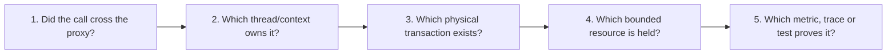

# Spring Production Runtime Interview Questions

<DocLabels items={[
  {label: 'Senior', tone: 'advanced'},
  {label: 'Runtime failures', tone: 'production'},
  {label: 'Expandable answers', tone: 'foundation'},
]} />

<DocCallout type="production" title="Annotations do not cross arbitrary boundaries">

For every answer identify whether the call crossed the Spring proxy, which thread owns it,
whether a physical transaction exists, which resource is held and how another replica
changes the conclusion.

</DocCallout>

<ExpandableAnswer title="Why can `@Transactional` fail on self-invocation?">

Spring usually applies the transaction interceptor through a proxy. A same-instance call
through `this` does not re-enter that proxy, so the inner annotation is not evaluated.
Move the boundary to another bean, expose one correct public transaction boundary or use
`TransactionTemplate` when local explicit orchestration is clearer.

</ExpandableAnswer>

<ExpandableAnswer title="Why can `@Async` appear to run synchronously or lose context?">

Self-invocation or a non-eligible method can bypass the async proxy. Once dispatch occurs,
the executor thread does not automatically inherit a transaction, MDC or arbitrary
thread-local state. Select a bounded named executor, define rejection behavior, propagate
only required context and start a transaction inside the async unit when needed.

</ExpandableAnswer>

<ExpandableAnswer title="Are Spring singleton beans thread-safe?">

No. Singleton means one instance per application context. Concurrent request threads may
call it simultaneously. Keep services stateless or protect shared state with a design that
also works across replicas; a JVM lock cannot protect a cluster-wide business invariant.

</ExpandableAnswer>

<ExpandableAnswer title="What is the difference between bean scope and object lifetime?">

Scope defines how Spring obtains an instance—singleton, prototype, request, session or a
custom scope. References can outlive or cache a scoped lookup. Injecting a prototype or
request-scoped dependency into a singleton needs a provider/scoped proxy when each use must
resolve the current target.

</ExpandableAnswer>

<ExpandableAnswer title="Why avoid a remote call inside a database transaction?">

The transaction holds a connection and possibly locks while waiting on DNS, TLS, a pool,
the network and the downstream service. This expands contention and creates ambiguous
cross-system rollback. Keep the local transaction short; use idempotent commands,
outbox/events and compensation according to the consistency requirement.

</ExpandableAnswer>

<ExpandableAnswer title="What happens when two `SecurityFilterChain` beans match?">

`FilterChainProxy` selects the first matching chain by order. A broad early matcher can
shadow a later policy, leaving routes unexpectedly open or requiring the wrong
authentication. Give each chain an explicit matcher/order and test boundary, overlap and
fall-through cases with adversarial requests.

</ExpandableAnswer>

<ExpandableAnswer title="How should application secrets enter Spring configuration?">

Use an environment-specific secret manager or orchestrator secret, expose the value through
the configuration system and bind it to the narrowest validated properties type. Prevent
logging through values, exception messages, Actuator exposure and configuration dumps.
Define rotation and mixed-version behavior; never bake production secrets into source or
the image.

</ExpandableAnswer>

<ExpandableAnswer title="Why can `REQUIRES_NEW` exhaust the database pool?">

The outer physical transaction retains its connection while the inner scope asks for a
second connection. With many concurrent outer calls, every connection can be held while
workers wait for inner acquisition. Size and bound concurrency from the nested resource
requirement, or redesign the boundary so work does not nest connections.

</ExpandableAnswer>

## Architect Follow-Up

Explain how the answers change for reactive transactions, virtual threads and a rolling
deployment with two application versions. A strong response distinguishes thread-local,
Reactor-context, database and cluster ownership rather than applying one rule everywhere.

## Official References

- [Spring AOP proxying](https://docs.spring.io/spring-framework/reference/core/aop/proxying.html)
- [Spring declarative transactions](https://docs.spring.io/spring-framework/reference/data-access/transaction/declarative.html)
- [Spring task execution](https://docs.spring.io/spring-framework/reference/integration/scheduling.html)
- [Spring Security servlet architecture](https://docs.spring.io/spring-security/reference/servlet/architecture.html)

## Recommended Next

Attempt the [Spring Architect Interview Workbook](../SPRING-ARCHITECT-INTERVIEW-WORKBOOK.md).
