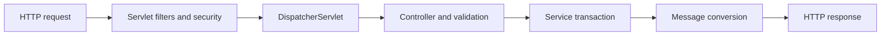

# Spring Web And Data Interview Questions

<DocLabels items={[
  {label: 'Intermediate', tone: 'intermediate'},
  {label: 'HTTP and persistence', tone: 'foundation'},
  {label: 'Production boundaries', tone: 'production'},
]} />

<DocCallout type="tip" title="Trace the boundary in both directions">

Follow the request from filter to response conversion, then trace database state and errors
back outward. This prevents controller, security and persistence responsibilities from
being blended into one vague “Spring handled it” answer.

</DocCallout>

<ExpandableAnswer title="What is the difference between `@Controller` and `@RestController`?">

`@Controller` commonly participates in MVC view resolution; a method needs
`@ResponseBody` to write a serialized body. `@RestController` combines
`@Controller` and `@ResponseBody`, so return values go through MVC return-value handlers
and `HttpMessageConverter`s. It does not automatically define status codes, versioning,
error contracts or transaction boundaries.

</ExpandableAnswer>

<ExpandableAnswer title="What is the purpose of `@ComponentScan`?">

It discovers stereotype-annotated classes below configured packages and registers their
bean definitions. Scanning an overly broad package can register unrelated configuration,
increase startup work and create ambiguous beans. Library auto-configuration should use
explicit imports/auto-configuration mechanisms rather than depend on consumer scanning.

</ExpandableAnswer>

<ExpandableAnswer title="How should a servlet application log requests while excluding health probes?">

Use a `OncePerRequestFilter` with an explicit `shouldNotFilter` policy, measure duration in
a `finally` block and emit bounded fields such as method, route template, status, trace ID
and duration. Do not log bearer tokens, credentials, raw sensitive bodies or unbounded IDs
as metric tags. Decide how async and error dispatches are counted. WebFlux uses a
`WebFilter`, not a servlet filter.

</ExpandableAnswer>

<ExpandableAnswer title="Why does `LazyInitializationException` occur?">

A lazy association needs an open persistence context. Access after the service transaction
closed cannot initialize it. If the context remains open, serialization may instead issue
hidden N+1 SQL. Fetch the use-case graph deliberately and map to a response DTO inside the
owned transaction; do not make every association eager or hide query ownership with Open
Session in View.

</ExpandableAnswer>

<ExpandableAnswer title="What is Spring Boot Actuator?">

Actuator exposes production endpoints and contributors for health, information, metrics,
loggers, mappings, configuration and other operational state. Expose the smallest required
set, secure sensitive endpoints and separate management access when appropriate. Liveness
should answer whether the process must restart; readiness should answer whether it can
receive traffic.

</ExpandableAnswer>

<ExpandableAnswer title="What is the difference between a filter, interceptor and aspect?">

A servlet `Filter` wraps the servlet chain and is appropriate for transport infrastructure
such as security, correlation and request logging. A `HandlerInterceptor` is MVC
handler-aware. A Spring AOP aspect intercepts eligible Spring bean method calls and is used
for method-level concerns such as transactions or auditing. Exception and async behavior
differs because the mechanisms own different boundaries.

</ExpandableAnswer>

<ExpandableAnswer title="Why can returning a JPA entity from a controller fail in two different ways?">

With a closed persistence context, Jackson touching lazy state can throw
`LazyInitializationException`. With an open context, it may issue uncontrolled SQL, recurse
through bidirectional relationships or expose persistence fields. Stable response DTOs and
explicit fetch plans keep the HTTP contract and query plan owned by the use case.

</ExpandableAnswer>

## Important Annotation Check

| Annotation | Boundary it configures |
|---|---|
| `@ConfigurationProperties` | typed external configuration |
| `@Transactional` | eligible proxied method transaction |
| `@Valid` | cascaded Bean Validation at supported boundary |
| `@ControllerAdvice` | MVC exception-to-response mapping |
| `@PreAuthorize` | method-security authorization interceptor |
| `@Cacheable` | cache interceptor around an eligible method call |

The annotation declares policy; the interviewer still expects the runtime owner and the
failure behavior.

## Official References

- [Spring MVC DispatcherServlet](https://docs.spring.io/spring-framework/reference/web/webmvc/mvc-servlet.html)
- [Spring MVC annotated controllers](https://docs.spring.io/spring-framework/reference/web/webmvc/mvc-controller.html)
- [Spring Boot Actuator](https://docs.spring.io/spring-boot/reference/actuator/)
- [Spring Data JPA reference](https://docs.spring.io/spring-data/jpa/reference/)

## Recommended Next

Continue with [Production Runtime Questions](./SPRING-PRODUCTION-RUNTIME-INTERVIEW.md).
